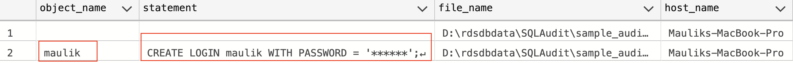

# Monitoring / Auditing #

## Monitoring Engine errors / logs ##
Publishing trace and dump files isn't supported

1. Agent log - Supported
2. Error log - Supported
3. Trace - TBD
4. Dump - TBD

For more information [Logs](https://docs.aws.amazon.com/AmazonRDS/latest/UserGuide/USER_LogAccess.Concepts.SQLServer.html)

## Audit Trail ##

[RDS API Actions](https://docs.aws.amazon.com/AmazonRDS/latest/APIReference/API_Operations.html) Can be audited using [CloudTrail](https://docs.aws.amazon.com/AmazonRDS/latest/UserGuide/logging-using-cloudtrail.html)

## RDS DB Instance Auditing ##
### Key Events of Interest ###
[RDS Event Categories and messages](https://docs.aws.amazon.com/AmazonRDS/latest/UserGuide/USER_Events.Messages.html)

creation 
- Db instance created(RDS-EVENT-0005)
- restoration of snapshot (RDS-EVENT-0043)

failed
- the DB instance creation failed (RDS-EVENT-0278)

low storage
- Allocated storage has been exhausted. Allocate additional storage to resolve (RDS-EVENT-0007)

failure
- Multi-AZ instance failover started (RDS-EVENT-0013)
- Multi-AZ instance failover completed (RDS-EVENT-0049)


deletion
- Db instance deletion(RDS-EVENT-0003)

maintenance
- minor upgrade version available (RDS-EVENT-0155)
- engine version upgrade started (RDS-EVENT-0267)
- engine version upgrade finished (RDS-EVENT-0268)
- engine version upgrade failed (RDS-EVENT-0270)
- downtime started (RDS-EVENT-0266)
- applying off-line patches to DB instance (RDS-EVENT-0026)
- finished applying off-line patches to DB instance (RDS-EVENT-0027)
- database instance patched (RDS-EVENT-0047)


read replica
- Replication has stopped (RDS-EVENT-0045)
- Replication for the Read Replica resumed (RDS-EVENT-0046)

snapshot events (creation)
- manaul snapshot created (RDS-EVENT-0042)
- automated snapshot created (RDS-EVENT-0091)

notification
- Db instance started (RDS-EVENT-0088 )
- Db instance stopped (RDS-EVENT-0087)
- starting of local snapshot copy (RDS-EVENT-0196)
- cancelling local snapshot copy (RDS-EVENT-0190)
- finishing of local snapshot copy (RDS-EVENT-0197)
- starting of cross region snapshot copy (RDS-EVENT-0059)
- finishing of cross region snapshot copy (RDS-EVENT-0060)
- cancellation of cross region snapshot copy (RDS-EVENT-0061)


availability 
- instance start
- stop
- storage full threshold reached, database had been shutdown (RDS-EVENT-0221)
- free storage capacity is low (RDS-EVENT-0222)

backup 
- backing up Db instance (RDS-EVENT-0001) 
- finishing up of Db instance (RDS-EVENT-0002) 

configuration change 
- Db instance class change (RDS-EVENT-0014)
- master credential change (RDS-EVENT-0016)
- finished applying modification to allocation storage change (RDS-EVENT-0017)
- applied change to security group (RDS-EVENT-0038)

[More information](https://docs.aws.amazon.com/AmazonRDS/latest/UserGuide/USER_Events.Messages.html#USER_Events.Messages.instance)

## SQL Server Auditing ##
### Object Model ###


### Key Audit Events Of Interest ###
[When Backup/Restore command is issued](https://learn.microsoft.com/en-us/sql/relational-databases/event-classes/audit-backup-and-restore-event-class?view=sql-server-ver16) USE ``BACKUP_RESTORE_GROUP``

[When Server principle is created, altered or dropped](https://learn.microsoft.com/en-us/sql/relational-databases/event-classes/audit-server-principal-management-event-class?view=sql-server-ver16) USE ``SERVER_PRINCIPAL_CHANGE_GROUP``

[When Server is started/stopped](https://learn.microsoft.com/en-us/sql/relational-databases/event-classes/audit-server-starts-and-stops-event-class?view=sql-server-ver16) USE ``SERVER_STATE_CHANGE_GROUP``

[Server level GDR(Grant, Deny, Revoke) Event](https://learn.microsoft.com/en-us/sql/relational-databases/event-classes/audit-server-scope-gdr-event-class?view=sql-server-ver16) USE ``SERVER_OBJECT_PERMISSION_CHANGE_GROUP``

[When principles are created, altered or dropped from a database](https://learn.microsoft.com/en-us/sql/relational-databases/event-classes/audit-database-principal-management-event-class?view=sql-server-ver16) USE ``DATABASE_PRINCIPAL_CHANGE_GROUP``

[When user successfully logs in](https://learn.microsoft.com/en-us/sql/relational-databases/event-classes/audit-login-event-class?view=sql-server-ver16) USE ``SUCCESSFUL_LOGIN_GROUP``

[When user login fails](https://learn.microsoft.com/en-us/sql/relational-databases/event-classes/audit-login-failed-event-class?view=sql-server-ver16) USE ``FAILED_LOGIN_GROUP``


[When Audit specification is changed](https://learn.microsoft.com/en-us/sql/relational-databases/event-classes/audit-change-audit-event-class?view=sql-server-ver16), USE ``AUDIT_CHANGE_GROUP``

### Capturing Audit Events ###

[Sample Audit policy for SQL Server](https://docs.aws.amazon.com/AmazonRDS/latest/UserGuide/DBActivityStreams.configuring-auditing-SQLServer.html)

[Monitoring Activity Streams](https://docs.aws.amazon.com/AmazonRDS/latest/UserGuide/DBActivityStreams.Monitoring.html)

[Integrate with Guardium Data Protection - Data Activity monitoring](https://www.ibm.com/docs/en/guardium/11.5?topic=setup-discover-configure-aws-data-streams) and [System requirements for Guardium](https://www.ibm.com/support/pages/ibm-guardium-system-requirements-and-supported-platforms)

## AWS RDS SQL Server Auditing configuration ##
To configure SQL Server Audit options
[Refer AWS RDS SQL Db instance here](https://docs.aws.amazon.com/prescriptive-guidance/latest/sql-server-auditing-on-aws/auditing-rds-sql-instances.html)

### Step 1: Create Server level Audit ###
```
CREATE SERVER AUDIT sample_audit  
TO FILE
        (     
            FILEPATH = N'D:\rdsdbdata\SQLAudit\',
            MAXSIZE = 20 MB,
            MAX_ROLLOVER_FILES = 2147483647
        )
        WITH (QUEUE_DELAY = 1000, ON_FAILURE = CONTINUE);
```

Turn the Audit ON
```
ALTER SERVER AUDIT [sample_audit] WITH (STATE = ON)
GO
```

### Step 2: Create server/database level audit with desired action group ###
```
CREATE SERVER AUDIT SPECIFICATION [sample_audit-server-spec]
FOR SERVER AUDIT [sample_audit]
ADD (SERVER_PRINCIPAL_CHANGE_GROUP),
ADD (BACKUP_RESTORE_GROUP),
ADD (SERVER_STATE_CHANGE_GROUP)
WITH (STATE = ON)
GO
```

### Step 3: Execute query that generates audit event ###
```
CREATE LOGIN maulik WITH PASSWORD = 'simple';
```

### Step 4: Query Audit ###
```
SELECT   object_name, [statement],file_name,host_name
	FROM     msdb.dbo.rds_fn_get_audit_file
	             ('D:\rdsdbdata\SQLAudit\*.sqlaudit'
	             , default
	             , default )
```

OR if audit log is transmitted to S3 bucket

```
SELECT   * 
	FROM     msdb.dbo.rds_fn_get_audit_file
	             ('D:\rdsdbdata\SQLAudit\transmitted\*.sqlaudit'
	             , default
	             , default )
```



To find the list of user initiated database backups taken from AWS RDS Instnace for given database `sample_db`, specify `object_name=sample_db` and `action_id=BA`

```
SELECT  event_time,action_id,host_name,class_type, object_name, [statement],file_name,host_name
	FROM     msdb.dbo.rds_fn_get_audit_file 
	             ('D:\rdsdbdata\SQLAudit\*.sqlaudit'
	             , default
	             , default) 
    WHERE action_id='BA' AND object_name='sample_db'
    ORDER by event_time DESC
```

