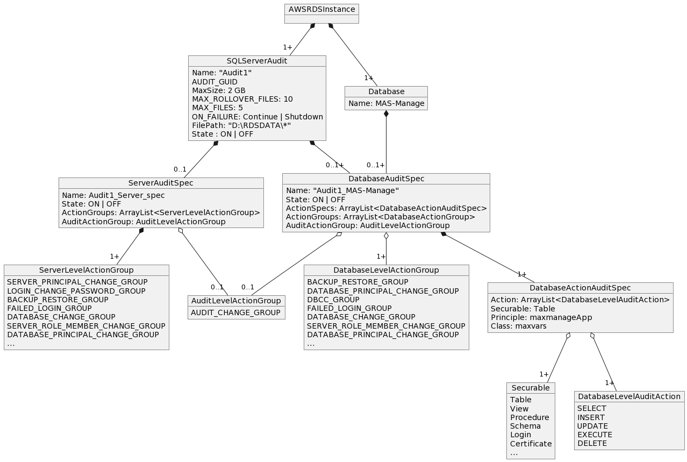
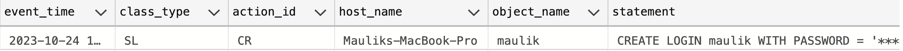
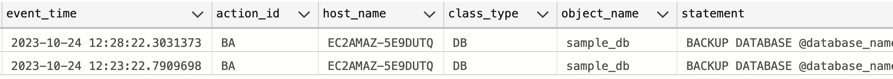
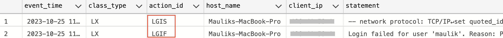

# Monitoring / Auditing #

## Monitoring Engine errors / logs ##
Publishing trace and dump files isn't supported

1. Agent log - Supported
2. Error log - Supported
3. Trace - TBD
4. Dump - TBD

For more information [Logs](https://docs.aws.amazon.com/AmazonRDS/latest/UserGuide/USER_LogAccess.Concepts.SQLServer.html)

## Audit Trail ##

[RDS API Actions](https://docs.aws.amazon.com/AmazonRDS/latest/APIReference/API_Operations.html) Can be audited using [CloudTrail](https://docs.aws.amazon.com/AmazonRDS/latest/UserGuide/logging-using-cloudtrail.html)

## RDS DB Instance Auditing ##
### Key Events of Interest ###
[RDS Event Categories and messages](https://docs.aws.amazon.com/AmazonRDS/latest/UserGuide/USER_Events.Messages.html)

creation 
- Db instance created(RDS-EVENT-0005)
- restoration of snapshot (RDS-EVENT-0043)

failed
- the DB instance creation failed (RDS-EVENT-0278)

low storage
- Allocated storage has been exhausted. Allocate additional storage to resolve (RDS-EVENT-0007)

failure
- Multi-AZ instance failover started (RDS-EVENT-0013)
- Multi-AZ instance failover completed (RDS-EVENT-0049)


deletion
- Db instance deletion(RDS-EVENT-0003)

maintenance
- minor upgrade version available (RDS-EVENT-0155)
- engine version upgrade started (RDS-EVENT-0267)
- engine version upgrade finished (RDS-EVENT-0268)
- engine version upgrade failed (RDS-EVENT-0270)
- downtime started (RDS-EVENT-0266)
- applying off-line patches to DB instance (RDS-EVENT-0026)
- finished applying off-line patches to DB instance (RDS-EVENT-0027)
- database instance patched (RDS-EVENT-0047)


read replica
- Replication has stopped (RDS-EVENT-0045)
- Replication for the Read Replica resumed (RDS-EVENT-0046)

snapshot events (creation)
- manaul snapshot created (RDS-EVENT-0042)
- automated snapshot created (RDS-EVENT-0091)

notification
- Db instance started (RDS-EVENT-0088 )
- Db instance stopped (RDS-EVENT-0087)
- starting of local snapshot copy (RDS-EVENT-0196)
- cancelling local snapshot copy (RDS-EVENT-0190)
- finishing of local snapshot copy (RDS-EVENT-0197)
- starting of cross region snapshot copy (RDS-EVENT-0059)
- finishing of cross region snapshot copy (RDS-EVENT-0060)
- cancellation of cross region snapshot copy (RDS-EVENT-0061)


availability 
- instance start
- stop
- storage full threshold reached, database had been shutdown (RDS-EVENT-0221)
- free storage capacity is low (RDS-EVENT-0222)

backup 
- backing up Db instance (RDS-EVENT-0001) 
- finishing up of Db instance (RDS-EVENT-0002) 

configuration change 
- Db instance class change (RDS-EVENT-0014)
- master credential change (RDS-EVENT-0016)
- finished applying modification to allocation storage change (RDS-EVENT-0017)
- applied change to security group (RDS-EVENT-0038)

[More information](https://docs.aws.amazon.com/AmazonRDS/latest/UserGuide/USER_Events.Messages.html#USER_Events.Messages.instance)

## SQL Server Auditing ##
### Object Model ###


### Key Audit Events Of Interest ###
[When Backup/Restore command is issued](https://learn.microsoft.com/en-us/sql/relational-databases/event-classes/audit-backup-and-restore-event-class?view=sql-server-ver16) USE ``BACKUP_RESTORE_GROUP``

[When Server principle is created, altered or dropped](https://learn.microsoft.com/en-us/sql/relational-databases/event-classes/audit-server-principal-management-event-class?view=sql-server-ver16) USE ``SERVER_PRINCIPAL_CHANGE_GROUP``

[When Server is started/stopped](https://learn.microsoft.com/en-us/sql/relational-databases/event-classes/audit-server-starts-and-stops-event-class?view=sql-server-ver16) USE ``SERVER_STATE_CHANGE_GROUP``

[Server level GDR(Grant, Deny, Revoke) Event](https://learn.microsoft.com/en-us/sql/relational-databases/event-classes/audit-server-scope-gdr-event-class?view=sql-server-ver16) USE ``SERVER_OBJECT_PERMISSION_CHANGE_GROUP``

[When principles are created, altered or dropped from a database](https://learn.microsoft.com/en-us/sql/relational-databases/event-classes/audit-database-principal-management-event-class?view=sql-server-ver16) USE ``DATABASE_PRINCIPAL_CHANGE_GROUP``

[When user successfully logs in](https://learn.microsoft.com/en-us/sql/relational-databases/event-classes/audit-login-event-class?view=sql-server-ver16) USE ``SUCCESSFUL_LOGIN_GROUP``

[When user login fails](https://learn.microsoft.com/en-us/sql/relational-databases/event-classes/audit-login-failed-event-class?view=sql-server-ver16) USE ``FAILED_LOGIN_GROUP``


[When Audit specification is changed](https://learn.microsoft.com/en-us/sql/relational-databases/event-classes/audit-change-audit-event-class?view=sql-server-ver16), USE ``AUDIT_CHANGE_GROUP``

### Capturing Audit Events ###

[Sample Audit policy for SQL Server](https://docs.aws.amazon.com/AmazonRDS/latest/UserGuide/DBActivityStreams.configuring-auditing-SQLServer.html)

[Monitoring Activity Streams](https://docs.aws.amazon.com/AmazonRDS/latest/UserGuide/DBActivityStreams.Monitoring.html)

[Integrate with Guardium Data Protection - Data Activity monitoring](https://www.ibm.com/docs/en/guardium/11.5?topic=setup-discover-configure-aws-data-streams) and [System requirements for Guardium](https://www.ibm.com/support/pages/ibm-guardium-system-requirements-and-supported-platforms)

## AWS RDS SQL Server Auditing configuration ##
To configure SQL Server Audit options
[Refer AWS RDS SQL Db instance here](https://docs.aws.amazon.com/prescriptive-guidance/latest/sql-server-auditing-on-aws/auditing-rds-sql-instances.html)

### Step 1: Create Server level Audit ###
[Refer Creating audits section](https://docs.aws.amazon.com/AmazonRDS/latest/UserGuide/Appendix.SQLServer.Options.Audit.html#Appendix.SQLServer.Options.Audit.Adding) for details

Guidelines
- Don't configure MAX_ROLLOVER_FILES or MAX_FILES.
- For FILEPATH, specify D:\rdsdbdata\SQLAudit\
- Don't use RDS_ as a prefix in the server audit name.
- For MAXSIZE, specify a size between 2 MB and 50 MB.
- Do not specify RETENTION PERIOD in option group for Audit if audit log is not required to be stored on AWS RDS instance

Sample Audit
```
CREATE SERVER AUDIT sample_audit  
TO FILE
        (     
            FILEPATH = N'D:\rdsdbdata\SQLAudit\',
            MAXSIZE = 2 MB
        )
        WITH (QUEUE_DELAY = 1000, ON_FAILURE = CONTINUE);
```

Turn the Audit ON
```
ALTER SERVER AUDIT [sample_audit] WITH (STATE = ON)
GO
```


### Step 2: Identify action_id and class_type to be filtered
[sys.dm_audit_actions](https://learn.microsoft.com/en-us/sql/relational-databases/system-dynamic-management-views/sys-dm-audit-actions-transact-sql?view=sql-server-ver16) provides `name`,`class_desc`,`containing_group_name`


#### 2.1 - Audit Configuration at Action Level ####
```
select * from sys.dm_audit_actions where configuration_level='Action'
```
Here, we can see that individual Action level logging is possible at three diffrent class levels 
- `Database`
- `Schema` 
-  `Object` as seen in `class_desc`

|action_id|name|class_desc|covering_action_name|parent_class_desc|covering_parent_action_name|configuration_level|containing_group_name|action_in_log|
|---|---|---|---|---|---|---|---|---|
|SL  |SELECT|DATABASE|SCHEMA_OBJECT_ACCESS_GROUP|SERVER|NULL|Action|SCHEMA_OBJECT_ACCESS_GROUP|0|
|IN  |INSERT|DATABASE|SCHEMA_OBJECT_ACCESS_GROUP|SERVER|NULL|Action|SCHEMA_OBJECT_ACCESS_GROUP|0|
|UP  |UPDATE|DATABASE|SCHEMA_OBJECT_ACCESS_GROUP|SERVER|NULL|Action|SCHEMA_OBJECT_ACCESS_GROUP|0|
|DL  |DELETE|DATABASE|SCHEMA_OBJECT_ACCESS_GROUP|SERVER|NULL|Action|SCHEMA_OBJECT_ACCESS_GROUP|0|
|RF  |REFERENCES|DATABASE|SCHEMA_OBJECT_ACCESS_GROUP|SERVER|NULL|Action|SCHEMA_OBJECT_ACCESS_GROUP|0|
|EX  |EXECUTE|DATABASE|SCHEMA_OBJECT_ACCESS_GROUP|SERVER|NULL|Action|SCHEMA_OBJECT_ACCESS_GROUP|0|
|RC  |RECEIVE|DATABASE|SCHEMA_OBJECT_ACCESS_GROUP|SERVER|NULL|Action|SCHEMA_OBJECT_ACCESS_GROUP|0|
|SL  |SELECT|OBJECT|NULL|SCHEMA|SELECT|Action|SCHEMA_OBJECT_ACCESS_GROUP|1|
|UP  |UPDATE|OBJECT|NULL|SCHEMA|UPDATE|Action|SCHEMA_OBJECT_ACCESS_GROUP|1|
|RF  |REFERENCES|OBJECT|NULL|SCHEMA|REFERENCES|Action|SCHEMA_OBJECT_ACCESS_GROUP|1|
|IN  |INSERT|OBJECT|NULL|SCHEMA|INSERT|Action|SCHEMA_OBJECT_ACCESS_GROUP|1|
|DL  |DELETE|OBJECT|NULL|SCHEMA|DELETE|Action|SCHEMA_OBJECT_ACCESS_GROUP|1|
|EX  |EXECUTE|OBJECT|NULL|SCHEMA|EXECUTE|Action|SCHEMA_OBJECT_ACCESS_GROUP|1|
|RC  |RECEIVE|OBJECT|NULL|SCHEMA|RECEIVE|Action|SCHEMA_OBJECT_ACCESS_GROUP|1|
|SL  |SELECT|SCHEMA|NULL|DATABASE|SELECT|Action|SCHEMA_OBJECT_ACCESS_GROUP|0|
|IN  |INSERT|SCHEMA|NULL|DATABASE|INSERT|Action|SCHEMA_OBJECT_ACCESS_GROUP|0|
|UP  |UPDATE|SCHEMA|NULL|DATABASE|UPDATE|Action|SCHEMA_OBJECT_ACCESS_GROUP|0|
|DL  |DELETE|SCHEMA|NULL|DATABASE|DELETE|Action|SCHEMA_OBJECT_ACCESS_GROUP|0|
|RF  |REFERENCES|SCHEMA|NULL|DATABASE|REFERENCES|Action|SCHEMA_OBJECT_ACCESS_GROUP|0|
|EX  |EXECUTE|SCHEMA|NULL|DATABASE|EXECUTE|Action|SCHEMA_OBJECT_ACCESS_GROUP|0|
|RC  |RECEIVE|SCHEMA|NULL|DATABASE|RECEIVE|Action|SCHEMA_OBJECT_ACCESS_GROUP|0|

#### 2.2 - Audit Configuration at Group Level ####

```
select * from sys.dm_audit_actions where configuration_level='Group' order by containing_group_name
```
here, we can see important action group such as 
- `BACKUP_RESTORE_GROUP`
- `FAILED_LOGIN_GROUP`
- `LOGIN_CHANGE_PASSWORD_GROUP`
- `SUCCESSFUL_LOGIN_GROUP`

and class_desc as
- DATABASE
- SERVER

|action_id|name|class_desc|covering_action_name|parent_class_desc|covering_parent_action_name|configuration_level|containing_group_name|action_in_log|
|---|---|---|---|---|---|---|---|---|
|PWAR|APPLICATION_ROLE_CHANGE_PASSWORD_GROUP|DATABASE|NULL|SERVER|APPLICATION_ROLE_CHANGE_PASSWORD_GROUP|Group|APPLICATION_ROLE_CHANGE_PASSWORD_GROUP|0|
|PWAR|APPLICATION_ROLE_CHANGE_PASSWORD_GROUP|SERVER|NULL|NULL|NULL|Group|APPLICATION_ROLE_CHANGE_PASSWORD_GROUP|0|
|CNAU|AUDIT_CHANGE_GROUP|SERVER|NULL|NULL|NULL|Group|AUDIT_CHANGE_GROUP|0|
|CNAU|AUDIT_CHANGE_GROUP|DATABASE|NULL|SERVER|AUDIT_CHANGE_GROUP|Group|AUDIT_CHANGE_GROUP|0|
|BRDB|BACKUP_RESTORE_GROUP|DATABASE|NULL|SERVER|BACKUP_RESTORE_GROUP|Group|BACKUP_RESTORE_GROUP|0|
|BRDB|BACKUP_RESTORE_GROUP|SERVER|NULL|NULL|NULL|Group|BACKUP_RESTORE_GROUP|0|
|BCMG|BATCH_COMPLETED_GROUP|DATABASE|NULL|SERVER|BATCH_COMPLETED_GROUP|Group|BATCH_COMPLETED_GROUP|0|
|BCMG|BATCH_COMPLETED_GROUP|SERVER|NULL|NULL|NULL|Group|BATCH_COMPLETED_GROUP|0|
|BSTG|BATCH_STARTED_GROUP|SERVER|NULL|NULL|NULL|Group|BATCH_STARTED_GROUP|0|
|BSTG|BATCH_STARTED_GROUP|DATABASE|NULL|SERVER|BATCH_STARTED_GROUP|Group|BATCH_STARTED_GROUP|0|
|LGBG|BROKER_LOGIN_GROUP|SERVER|NULL|NULL|NULL|Group|BROKER_LOGIN_GROUP|0|
|MNDB|DATABASE_CHANGE_GROUP|SERVER|NULL|NULL|NULL|Group|DATABASE_CHANGE_GROUP|0|
|MNDB|DATABASE_CHANGE_GROUP|DATABASE|NULL|SERVER|DATABASE_CHANGE_GROUP|Group|DATABASE_CHANGE_GROUP|0|
|DAGL|DATABASE_LOGOUT_GROUP|DATABASE|NULL|SERVER|DATABASE_LOGOUT_GROUP|Group|DATABASE_LOGOUT_GROUP|0|
|DAGL|DATABASE_LOGOUT_GROUP|SERVER|NULL|NULL|NULL|Group|DATABASE_LOGOUT_GROUP|0|
|LGMG|DATABASE_MIRRORING_LOGIN_GROUP|SERVER|NULL|NULL|NULL|Group|DATABASE_MIRRORING_LOGIN_GROUP|0|
|ACDO|DATABASE_OBJECT_ACCESS_GROUP|SERVER|NULL|NULL|NULL|Group|DATABASE_OBJECT_ACCESS_GROUP|0|
|ACDO|DATABASE_OBJECT_ACCESS_GROUP|DATABASE|NULL|SERVER|DATABASE_OBJECT_ACCESS_GROUP|Group|DATABASE_OBJECT_ACCESS_GROUP|0|
|MNDO|DATABASE_OBJECT_CHANGE_GROUP|DATABASE|NULL|SERVER|DATABASE_OBJECT_CHANGE_GROUP|Group|DATABASE_OBJECT_CHANGE_GROUP|0|
|MNDO|DATABASE_OBJECT_CHANGE_GROUP|SERVER|NULL|NULL|NULL|Group|DATABASE_OBJECT_CHANGE_GROUP|0|
|TODO|DATABASE_OBJECT_OWNERSHIP_CHANGE_GROUP|SERVER|NULL|NULL|NULL|Group|DATABASE_OBJECT_OWNERSHIP_CHANGE_GROUP|0|
|TODO|DATABASE_OBJECT_OWNERSHIP_CHANGE_GROUP|DATABASE|NULL|SERVER|DATABASE_OBJECT_OWNERSHIP_CHANGE_GROUP|Group|DATABASE_OBJECT_OWNERSHIP_CHANGE_GROUP|0|
|GRDO|DATABASE_OBJECT_PERMISSION_CHANGE_GROUP|DATABASE|NULL|SERVER|DATABASE_OBJECT_PERMISSION_CHANGE_GROUP|Group|DATABASE_OBJECT_PERMISSION_CHANGE_GROUP|0|
|GRDO|DATABASE_OBJECT_PERMISSION_CHANGE_GROUP|SERVER|NULL|NULL|NULL|Group|DATABASE_OBJECT_PERMISSION_CHANGE_GROUP|0|
|OPDB|DATABASE_OPERATION_GROUP|SERVER|NULL|NULL|NULL|Group|DATABASE_OPERATION_GROUP|0|
|OPDB|DATABASE_OPERATION_GROUP|DATABASE|NULL|SERVER|DATABASE_OPERATION_GROUP|Group|DATABASE_OPERATION_GROUP|0|
|TODB|DATABASE_OWNERSHIP_CHANGE_GROUP|DATABASE|NULL|SERVER|DATABASE_OWNERSHIP_CHANGE_GROUP|Group|DATABASE_OWNERSHIP_CHANGE_GROUP|0|
|TODB|DATABASE_OWNERSHIP_CHANGE_GROUP|SERVER|NULL|NULL|NULL|Group|DATABASE_OWNERSHIP_CHANGE_GROUP|0|
|GRDB|DATABASE_PERMISSION_CHANGE_GROUP|SERVER|NULL|NULL|NULL|Group|DATABASE_PERMISSION_CHANGE_GROUP|0|
|GRDB|DATABASE_PERMISSION_CHANGE_GROUP|DATABASE|NULL|SERVER|DATABASE_PERMISSION_CHANGE_GROUP|Group|DATABASE_PERMISSION_CHANGE_GROUP|0|
|MNDP|DATABASE_PRINCIPAL_CHANGE_GROUP|DATABASE|NULL|SERVER|DATABASE_PRINCIPAL_CHANGE_GROUP|Group|DATABASE_PRINCIPAL_CHANGE_GROUP|0|
|MNDP|DATABASE_PRINCIPAL_CHANGE_GROUP|SERVER|NULL|NULL|NULL|Group|DATABASE_PRINCIPAL_CHANGE_GROUP|0|
|IMDP|DATABASE_PRINCIPAL_IMPERSONATION_GROUP|DATABASE|NULL|SERVER|DATABASE_PRINCIPAL_IMPERSONATION_GROUP|Group|DATABASE_PRINCIPAL_IMPERSONATION_GROUP|0|
|IMDP|DATABASE_PRINCIPAL_IMPERSONATION_GROUP|SERVER|NULL|NULL|NULL|Group|DATABASE_PRINCIPAL_IMPERSONATION_GROUP|0|
|ADDP|DATABASE_ROLE_MEMBER_CHANGE_GROUP|DATABASE|NULL|SERVER|DATABASE_ROLE_MEMBER_CHANGE_GROUP|Group|DATABASE_ROLE_MEMBER_CHANGE_GROUP|0|
|ADDP|DATABASE_ROLE_MEMBER_CHANGE_GROUP|SERVER|NULL|NULL|NULL|Group|DATABASE_ROLE_MEMBER_CHANGE_GROUP|0|
|DBCG|DBCC_GROUP|SERVER|NULL|NULL|NULL|Group|DBCC_GROUP|0|
|DBCG|DBCC_GROUP|DATABASE|NULL|SERVER|DBCC_GROUP|Group|DBCC_GROUP|0|
|DAGF|FAILED_DATABASE_AUTHENTICATION_GROUP|DATABASE|NULL|SERVER|FAILED_DATABASE_AUTHENTICATION_GROUP|Group|FAILED_DATABASE_AUTHENTICATION_GROUP|0|
|DAGF|FAILED_DATABASE_AUTHENTICATION_GROUP|SERVER|NULL|NULL|NULL|Group|FAILED_DATABASE_AUTHENTICATION_GROUP|0|
|LGFL|FAILED_LOGIN_GROUP|SERVER|NULL|NULL|NULL|Group|FAILED_LOGIN_GROUP|0|
|FTG |FULLTEXT_GROUP|SERVER|NULL|NULL|NULL|Group|FULLTEXT_GROUP|0|
|LGGG|GLOBAL_TRANSACTIONS_LOGIN_GROUP|SERVER|NULL|NULL|NULL|Group|GLOBAL_TRANSACTIONS_LOGIN_GROUP|0|
|PWCG|LOGIN_CHANGE_PASSWORD_GROUP|SERVER|NULL|NULL|NULL|Group|LOGIN_CHANGE_PASSWORD_GROUP|0|
|LO  |LOGOUT_GROUP|SERVER|NULL|NULL|NULL|Group|LOGOUT_GROUP|0|
|ACO |SCHEMA_OBJECT_ACCESS_GROUP|DATABASE|NULL|SERVER|SCHEMA_OBJECT_ACCESS_GROUP|Group|SCHEMA_OBJECT_ACCESS_GROUP|0|
|ACO |SCHEMA_OBJECT_ACCESS_GROUP|SERVER|NULL|NULL|NULL|Group|SCHEMA_OBJECT_ACCESS_GROUP|0|
|MNO |SCHEMA_OBJECT_CHANGE_GROUP|SERVER|NULL|NULL|NULL|Group|SCHEMA_OBJECT_CHANGE_GROUP|0|
|MNO |SCHEMA_OBJECT_CHANGE_GROUP|DATABASE|NULL|SERVER|SCHEMA_OBJECT_CHANGE_GROUP|Group|SCHEMA_OBJECT_CHANGE_GROUP|0|
|TOO |SCHEMA_OBJECT_OWNERSHIP_CHANGE_GROUP|DATABASE|NULL|SERVER|SCHEMA_OBJECT_OWNERSHIP_CHANGE_GROUP|Group|SCHEMA_OBJECT_OWNERSHIP_CHANGE_GROUP|0|
|TOO |SCHEMA_OBJECT_OWNERSHIP_CHANGE_GROUP|SERVER|NULL|NULL|NULL|Group|SCHEMA_OBJECT_OWNERSHIP_CHANGE_GROUP|0|
|GRO |SCHEMA_OBJECT_PERMISSION_CHANGE_GROUP|SERVER|NULL|NULL|NULL|Group|SCHEMA_OBJECT_PERMISSION_CHANGE_GROUP|0|
|GRO |SCHEMA_OBJECT_PERMISSION_CHANGE_GROUP|DATABASE|NULL|SERVER|SCHEMA_OBJECT_PERMISSION_CHANGE_GROUP|Group|SCHEMA_OBJECT_PERMISSION_CHANGE_GROUP|0|
|SCCG|SENSITIVITY_CLASSIFICATION_CHANGE_GROUP|DATABASE|NULL|SERVER|SENSITIVITY_CLASSIFICATION_CHANGE_GROUP|Group|SENSITIVITY_CLASSIFICATION_CHANGE_GROUP|0|
|SCCG|SENSITIVITY_CLASSIFICATION_CHANGE_GROUP|SERVER|NULL|NULL|NULL|Group|SENSITIVITY_CLASSIFICATION_CHANGE_GROUP|0|
|MNSO|SERVER_OBJECT_CHANGE_GROUP|SERVER|NULL|NULL|NULL|Group|SERVER_OBJECT_CHANGE_GROUP|0|
|TOSO|SERVER_OBJECT_OWNERSHIP_CHANGE_GROUP|SERVER|NULL|NULL|NULL|Group|SERVER_OBJECT_OWNERSHIP_CHANGE_GROUP|0|
|GRSO|SERVER_OBJECT_PERMISSION_CHANGE_GROUP|SERVER|NULL|NULL|NULL|Group|SERVER_OBJECT_PERMISSION_CHANGE_GROUP|0|
|OPSV|SERVER_OPERATION_GROUP|SERVER|NULL|NULL|NULL|Group|SERVER_OPERATION_GROUP|0|
|GRSV|SERVER_PERMISSION_CHANGE_GROUP|SERVER|NULL|NULL|NULL|Group|SERVER_PERMISSION_CHANGE_GROUP|0|
|MNSP|SERVER_PRINCIPAL_CHANGE_GROUP|SERVER|NULL|NULL|NULL|Group|SERVER_PRINCIPAL_CHANGE_GROUP|0|
|IMSP|SERVER_PRINCIPAL_IMPERSONATION_GROUP|SERVER|NULL|NULL|NULL|Group|SERVER_PRINCIPAL_IMPERSONATION_GROUP|0|
|ADSP|SERVER_ROLE_MEMBER_CHANGE_GROUP|SERVER|NULL|NULL|NULL|Group|SERVER_ROLE_MEMBER_CHANGE_GROUP|0|
|STSV|SERVER_STATE_CHANGE_GROUP|SERVER|NULL|NULL|NULL|Group|SERVER_STATE_CHANGE_GROUP|0|
|UNDG|STATEMENT_ROLLBACK_GROUP|SERVER|TRANSACTION_GROUP|NULL|NULL|Group|STATEMENT_ROLLBACK_GROUP|0|
|LGSG|STORAGE_LOGIN_GROUP|SERVER|NULL|NULL|NULL|Group|STORAGE_LOGIN_GROUP|0|
|DAGS|SUCCESSFUL_DATABASE_AUTHENTICATION_GROUP|SERVER|NULL|NULL|NULL|Group|SUCCESSFUL_DATABASE_AUTHENTICATION_GROUP|0|
|DAGS|SUCCESSFUL_DATABASE_AUTHENTICATION_GROUP|DATABASE|NULL|SERVER|SUCCESSFUL_DATABASE_AUTHENTICATION_GROUP|Group|SUCCESSFUL_DATABASE_AUTHENTICATION_GROUP|0|
|LGSD|SUCCESSFUL_LOGIN_GROUP|SERVER|NULL|NULL|NULL|Group|SUCCESSFUL_LOGIN_GROUP|0|
|TRCG|TRACE_CHANGE_GROUP|SERVER|NULL|NULL|NULL|Group|TRACE_CHANGE_GROUP|0|
|TXGG|TRANSACTION_BEGIN_GROUP|SERVER|TRANSACTION_GROUP|NULL|NULL|Group|TRANSACTION_BEGIN_GROUP|0|
|TXCG|TRANSACTION_COMMIT_GROUP|SERVER|TRANSACTION_GROUP|NULL|NULL|Group|TRANSACTION_COMMIT_GROUP|0|
|TX  |TRANSACTION_GROUP|SERVER|NULL|NULL|NULL|Group|TRANSACTION_GROUP|0|
|TX  |TRANSACTION_GROUP|DATABASE|NULL|SERVER|TRANSACTION_GROUP|Group|TRANSACTION_GROUP|0|
|TXGG|TRANSACTION_BEGIN_GROUP|DATABASE|TRANSACTION_GROUP|SERVER|TRANSACTION_BEGIN_GROUP|Group|TRANSACTION_GROUP|0|
|TXCG|TRANSACTION_COMMIT_GROUP|DATABASE|TRANSACTION_GROUP|SERVER|TRANSACTION_COMMIT_GROUP|Group|TRANSACTION_GROUP|0|
|TXRG|TRANSACTION_ROLLBACK_GROUP|DATABASE|TRANSACTION_GROUP|SERVER|TRANSACTION_ROLLBACK_GROUP|Group|TRANSACTION_GROUP|0|
|UNDG|STATEMENT_ROLLBACK_GROUP|DATABASE|TRANSACTION_GROUP|SERVER|STATEMENT_ROLLBACK_GROUP|Group|TRANSACTION_GROUP|0|
|TXRG|TRANSACTION_ROLLBACK_GROUP|SERVER|TRANSACTION_GROUP|NULL|NULL|Group|TRANSACTION_ROLLBACK_GROUP|0|
|UCGP|USER_CHANGE_PASSWORD_GROUP|SERVER|NULL|NULL|NULL|Group|USER_CHANGE_PASSWORD_GROUP|0|
|UCGP|USER_CHANGE_PASSWORD_GROUP|DATABASE|NULL|SERVER|USER_CHANGE_PASSWORD_GROUP|Group|USER_CHANGE_PASSWORD_GROUP|0|
|UDAG|USER_DEFINED_AUDIT_GROUP|DATABASE|NULL|SERVER|USER_DEFINED_AUDIT_GROUP|Group|USER_DEFINED_AUDIT_GROUP|0|
|UDAG|USER_DEFINED_AUDIT_GROUP|SERVER|NULL|NULL|NULL|Group|USER_DEFINED_AUDIT_GROUP|0|

#### 2.3 - No configuration level ####
Observe important events with abberviation `LGIS` and `LGIF` for `LOGIN SUCCEEDED` and `LOGIN FAILED` in the table below 

```
select * from sys.dm_audit_actions where configuration_level IS NULL order by containing_group_name

```

|action_id|name|class_desc|covering_action_name|parent_class_desc|covering_parent_action_name|configuration_level|containing_group_name|action_in_log|
|---|---|---|---|---|---|---|---|---|
|AUSC|AUDIT SESSION CHANGED|SERVER AUDIT|NULL|SERVER|NULL|NULL|NULL|1|
|PWC |CHANGE PASSWORD|APPLICATION ROLE|NULL|DATABASE|APPLICATION_ROLE_CHANGE_PASSWORD_GROUP|NULL|APPLICATION_ROLE_CHANGE_PASSWORD_GROUP|1|
|CR  |CREATE|SERVER AUDIT|NULL|SERVER|AUDIT_CHANGE_GROUP|NULL|AUDIT_CHANGE_GROUP|1|
|AL  |ALTER|SERVER AUDIT|NULL|SERVER|AUDIT_CHANGE_GROUP|NULL|AUDIT_CHANGE_GROUP|1|
|DR  |DROP|SERVER AUDIT|NULL|SERVER|AUDIT_CHANGE_GROUP|NULL|AUDIT_CHANGE_GROUP|1|
|AUSF|AUDIT SHUTDOWN ON FAILURE|SERVER AUDIT|NULL|SERVER|AUDIT_CHANGE_GROUP|NULL|AUDIT_CHANGE_GROUP|1|
|CR  |CREATE|SERVER AUDIT SPECIFICATION|NULL|SERVER|AUDIT_CHANGE_GROUP|NULL|AUDIT_CHANGE_GROUP|1|
|AL  |ALTER|SERVER AUDIT SPECIFICATION|NULL|SERVER|AUDIT_CHANGE_GROUP|NULL|AUDIT_CHANGE_GROUP|1|
|DR  |DROP|SERVER AUDIT SPECIFICATION|NULL|SERVER|AUDIT_CHANGE_GROUP|NULL|AUDIT_CHANGE_GROUP|1|
|CR  |CREATE|DATABASE AUDIT SPECIFICATION|NULL|DATABASE|AUDIT_CHANGE_GROUP|NULL|AUDIT_CHANGE_GROUP|1|
|AL  |ALTER|DATABASE AUDIT SPECIFICATION|NULL|DATABASE|AUDIT_CHANGE_GROUP|NULL|AUDIT_CHANGE_GROUP|1|
|DR  |DROP|DATABASE AUDIT SPECIFICATION|NULL|DATABASE|AUDIT_CHANGE_GROUP|NULL|AUDIT_CHANGE_GROUP|1|
|CR  |CREATE|AUDIT|NULL|DATABASE|AUDIT_CHANGE_GROUP|NULL|AUDIT_CHANGE_GROUP|1|
|DR  |DROP|AUDIT|NULL|DATABASE|AUDIT_CHANGE_GROUP|NULL|AUDIT_CHANGE_GROUP|1|
|AL  |ALTER|AUDIT|NULL|DATABASE|AUDIT_CHANGE_GROUP|NULL|AUDIT_CHANGE_GROUP|1|
|RS  |RESTORE|DATABASE|BACKUP_RESTORE_GROUP|SERVER|BACKUP_RESTORE_GROUP|NULL|BACKUP_RESTORE_GROUP|1|
|BA  |BACKUP|DATABASE|BACKUP_RESTORE_GROUP|SERVER|BACKUP_RESTORE_GROUP|NULL|BACKUP_RESTORE_GROUP|1|
|BAL |BACKUP LOG|DATABASE|BACKUP_RESTORE_GROUP|SERVER|BACKUP_RESTORE_GROUP|NULL|BACKUP_RESTORE_GROUP|1|
|BCM |BATCH COMPLETED|DATABASE|BATCH_COMPLETED_GROUP|SERVER|BATCH_COMPLETED_GROUP|NULL|BATCH_COMPLETED_GROUP|1|
|RCM |RPC COMPLETED|DATABASE|BATCH_COMPLETED_GROUP|SERVER|BATCH_COMPLETED_GROUP|NULL|BATCH_COMPLETED_GROUP|1|
|TRBC|TRANSACTION BEGIN COMPLETED|DATABASE|BATCH_COMPLETED_GROUP|SERVER|BATCH_COMPLETED_GROUP|NULL|BATCH_COMPLETED_GROUP|1|
|TRCC|TRANSACTION COMMIT COMPLETED|DATABASE|BATCH_COMPLETED_GROUP|SERVER|BATCH_COMPLETED_GROUP|NULL|BATCH_COMPLETED_GROUP|1|
|TRRC|TRANSACTION ROLLBACK COMPLETED|DATABASE|BATCH_COMPLETED_GROUP|SERVER|BATCH_COMPLETED_GROUP|NULL|BATCH_COMPLETED_GROUP|1|
|TRSC|TRANSACTION SAVEPOINT COMPLETED|DATABASE|BATCH_COMPLETED_GROUP|SERVER|BATCH_COMPLETED_GROUP|NULL|BATCH_COMPLETED_GROUP|1|
|TRPC|TRANSACTION PROMOTE COMPLETED|DATABASE|BATCH_COMPLETED_GROUP|SERVER|BATCH_COMPLETED_GROUP|NULL|BATCH_COMPLETED_GROUP|1|
|TRGC|TRANSACTION PROPAGATE COMPLETED|DATABASE|BATCH_COMPLETED_GROUP|SERVER|BATCH_COMPLETED_GROUP|NULL|BATCH_COMPLETED_GROUP|1|
|RST |RPC STARTED|DATABASE|BATCH_STARTED_GROUP|SERVER|BATCH_STARTED_GROUP|NULL|BATCH_STARTED_GROUP|1|
|BST |BATCH STARTED|DATABASE|BATCH_STARTED_GROUP|SERVER|BATCH_STARTED_GROUP|NULL|BATCH_STARTED_GROUP|1|
|TRBS|TRANSACTION BEGIN STARTING|DATABASE|BATCH_STARTED_GROUP|SERVER|BATCH_STARTED_GROUP|NULL|BATCH_STARTED_GROUP|1|
|TRCS|TRANSACTION COMMIT STARTING|DATABASE|BATCH_STARTED_GROUP|SERVER|BATCH_STARTED_GROUP|NULL|BATCH_STARTED_GROUP|1|
|TRRS|TRANSACTION ROLLBACK STARTING|DATABASE|BATCH_STARTED_GROUP|SERVER|BATCH_STARTED_GROUP|NULL|BATCH_STARTED_GROUP|1|
|TRSS|TRANSACTION SAVEPOINT STARTING|DATABASE|BATCH_STARTED_GROUP|SERVER|BATCH_STARTED_GROUP|NULL|BATCH_STARTED_GROUP|1|
|TRPS|TRANSACTION PROMOTE STARTING|DATABASE|BATCH_STARTED_GROUP|SERVER|BATCH_STARTED_GROUP|NULL|BATCH_STARTED_GROUP|1|
|TRGS|TRANSACTION PROPAGATE STARTING|DATABASE|BATCH_STARTED_GROUP|SERVER|BATCH_STARTED_GROUP|NULL|BATCH_STARTED_GROUP|1|
|LGB |BROKER LOGIN|SERVER|BROKER_LOGIN_GROUP|NULL|NULL|NULL|BROKER_LOGIN_GROUP|1|
|CR  |CREATE|DATABASE|DATABASE_CHANGE_GROUP|SERVER|DATABASE_CHANGE_GROUP|NULL|DATABASE_CHANGE_GROUP|1|
|AL  |ALTER|DATABASE|DATABASE_CHANGE_GROUP|SERVER|DATABASE_CHANGE_GROUP|NULL|DATABASE_CHANGE_GROUP|1|
|DR  |DROP|DATABASE|DATABASE_CHANGE_GROUP|SERVER|DATABASE_CHANGE_GROUP|NULL|DATABASE_CHANGE_GROUP|1|
|DBL |DATABASE LOGOUT|DATABASE|DATABASE_LOGOUT_GROUP|SERVER|DATABASE_LOGOUT_GROUP|NULL|DATABASE_LOGOUT_GROUP|1|
|LGM |DATABASE MIRRORING LOGIN|SERVER|DATABASE_MIRRORING_LOGIN_GROUP|NULL|NULL|NULL|DATABASE_MIRRORING_LOGIN_GROUP|1|
|RF  |REFERENCES|ASSEMBLY|NULL|DATABASE|DATABASE_OBJECT_ACCESS_GROUP|NULL|DATABASE_OBJECT_ACCESS_GROUP|1|
|RF  |REFERENCES|MESSAGE TYPE|NULL|DATABASE|DATABASE_OBJECT_ACCESS_GROUP|NULL|DATABASE_OBJECT_ACCESS_GROUP|1|
|RF  |REFERENCES|CONTRACT|NULL|DATABASE|DATABASE_OBJECT_ACCESS_GROUP|NULL|DATABASE_OBJECT_ACCESS_GROUP|1|
|SN  |SEND|SERVICE|NULL|DATABASE|DATABASE_OBJECT_ACCESS_GROUP|NULL|DATABASE_OBJECT_ACCESS_GROUP|1|
|RF  |REFERENCES|SYMMETRIC KEY|NULL|DATABASE|DATABASE_OBJECT_ACCESS_GROUP|NULL|DATABASE_OBJECT_ACCESS_GROUP|1|
|RF  |REFERENCES|CERTIFICATE|NULL|DATABASE|DATABASE_OBJECT_ACCESS_GROUP|NULL|DATABASE_OBJECT_ACCESS_GROUP|1|
|RF  |REFERENCES|ASYMMETRIC KEY|NULL|DATABASE|DATABASE_OBJECT_ACCESS_GROUP|NULL|DATABASE_OBJECT_ACCESS_GROUP|1|
|RF  |REFERENCES|DATABASE SCOPED CREDENTIAL|NULL|DATABASE|DATABASE_OBJECT_ACCESS_GROUP|NULL|DATABASE_OBJECT_ACCESS_GROUP|1|
|RF  |REFERENCES|EXTERNAL LIBRARY|NULL|DATABASE|DATABASE_OBJECT_ACCESS_GROUP|NULL|DATABASE_OBJECT_ACCESS_GROUP|1|
|RF  |REFERENCES|EXTERNAL LANGUAGE|NULL|DATABASE|DATABASE_OBJECT_ACCESS_GROUP|NULL|DATABASE_OBJECT_ACCESS_GROUP|1|
|DR  |DROP|MASTER KEY|NULL|DATABASE|DATABASE_OBJECT_CHANGE_GROUP|NULL|DATABASE_OBJECT_CHANGE_GROUP|1|
|CR  |CREATE|DATABASE ENCRYPTION KEY|NULL|DATABASE|DATABASE_OBJECT_CHANGE_GROUP|NULL|DATABASE_OBJECT_CHANGE_GROUP|1|
|AL  |ALTER|DATABASE ENCRYPTION KEY|NULL|DATABASE|DATABASE_OBJECT_CHANGE_GROUP|NULL|DATABASE_OBJECT_CHANGE_GROUP|1|
|DR  |DROP|DATABASE ENCRYPTION KEY|NULL|DATABASE|DATABASE_OBJECT_CHANGE_GROUP|NULL|DATABASE_OBJECT_CHANGE_GROUP|1|
|CR  |CREATE|EXTERNAL FILE FORMAT|NULL|DATABASE|DATABASE_OBJECT_CHANGE_GROUP|NULL|DATABASE_OBJECT_CHANGE_GROUP|1|
|DR  |DROP|EXTERNAL FILE FORMAT|NULL|DATABASE|DATABASE_OBJECT_CHANGE_GROUP|NULL|DATABASE_OBJECT_CHANGE_GROUP|1|
|CR  |CREATE|EXTERNAL LANGUAGE|NULL|DATABASE|DATABASE_OBJECT_CHANGE_GROUP|NULL|DATABASE_OBJECT_CHANGE_GROUP|1|
|AL  |ALTER|EXTERNAL LANGUAGE|NULL|DATABASE|DATABASE_OBJECT_CHANGE_GROUP|NULL|DATABASE_OBJECT_CHANGE_GROUP|1|
|DR  |DROP|EXTERNAL LANGUAGE|NULL|DATABASE|DATABASE_OBJECT_CHANGE_GROUP|NULL|DATABASE_OBJECT_CHANGE_GROUP|1|
|CR  |CREATE|EXTERNAL LIBRARY|NULL|DATABASE|DATABASE_OBJECT_CHANGE_GROUP|NULL|DATABASE_OBJECT_CHANGE_GROUP|1|
|AL  |ALTER|EXTERNAL LIBRARY|NULL|DATABASE|DATABASE_OBJECT_CHANGE_GROUP|NULL|DATABASE_OBJECT_CHANGE_GROUP|1|
|DR  |DROP|EXTERNAL LIBRARY|NULL|DATABASE|DATABASE_OBJECT_CHANGE_GROUP|NULL|DATABASE_OBJECT_CHANGE_GROUP|1|
|CR  |CREATE|DATABASE EVENT SESSION|NULL|DATABASE|DATABASE_OBJECT_CHANGE_GROUP|NULL|DATABASE_OBJECT_CHANGE_GROUP|1|
|AL  |ALTER|DATABASE EVENT SESSION|NULL|DATABASE|DATABASE_OBJECT_CHANGE_GROUP|NULL|DATABASE_OBJECT_CHANGE_GROUP|1|
|DR  |DROP|DATABASE EVENT SESSION|NULL|DATABASE|DATABASE_OBJECT_CHANGE_GROUP|NULL|DATABASE_OBJECT_CHANGE_GROUP|1|
|CR  |CREATE|DATABASE SCOPED CREDENTIAL|NULL|DATABASE|DATABASE_OBJECT_CHANGE_GROUP|NULL|DATABASE_OBJECT_CHANGE_GROUP|1|
|AL  |ALTER|DATABASE SCOPED CREDENTIAL|NULL|DATABASE|DATABASE_OBJECT_CHANGE_GROUP|NULL|DATABASE_OBJECT_CHANGE_GROUP|1|
|DR  |DROP|DATABASE SCOPED CREDENTIAL|NULL|DATABASE|DATABASE_OBJECT_CHANGE_GROUP|NULL|DATABASE_OBJECT_CHANGE_GROUP|1|
|CR  |CREATE|COLUMN ENCRYPTION KEY|NULL|DATABASE|DATABASE_OBJECT_CHANGE_GROUP|NULL|DATABASE_OBJECT_CHANGE_GROUP|1|
|AL  |ALTER|COLUMN ENCRYPTION KEY|NULL|DATABASE|DATABASE_OBJECT_CHANGE_GROUP|NULL|DATABASE_OBJECT_CHANGE_GROUP|1|
|DR  |DROP|COLUMN ENCRYPTION KEY|NULL|DATABASE|DATABASE_OBJECT_CHANGE_GROUP|NULL|DATABASE_OBJECT_CHANGE_GROUP|1|
|VW  |VIEW|COLUMN ENCRYPTION KEY|NULL|DATABASE|DATABASE_OBJECT_CHANGE_GROUP|NULL|DATABASE_OBJECT_CHANGE_GROUP|1|
|CR  |CREATE|COLUMN MASTER KEY|NULL|DATABASE|DATABASE_OBJECT_CHANGE_GROUP|NULL|DATABASE_OBJECT_CHANGE_GROUP|1|
|DR  |DROP|COLUMN MASTER KEY|NULL|DATABASE|DATABASE_OBJECT_CHANGE_GROUP|NULL|DATABASE_OBJECT_CHANGE_GROUP|1|
|VW  |VIEW|COLUMN MASTER KEY|NULL|DATABASE|DATABASE_OBJECT_CHANGE_GROUP|NULL|DATABASE_OBJECT_CHANGE_GROUP|1|
|AL  |ALTER|DATABASE SCOPED CONFIGURATION|NULL|DATABASE|DATABASE_OBJECT_CHANGE_GROUP|NULL|DATABASE_OBJECT_CHANGE_GROUP|1|
|CR  |CREATE|DATABASE SCOPED RESOURCE GOVERNOR|NULL|DATABASE|DATABASE_OBJECT_CHANGE_GROUP|NULL|DATABASE_OBJECT_CHANGE_GROUP|1|
|AL  |ALTER|DATABASE SCOPED RESOURCE GOVERNOR|NULL|DATABASE|DATABASE_OBJECT_CHANGE_GROUP|NULL|DATABASE_OBJECT_CHANGE_GROUP|1|
|DR  |DROP|DATABASE SCOPED RESOURCE GOVERNOR|NULL|DATABASE|DATABASE_OBJECT_CHANGE_GROUP|NULL|DATABASE_OBJECT_CHANGE_GROUP|1|
|CR  |CREATE|EXTERNAL DATA SOURCE|NULL|DATABASE|DATABASE_OBJECT_CHANGE_GROUP|NULL|DATABASE_OBJECT_CHANGE_GROUP|1|
|AL  |ALTER|EXTERNAL DATA SOURCE|NULL|DATABASE|DATABASE_OBJECT_CHANGE_GROUP|NULL|DATABASE_OBJECT_CHANGE_GROUP|1|
|DR  |DROP|EXTERNAL DATA SOURCE|NULL|DATABASE|DATABASE_OBJECT_CHANGE_GROUP|NULL|DATABASE_OBJECT_CHANGE_GROUP|1|
|CR  |CREATE|SCHEMA|NULL|DATABASE|DATABASE_OBJECT_CHANGE_GROUP|NULL|DATABASE_OBJECT_CHANGE_GROUP|1|
|AL  |ALTER|SCHEMA|NULL|DATABASE|DATABASE_OBJECT_CHANGE_GROUP|NULL|DATABASE_OBJECT_CHANGE_GROUP|1|
|DR  |DROP|SCHEMA|NULL|DATABASE|DATABASE_OBJECT_CHANGE_GROUP|NULL|DATABASE_OBJECT_CHANGE_GROUP|1|
|CR  |CREATE|ASSEMBLY|NULL|DATABASE|DATABASE_OBJECT_CHANGE_GROUP|NULL|DATABASE_OBJECT_CHANGE_GROUP|1|
|AL  |ALTER|ASSEMBLY|NULL|DATABASE|DATABASE_OBJECT_CHANGE_GROUP|NULL|DATABASE_OBJECT_CHANGE_GROUP|1|
|DR  |DROP|ASSEMBLY|NULL|DATABASE|DATABASE_OBJECT_CHANGE_GROUP|NULL|DATABASE_OBJECT_CHANGE_GROUP|1|
|CR  |CREATE|EVENT NOTIFICATION DATABASE|NULL|DATABASE|DATABASE_OBJECT_CHANGE_GROUP|NULL|DATABASE_OBJECT_CHANGE_GROUP|1|
|CR  |CREATE|EVENT NOTIFICATION OBJECT|NULL|DATABASE|DATABASE_OBJECT_CHANGE_GROUP|NULL|DATABASE_OBJECT_CHANGE_GROUP|1|
|AL  |ALTER|EVENT NOTIFICATION DATABASE|NULL|DATABASE|DATABASE_OBJECT_CHANGE_GROUP|NULL|DATABASE_OBJECT_CHANGE_GROUP|1|
|DR  |DROP|EVENT NOTIFICATION DATABASE|NULL|DATABASE|DATABASE_OBJECT_CHANGE_GROUP|NULL|DATABASE_OBJECT_CHANGE_GROUP|1|
|AL  |ALTER|EVENT NOTIFICATION OBJECT|NULL|DATABASE|DATABASE_OBJECT_CHANGE_GROUP|NULL|DATABASE_OBJECT_CHANGE_GROUP|1|
|DR  |DROP|EVENT NOTIFICATION OBJECT|NULL|DATABASE|DATABASE_OBJECT_CHANGE_GROUP|NULL|DATABASE_OBJECT_CHANGE_GROUP|1|
|CR  |CREATE|TRIGGER DATABASE|NULL|DATABASE|DATABASE_OBJECT_CHANGE_GROUP|NULL|DATABASE_OBJECT_CHANGE_GROUP|1|
|AL  |ALTER|TRIGGER DATABASE|NULL|DATABASE|DATABASE_OBJECT_CHANGE_GROUP|NULL|DATABASE_OBJECT_CHANGE_GROUP|1|
|DR  |DROP|TRIGGER DATABASE|NULL|DATABASE|DATABASE_OBJECT_CHANGE_GROUP|NULL|DATABASE_OBJECT_CHANGE_GROUP|1|
|CR  |CREATE|PARTITION FUNCTION|NULL|DATABASE|DATABASE_OBJECT_CHANGE_GROUP|NULL|DATABASE_OBJECT_CHANGE_GROUP|1|
|AL  |ALTER|PARTITION FUNCTION|NULL|DATABASE|DATABASE_OBJECT_CHANGE_GROUP|NULL|DATABASE_OBJECT_CHANGE_GROUP|1|
|DR  |DROP|PARTITION FUNCTION|NULL|DATABASE|DATABASE_OBJECT_CHANGE_GROUP|NULL|DATABASE_OBJECT_CHANGE_GROUP|1|
|CR  |CREATE|PARTITION SCHEME|NULL|DATABASE|DATABASE_OBJECT_CHANGE_GROUP|NULL|DATABASE_OBJECT_CHANGE_GROUP|1|
|AL  |ALTER|PARTITION SCHEME|NULL|DATABASE|DATABASE_OBJECT_CHANGE_GROUP|NULL|DATABASE_OBJECT_CHANGE_GROUP|1|
|DR  |DROP|PARTITION SCHEME|NULL|DATABASE|DATABASE_OBJECT_CHANGE_GROUP|NULL|DATABASE_OBJECT_CHANGE_GROUP|1|
|CR  |CREATE|MESSAGE TYPE|NULL|DATABASE|DATABASE_OBJECT_CHANGE_GROUP|NULL|DATABASE_OBJECT_CHANGE_GROUP|1|
|AL  |ALTER|MESSAGE TYPE|NULL|DATABASE|DATABASE_OBJECT_CHANGE_GROUP|NULL|DATABASE_OBJECT_CHANGE_GROUP|1|
|DR  |DROP|MESSAGE TYPE|NULL|DATABASE|DATABASE_OBJECT_CHANGE_GROUP|NULL|DATABASE_OBJECT_CHANGE_GROUP|1|
|CR  |CREATE|CONTRACT|NULL|DATABASE|DATABASE_OBJECT_CHANGE_GROUP|NULL|DATABASE_OBJECT_CHANGE_GROUP|1|
|DR  |DROP|CONTRACT|NULL|DATABASE|DATABASE_OBJECT_CHANGE_GROUP|NULL|DATABASE_OBJECT_CHANGE_GROUP|1|
|CR  |CREATE|SERVICE|NULL|DATABASE|DATABASE_OBJECT_CHANGE_GROUP|NULL|DATABASE_OBJECT_CHANGE_GROUP|1|
|AL  |ALTER|SERVICE|NULL|DATABASE|DATABASE_OBJECT_CHANGE_GROUP|NULL|DATABASE_OBJECT_CHANGE_GROUP|1|
|DR  |DROP|SERVICE|NULL|DATABASE|DATABASE_OBJECT_CHANGE_GROUP|NULL|DATABASE_OBJECT_CHANGE_GROUP|1|
|CR  |CREATE|REMOTE SERVICE BINDING|NULL|DATABASE|DATABASE_OBJECT_CHANGE_GROUP|NULL|DATABASE_OBJECT_CHANGE_GROUP|1|
|AL  |ALTER|REMOTE SERVICE BINDING|NULL|DATABASE|DATABASE_OBJECT_CHANGE_GROUP|NULL|DATABASE_OBJECT_CHANGE_GROUP|1|
|DR  |DROP|REMOTE SERVICE BINDING|NULL|DATABASE|DATABASE_OBJECT_CHANGE_GROUP|NULL|DATABASE_OBJECT_CHANGE_GROUP|1|
|CR  |CREATE|ROUTE|NULL|DATABASE|DATABASE_OBJECT_CHANGE_GROUP|NULL|DATABASE_OBJECT_CHANGE_GROUP|1|
|AL  |ALTER|ROUTE|NULL|DATABASE|DATABASE_OBJECT_CHANGE_GROUP|NULL|DATABASE_OBJECT_CHANGE_GROUP|1|
|DR  |DROP|ROUTE|NULL|DATABASE|DATABASE_OBJECT_CHANGE_GROUP|NULL|DATABASE_OBJECT_CHANGE_GROUP|1|
|CR  |CREATE|BROKER PRIORITY|NULL|DATABASE|DATABASE_OBJECT_CHANGE_GROUP|NULL|DATABASE_OBJECT_CHANGE_GROUP|1|
|AL  |ALTER|BROKER PRIORITY|NULL|DATABASE|DATABASE_OBJECT_CHANGE_GROUP|NULL|DATABASE_OBJECT_CHANGE_GROUP|1|
|DR  |DROP|BROKER PRIORITY|NULL|DATABASE|DATABASE_OBJECT_CHANGE_GROUP|NULL|DATABASE_OBJECT_CHANGE_GROUP|1|
|CR  |CREATE|FULLTEXT CATALOG|NULL|DATABASE|DATABASE_OBJECT_CHANGE_GROUP|NULL|DATABASE_OBJECT_CHANGE_GROUP|1|
|AL  |ALTER|FULLTEXT CATALOG|NULL|DATABASE|DATABASE_OBJECT_CHANGE_GROUP|NULL|DATABASE_OBJECT_CHANGE_GROUP|1|
|DR  |DROP|FULLTEXT CATALOG|NULL|DATABASE|DATABASE_OBJECT_CHANGE_GROUP|NULL|DATABASE_OBJECT_CHANGE_GROUP|1|
|CR  |CREATE|FULLTEXT STOPLIST|NULL|DATABASE|DATABASE_OBJECT_CHANGE_GROUP|NULL|DATABASE_OBJECT_CHANGE_GROUP|1|
|AL  |ALTER|FULLTEXT STOPLIST|NULL|DATABASE|DATABASE_OBJECT_CHANGE_GROUP|NULL|DATABASE_OBJECT_CHANGE_GROUP|1|
|DR  |DROP|FULLTEXT STOPLIST|NULL|DATABASE|DATABASE_OBJECT_CHANGE_GROUP|NULL|DATABASE_OBJECT_CHANGE_GROUP|1|
|CR  |CREATE|SEARCH PROPERTY LIST|NULL|DATABASE|DATABASE_OBJECT_CHANGE_GROUP|NULL|DATABASE_OBJECT_CHANGE_GROUP|1|
|AL  |ALTER|SEARCH PROPERTY LIST|NULL|DATABASE|DATABASE_OBJECT_CHANGE_GROUP|NULL|DATABASE_OBJECT_CHANGE_GROUP|1|
|DR  |DROP|SEARCH PROPERTY LIST|NULL|DATABASE|DATABASE_OBJECT_CHANGE_GROUP|NULL|DATABASE_OBJECT_CHANGE_GROUP|1|
|AS  |ACCESS|FULLTEXT CATALOG|NULL|DATABASE|DATABASE_OBJECT_CHANGE_GROUP|NULL|DATABASE_OBJECT_CHANGE_GROUP|1|
|CR  |CREATE|SYMMETRIC KEY|NULL|DATABASE|DATABASE_OBJECT_CHANGE_GROUP|NULL|DATABASE_OBJECT_CHANGE_GROUP|1|
|AL  |ALTER|SYMMETRIC KEY|NULL|DATABASE|DATABASE_OBJECT_CHANGE_GROUP|NULL|DATABASE_OBJECT_CHANGE_GROUP|1|
|DR  |DROP|SYMMETRIC KEY|NULL|DATABASE|DATABASE_OBJECT_CHANGE_GROUP|NULL|DATABASE_OBJECT_CHANGE_GROUP|1|
|BA  |BACKUP|SYMMETRIC KEY|NULL|DATABASE|DATABASE_OBJECT_CHANGE_GROUP|NULL|DATABASE_OBJECT_CHANGE_GROUP|1|
|OP  |OPEN|SYMMETRIC KEY|NULL|DATABASE|DATABASE_OBJECT_CHANGE_GROUP|NULL|DATABASE_OBJECT_CHANGE_GROUP|1|
|CR  |CREATE|CERTIFICATE|NULL|DATABASE|DATABASE_OBJECT_CHANGE_GROUP|NULL|DATABASE_OBJECT_CHANGE_GROUP|1|
|AL  |ALTER|CERTIFICATE|NULL|DATABASE|DATABASE_OBJECT_CHANGE_GROUP|NULL|DATABASE_OBJECT_CHANGE_GROUP|1|
|DR  |DROP|CERTIFICATE|NULL|DATABASE|DATABASE_OBJECT_CHANGE_GROUP|NULL|DATABASE_OBJECT_CHANGE_GROUP|1|
|BA  |BACKUP|CERTIFICATE|NULL|DATABASE|DATABASE_OBJECT_CHANGE_GROUP|NULL|DATABASE_OBJECT_CHANGE_GROUP|1|
|AS  |ACCESS|CERTIFICATE|NULL|DATABASE|DATABASE_OBJECT_CHANGE_GROUP|NULL|DATABASE_OBJECT_CHANGE_GROUP|1|
|CR  |CREATE|ASYMMETRIC KEY|NULL|DATABASE|DATABASE_OBJECT_CHANGE_GROUP|NULL|DATABASE_OBJECT_CHANGE_GROUP|1|
|AL  |ALTER|ASYMMETRIC KEY|NULL|DATABASE|DATABASE_OBJECT_CHANGE_GROUP|NULL|DATABASE_OBJECT_CHANGE_GROUP|1|
|DR  |DROP|ASYMMETRIC KEY|NULL|DATABASE|DATABASE_OBJECT_CHANGE_GROUP|NULL|DATABASE_OBJECT_CHANGE_GROUP|1|
|AS  |ACCESS|ASYMMETRIC KEY|NULL|DATABASE|DATABASE_OBJECT_CHANGE_GROUP|NULL|DATABASE_OBJECT_CHANGE_GROUP|1|
|CR  |CREATE|MASTER KEY|NULL|DATABASE|DATABASE_OBJECT_CHANGE_GROUP|NULL|DATABASE_OBJECT_CHANGE_GROUP|1|
|OP  |OPEN|MASTER KEY|NULL|DATABASE|DATABASE_OBJECT_CHANGE_GROUP|NULL|DATABASE_OBJECT_CHANGE_GROUP|1|
|AL  |ALTER|MASTER KEY|NULL|DATABASE|DATABASE_OBJECT_CHANGE_GROUP|NULL|DATABASE_OBJECT_CHANGE_GROUP|1|
|BA  |BACKUP|MASTER KEY|NULL|DATABASE|DATABASE_OBJECT_CHANGE_GROUP|NULL|DATABASE_OBJECT_CHANGE_GROUP|1|
|RS  |RESTORE|MASTER KEY|NULL|DATABASE|DATABASE_OBJECT_CHANGE_GROUP|NULL|DATABASE_OBJECT_CHANGE_GROUP|1|
|TO  |TAKE OWNERSHIP|SCHEMA|NULL|DATABASE|DATABASE_OBJECT_OWNERSHIP_CHANGE_GROUP|NULL|DATABASE_OBJECT_OWNERSHIP_CHANGE_GROUP|1|
|TO  |TAKE OWNERSHIP|ASSEMBLY|NULL|DATABASE|DATABASE_OBJECT_OWNERSHIP_CHANGE_GROUP|NULL|DATABASE_OBJECT_OWNERSHIP_CHANGE_GROUP|1|
|TO  |TAKE OWNERSHIP|ROLE|NULL|DATABASE|DATABASE_OBJECT_OWNERSHIP_CHANGE_GROUP|NULL|DATABASE_OBJECT_OWNERSHIP_CHANGE_GROUP|1|
|TO  |TAKE OWNERSHIP|MESSAGE TYPE|NULL|DATABASE|DATABASE_OBJECT_OWNERSHIP_CHANGE_GROUP|NULL|DATABASE_OBJECT_OWNERSHIP_CHANGE_GROUP|1|
|TO  |TAKE OWNERSHIP|CONTRACT|NULL|DATABASE|DATABASE_OBJECT_OWNERSHIP_CHANGE_GROUP|NULL|DATABASE_OBJECT_OWNERSHIP_CHANGE_GROUP|1|
|TO  |TAKE OWNERSHIP|SERVICE|NULL|DATABASE|DATABASE_OBJECT_OWNERSHIP_CHANGE_GROUP|NULL|DATABASE_OBJECT_OWNERSHIP_CHANGE_GROUP|1|
|TO  |TAKE OWNERSHIP|REMOTE SERVICE BINDING|NULL|DATABASE|DATABASE_OBJECT_OWNERSHIP_CHANGE_GROUP|NULL|DATABASE_OBJECT_OWNERSHIP_CHANGE_GROUP|1|
|TO  |TAKE OWNERSHIP|ROUTE|NULL|DATABASE|DATABASE_OBJECT_OWNERSHIP_CHANGE_GROUP|NULL|DATABASE_OBJECT_OWNERSHIP_CHANGE_GROUP|1|
|TO  |TAKE OWNERSHIP|FULLTEXT CATALOG|NULL|DATABASE|DATABASE_OBJECT_OWNERSHIP_CHANGE_GROUP|NULL|DATABASE_OBJECT_OWNERSHIP_CHANGE_GROUP|1|
|TO  |TAKE OWNERSHIP|FULLTEXT STOPLIST|NULL|DATABASE|DATABASE_OBJECT_OWNERSHIP_CHANGE_GROUP|NULL|DATABASE_OBJECT_OWNERSHIP_CHANGE_GROUP|1|
|TO  |TAKE OWNERSHIP|SEARCH PROPERTY LIST|NULL|DATABASE|DATABASE_OBJECT_OWNERSHIP_CHANGE_GROUP|NULL|DATABASE_OBJECT_OWNERSHIP_CHANGE_GROUP|1|
|TO  |TAKE OWNERSHIP|SYMMETRIC KEY|NULL|DATABASE|DATABASE_OBJECT_OWNERSHIP_CHANGE_GROUP|NULL|DATABASE_OBJECT_OWNERSHIP_CHANGE_GROUP|1|
|TO  |TAKE OWNERSHIP|CERTIFICATE|NULL|DATABASE|DATABASE_OBJECT_OWNERSHIP_CHANGE_GROUP|NULL|DATABASE_OBJECT_OWNERSHIP_CHANGE_GROUP|1|
|TO  |TAKE OWNERSHIP|ASYMMETRIC KEY|NULL|DATABASE|DATABASE_OBJECT_OWNERSHIP_CHANGE_GROUP|NULL|DATABASE_OBJECT_OWNERSHIP_CHANGE_GROUP|1|
|TO  |TAKE OWNERSHIP|DATABASE SCOPED CREDENTIAL|NULL|DATABASE|DATABASE_OBJECT_OWNERSHIP_CHANGE_GROUP|NULL|DATABASE_OBJECT_OWNERSHIP_CHANGE_GROUP|1|
|TO  |TAKE OWNERSHIP|EXTERNAL LANGUAGE|NULL|DATABASE|DATABASE_OBJECT_OWNERSHIP_CHANGE_GROUP|NULL|DATABASE_OBJECT_OWNERSHIP_CHANGE_GROUP|1|
|R   |REVOKE|SCHEMA|NULL|DATABASE|DATABASE_OBJECT_PERMISSION_CHANGE_GROUP|NULL|DATABASE_OBJECT_PERMISSION_CHANGE_GROUP|1|
|D   |DENY|SCHEMA|NULL|DATABASE|DATABASE_OBJECT_PERMISSION_CHANGE_GROUP|NULL|DATABASE_OBJECT_PERMISSION_CHANGE_GROUP|1|
|G   |GRANT|SCHEMA|NULL|DATABASE|DATABASE_OBJECT_PERMISSION_CHANGE_GROUP|NULL|DATABASE_OBJECT_PERMISSION_CHANGE_GROUP|1|
|GWG |GRANT WITH GRANT|SCHEMA|NULL|DATABASE|DATABASE_OBJECT_PERMISSION_CHANGE_GROUP|NULL|DATABASE_OBJECT_PERMISSION_CHANGE_GROUP|1|
|RWG |REVOKE WITH GRANT|SCHEMA|NULL|DATABASE|DATABASE_OBJECT_PERMISSION_CHANGE_GROUP|NULL|DATABASE_OBJECT_PERMISSION_CHANGE_GROUP|1|
|RWC |REVOKE WITH CASCADE|SCHEMA|NULL|DATABASE|DATABASE_OBJECT_PERMISSION_CHANGE_GROUP|NULL|DATABASE_OBJECT_PERMISSION_CHANGE_GROUP|1|
|DWC |DENY WITH CASCADE|SCHEMA|NULL|DATABASE|DATABASE_OBJECT_PERMISSION_CHANGE_GROUP|NULL|DATABASE_OBJECT_PERMISSION_CHANGE_GROUP|1|
|R   |REVOKE|ASSEMBLY|NULL|DATABASE|DATABASE_OBJECT_PERMISSION_CHANGE_GROUP|NULL|DATABASE_OBJECT_PERMISSION_CHANGE_GROUP|1|
|D   |DENY|ASSEMBLY|NULL|DATABASE|DATABASE_OBJECT_PERMISSION_CHANGE_GROUP|NULL|DATABASE_OBJECT_PERMISSION_CHANGE_GROUP|1|
|G   |GRANT|ASSEMBLY|NULL|DATABASE|DATABASE_OBJECT_PERMISSION_CHANGE_GROUP|NULL|DATABASE_OBJECT_PERMISSION_CHANGE_GROUP|1|
|GWG |GRANT WITH GRANT|ASSEMBLY|NULL|DATABASE|DATABASE_OBJECT_PERMISSION_CHANGE_GROUP|NULL|DATABASE_OBJECT_PERMISSION_CHANGE_GROUP|1|
|RWG |REVOKE WITH GRANT|ASSEMBLY|NULL|DATABASE|DATABASE_OBJECT_PERMISSION_CHANGE_GROUP|NULL|DATABASE_OBJECT_PERMISSION_CHANGE_GROUP|1|
|RWC |REVOKE WITH CASCADE|ASSEMBLY|NULL|DATABASE|DATABASE_OBJECT_PERMISSION_CHANGE_GROUP|NULL|DATABASE_OBJECT_PERMISSION_CHANGE_GROUP|1|
|DWC |DENY WITH CASCADE|ASSEMBLY|NULL|DATABASE|DATABASE_OBJECT_PERMISSION_CHANGE_GROUP|NULL|DATABASE_OBJECT_PERMISSION_CHANGE_GROUP|1|
|R   |REVOKE|USER|NULL|DATABASE|DATABASE_OBJECT_PERMISSION_CHANGE_GROUP|NULL|DATABASE_OBJECT_PERMISSION_CHANGE_GROUP|1|
|D   |DENY|USER|NULL|DATABASE|DATABASE_OBJECT_PERMISSION_CHANGE_GROUP|NULL|DATABASE_OBJECT_PERMISSION_CHANGE_GROUP|1|
|G   |GRANT|USER|NULL|DATABASE|DATABASE_OBJECT_PERMISSION_CHANGE_GROUP|NULL|DATABASE_OBJECT_PERMISSION_CHANGE_GROUP|1|
|GWG |GRANT WITH GRANT|USER|NULL|DATABASE|DATABASE_OBJECT_PERMISSION_CHANGE_GROUP|NULL|DATABASE_OBJECT_PERMISSION_CHANGE_GROUP|1|
|RWG |REVOKE WITH GRANT|USER|NULL|DATABASE|DATABASE_OBJECT_PERMISSION_CHANGE_GROUP|NULL|DATABASE_OBJECT_PERMISSION_CHANGE_GROUP|1|
|RWC |REVOKE WITH CASCADE|USER|NULL|DATABASE|DATABASE_OBJECT_PERMISSION_CHANGE_GROUP|NULL|DATABASE_OBJECT_PERMISSION_CHANGE_GROUP|1|
|DWC |DENY WITH CASCADE|USER|NULL|DATABASE|DATABASE_OBJECT_PERMISSION_CHANGE_GROUP|NULL|DATABASE_OBJECT_PERMISSION_CHANGE_GROUP|1|
|R   |REVOKE|ROLE|NULL|DATABASE|DATABASE_OBJECT_PERMISSION_CHANGE_GROUP|NULL|DATABASE_OBJECT_PERMISSION_CHANGE_GROUP|1|
|D   |DENY|ROLE|NULL|DATABASE|DATABASE_OBJECT_PERMISSION_CHANGE_GROUP|NULL|DATABASE_OBJECT_PERMISSION_CHANGE_GROUP|1|
|G   |GRANT|ROLE|NULL|DATABASE|DATABASE_OBJECT_PERMISSION_CHANGE_GROUP|NULL|DATABASE_OBJECT_PERMISSION_CHANGE_GROUP|1|
|GWG |GRANT WITH GRANT|ROLE|NULL|DATABASE|DATABASE_OBJECT_PERMISSION_CHANGE_GROUP|NULL|DATABASE_OBJECT_PERMISSION_CHANGE_GROUP|1|
|RWG |REVOKE WITH GRANT|ROLE|NULL|DATABASE|DATABASE_OBJECT_PERMISSION_CHANGE_GROUP|NULL|DATABASE_OBJECT_PERMISSION_CHANGE_GROUP|1|
|RWC |REVOKE WITH CASCADE|ROLE|NULL|DATABASE|DATABASE_OBJECT_PERMISSION_CHANGE_GROUP|NULL|DATABASE_OBJECT_PERMISSION_CHANGE_GROUP|1|
|DWC |DENY WITH CASCADE|ROLE|NULL|DATABASE|DATABASE_OBJECT_PERMISSION_CHANGE_GROUP|NULL|DATABASE_OBJECT_PERMISSION_CHANGE_GROUP|1|
|R   |REVOKE|APPLICATION ROLE|NULL|DATABASE|DATABASE_OBJECT_PERMISSION_CHANGE_GROUP|NULL|DATABASE_OBJECT_PERMISSION_CHANGE_GROUP|1|
|D   |DENY|APPLICATION ROLE|NULL|DATABASE|DATABASE_OBJECT_PERMISSION_CHANGE_GROUP|NULL|DATABASE_OBJECT_PERMISSION_CHANGE_GROUP|1|
|G   |GRANT|APPLICATION ROLE|NULL|DATABASE|DATABASE_OBJECT_PERMISSION_CHANGE_GROUP|NULL|DATABASE_OBJECT_PERMISSION_CHANGE_GROUP|1|
|GWG |GRANT WITH GRANT|APPLICATION ROLE|NULL|DATABASE|DATABASE_OBJECT_PERMISSION_CHANGE_GROUP|NULL|DATABASE_OBJECT_PERMISSION_CHANGE_GROUP|1|
|RWG |REVOKE WITH GRANT|APPLICATION ROLE|NULL|DATABASE|DATABASE_OBJECT_PERMISSION_CHANGE_GROUP|NULL|DATABASE_OBJECT_PERMISSION_CHANGE_GROUP|1|
|RWC |REVOKE WITH CASCADE|APPLICATION ROLE|NULL|DATABASE|DATABASE_OBJECT_PERMISSION_CHANGE_GROUP|NULL|DATABASE_OBJECT_PERMISSION_CHANGE_GROUP|1|
|DWC |DENY WITH CASCADE|APPLICATION ROLE|NULL|DATABASE|DATABASE_OBJECT_PERMISSION_CHANGE_GROUP|NULL|DATABASE_OBJECT_PERMISSION_CHANGE_GROUP|1|
|R   |REVOKE|MESSAGE TYPE|NULL|DATABASE|DATABASE_OBJECT_PERMISSION_CHANGE_GROUP|NULL|DATABASE_OBJECT_PERMISSION_CHANGE_GROUP|1|
|D   |DENY|MESSAGE TYPE|NULL|DATABASE|DATABASE_OBJECT_PERMISSION_CHANGE_GROUP|NULL|DATABASE_OBJECT_PERMISSION_CHANGE_GROUP|1|
|G   |GRANT|MESSAGE TYPE|NULL|DATABASE|DATABASE_OBJECT_PERMISSION_CHANGE_GROUP|NULL|DATABASE_OBJECT_PERMISSION_CHANGE_GROUP|1|
|GWG |GRANT WITH GRANT|MESSAGE TYPE|NULL|DATABASE|DATABASE_OBJECT_PERMISSION_CHANGE_GROUP|NULL|DATABASE_OBJECT_PERMISSION_CHANGE_GROUP|1|
|RWG |REVOKE WITH GRANT|MESSAGE TYPE|NULL|DATABASE|DATABASE_OBJECT_PERMISSION_CHANGE_GROUP|NULL|DATABASE_OBJECT_PERMISSION_CHANGE_GROUP|1|
|RWC |REVOKE WITH CASCADE|MESSAGE TYPE|NULL|DATABASE|DATABASE_OBJECT_PERMISSION_CHANGE_GROUP|NULL|DATABASE_OBJECT_PERMISSION_CHANGE_GROUP|1|
|DWC |DENY WITH CASCADE|MESSAGE TYPE|NULL|DATABASE|DATABASE_OBJECT_PERMISSION_CHANGE_GROUP|NULL|DATABASE_OBJECT_PERMISSION_CHANGE_GROUP|1|
|R   |REVOKE|CONTRACT|NULL|DATABASE|DATABASE_OBJECT_PERMISSION_CHANGE_GROUP|NULL|DATABASE_OBJECT_PERMISSION_CHANGE_GROUP|1|
|D   |DENY|CONTRACT|NULL|DATABASE|DATABASE_OBJECT_PERMISSION_CHANGE_GROUP|NULL|DATABASE_OBJECT_PERMISSION_CHANGE_GROUP|1|
|G   |GRANT|CONTRACT|NULL|DATABASE|DATABASE_OBJECT_PERMISSION_CHANGE_GROUP|NULL|DATABASE_OBJECT_PERMISSION_CHANGE_GROUP|1|
|GWG |GRANT WITH GRANT|CONTRACT|NULL|DATABASE|DATABASE_OBJECT_PERMISSION_CHANGE_GROUP|NULL|DATABASE_OBJECT_PERMISSION_CHANGE_GROUP|1|
|RWG |REVOKE WITH GRANT|CONTRACT|NULL|DATABASE|DATABASE_OBJECT_PERMISSION_CHANGE_GROUP|NULL|DATABASE_OBJECT_PERMISSION_CHANGE_GROUP|1|
|RWC |REVOKE WITH CASCADE|CONTRACT|NULL|DATABASE|DATABASE_OBJECT_PERMISSION_CHANGE_GROUP|NULL|DATABASE_OBJECT_PERMISSION_CHANGE_GROUP|1|
|DWC |DENY WITH CASCADE|CONTRACT|NULL|DATABASE|DATABASE_OBJECT_PERMISSION_CHANGE_GROUP|NULL|DATABASE_OBJECT_PERMISSION_CHANGE_GROUP|1|
|R   |REVOKE|SERVICE|NULL|DATABASE|DATABASE_OBJECT_PERMISSION_CHANGE_GROUP|NULL|DATABASE_OBJECT_PERMISSION_CHANGE_GROUP|1|
|D   |DENY|SERVICE|NULL|DATABASE|DATABASE_OBJECT_PERMISSION_CHANGE_GROUP|NULL|DATABASE_OBJECT_PERMISSION_CHANGE_GROUP|1|
|G   |GRANT|SERVICE|NULL|DATABASE|DATABASE_OBJECT_PERMISSION_CHANGE_GROUP|NULL|DATABASE_OBJECT_PERMISSION_CHANGE_GROUP|1|
|GWG |GRANT WITH GRANT|SERVICE|NULL|DATABASE|DATABASE_OBJECT_PERMISSION_CHANGE_GROUP|NULL|DATABASE_OBJECT_PERMISSION_CHANGE_GROUP|1|
|RWG |REVOKE WITH GRANT|SERVICE|NULL|DATABASE|DATABASE_OBJECT_PERMISSION_CHANGE_GROUP|NULL|DATABASE_OBJECT_PERMISSION_CHANGE_GROUP|1|
|RWC |REVOKE WITH CASCADE|SERVICE|NULL|DATABASE|DATABASE_OBJECT_PERMISSION_CHANGE_GROUP|NULL|DATABASE_OBJECT_PERMISSION_CHANGE_GROUP|1|
|DWC |DENY WITH CASCADE|SERVICE|NULL|DATABASE|DATABASE_OBJECT_PERMISSION_CHANGE_GROUP|NULL|DATABASE_OBJECT_PERMISSION_CHANGE_GROUP|1|
|R   |REVOKE|REMOTE SERVICE BINDING|NULL|DATABASE|DATABASE_OBJECT_PERMISSION_CHANGE_GROUP|NULL|DATABASE_OBJECT_PERMISSION_CHANGE_GROUP|1|
|D   |DENY|REMOTE SERVICE BINDING|NULL|DATABASE|DATABASE_OBJECT_PERMISSION_CHANGE_GROUP|NULL|DATABASE_OBJECT_PERMISSION_CHANGE_GROUP|1|
|G   |GRANT|REMOTE SERVICE BINDING|NULL|DATABASE|DATABASE_OBJECT_PERMISSION_CHANGE_GROUP|NULL|DATABASE_OBJECT_PERMISSION_CHANGE_GROUP|1|
|GWG |GRANT WITH GRANT|REMOTE SERVICE BINDING|NULL|DATABASE|DATABASE_OBJECT_PERMISSION_CHANGE_GROUP|NULL|DATABASE_OBJECT_PERMISSION_CHANGE_GROUP|1|
|RWG |REVOKE WITH GRANT|REMOTE SERVICE BINDING|NULL|DATABASE|DATABASE_OBJECT_PERMISSION_CHANGE_GROUP|NULL|DATABASE_OBJECT_PERMISSION_CHANGE_GROUP|1|
|RWC |REVOKE WITH CASCADE|REMOTE SERVICE BINDING|NULL|DATABASE|DATABASE_OBJECT_PERMISSION_CHANGE_GROUP|NULL|DATABASE_OBJECT_PERMISSION_CHANGE_GROUP|1|
|DWC |DENY WITH CASCADE|REMOTE SERVICE BINDING|NULL|DATABASE|DATABASE_OBJECT_PERMISSION_CHANGE_GROUP|NULL|DATABASE_OBJECT_PERMISSION_CHANGE_GROUP|1|
|R   |REVOKE|ROUTE|NULL|DATABASE|DATABASE_OBJECT_PERMISSION_CHANGE_GROUP|NULL|DATABASE_OBJECT_PERMISSION_CHANGE_GROUP|1|
|D   |DENY|ROUTE|NULL|DATABASE|DATABASE_OBJECT_PERMISSION_CHANGE_GROUP|NULL|DATABASE_OBJECT_PERMISSION_CHANGE_GROUP|1|
|G   |GRANT|ROUTE|NULL|DATABASE|DATABASE_OBJECT_PERMISSION_CHANGE_GROUP|NULL|DATABASE_OBJECT_PERMISSION_CHANGE_GROUP|1|
|GWG |GRANT WITH GRANT|ROUTE|NULL|DATABASE|DATABASE_OBJECT_PERMISSION_CHANGE_GROUP|NULL|DATABASE_OBJECT_PERMISSION_CHANGE_GROUP|1|
|RWG |REVOKE WITH GRANT|ROUTE|NULL|DATABASE|DATABASE_OBJECT_PERMISSION_CHANGE_GROUP|NULL|DATABASE_OBJECT_PERMISSION_CHANGE_GROUP|1|
|RWC |REVOKE WITH CASCADE|ROUTE|NULL|DATABASE|DATABASE_OBJECT_PERMISSION_CHANGE_GROUP|NULL|DATABASE_OBJECT_PERMISSION_CHANGE_GROUP|1|
|DWC |DENY WITH CASCADE|ROUTE|NULL|DATABASE|DATABASE_OBJECT_PERMISSION_CHANGE_GROUP|NULL|DATABASE_OBJECT_PERMISSION_CHANGE_GROUP|1|
|R   |REVOKE|FULLTEXT CATALOG|NULL|DATABASE|DATABASE_OBJECT_PERMISSION_CHANGE_GROUP|NULL|DATABASE_OBJECT_PERMISSION_CHANGE_GROUP|1|
|D   |DENY|FULLTEXT CATALOG|NULL|DATABASE|DATABASE_OBJECT_PERMISSION_CHANGE_GROUP|NULL|DATABASE_OBJECT_PERMISSION_CHANGE_GROUP|1|
|G   |GRANT|FULLTEXT CATALOG|NULL|DATABASE|DATABASE_OBJECT_PERMISSION_CHANGE_GROUP|NULL|DATABASE_OBJECT_PERMISSION_CHANGE_GROUP|1|
|GWG |GRANT WITH GRANT|FULLTEXT CATALOG|NULL|DATABASE|DATABASE_OBJECT_PERMISSION_CHANGE_GROUP|NULL|DATABASE_OBJECT_PERMISSION_CHANGE_GROUP|1|
|RWG |REVOKE WITH GRANT|FULLTEXT CATALOG|NULL|DATABASE|DATABASE_OBJECT_PERMISSION_CHANGE_GROUP|NULL|DATABASE_OBJECT_PERMISSION_CHANGE_GROUP|1|
|RWC |REVOKE WITH CASCADE|FULLTEXT CATALOG|NULL|DATABASE|DATABASE_OBJECT_PERMISSION_CHANGE_GROUP|NULL|DATABASE_OBJECT_PERMISSION_CHANGE_GROUP|1|
|DWC |DENY WITH CASCADE|FULLTEXT CATALOG|NULL|DATABASE|DATABASE_OBJECT_PERMISSION_CHANGE_GROUP|NULL|DATABASE_OBJECT_PERMISSION_CHANGE_GROUP|1|
|R   |REVOKE|FULLTEXT STOPLIST|NULL|DATABASE|DATABASE_OBJECT_PERMISSION_CHANGE_GROUP|NULL|DATABASE_OBJECT_PERMISSION_CHANGE_GROUP|1|
|D   |DENY|FULLTEXT STOPLIST|NULL|DATABASE|DATABASE_OBJECT_PERMISSION_CHANGE_GROUP|NULL|DATABASE_OBJECT_PERMISSION_CHANGE_GROUP|1|
|G   |GRANT|FULLTEXT STOPLIST|NULL|DATABASE|DATABASE_OBJECT_PERMISSION_CHANGE_GROUP|NULL|DATABASE_OBJECT_PERMISSION_CHANGE_GROUP|1|
|GWG |GRANT WITH GRANT|FULLTEXT STOPLIST|NULL|DATABASE|DATABASE_OBJECT_PERMISSION_CHANGE_GROUP|NULL|DATABASE_OBJECT_PERMISSION_CHANGE_GROUP|1|
|RWG |REVOKE WITH GRANT|FULLTEXT STOPLIST|NULL|DATABASE|DATABASE_OBJECT_PERMISSION_CHANGE_GROUP|NULL|DATABASE_OBJECT_PERMISSION_CHANGE_GROUP|1|
|RWC |REVOKE WITH CASCADE|FULLTEXT STOPLIST|NULL|DATABASE|DATABASE_OBJECT_PERMISSION_CHANGE_GROUP|NULL|DATABASE_OBJECT_PERMISSION_CHANGE_GROUP|1|
|DWC |DENY WITH CASCADE|FULLTEXT STOPLIST|NULL|DATABASE|DATABASE_OBJECT_PERMISSION_CHANGE_GROUP|NULL|DATABASE_OBJECT_PERMISSION_CHANGE_GROUP|1|
|R   |REVOKE|SEARCH PROPERTY LIST|NULL|DATABASE|DATABASE_OBJECT_PERMISSION_CHANGE_GROUP|NULL|DATABASE_OBJECT_PERMISSION_CHANGE_GROUP|1|
|D   |DENY|SEARCH PROPERTY LIST|NULL|DATABASE|DATABASE_OBJECT_PERMISSION_CHANGE_GROUP|NULL|DATABASE_OBJECT_PERMISSION_CHANGE_GROUP|1|
|G   |GRANT|SEARCH PROPERTY LIST|NULL|DATABASE|DATABASE_OBJECT_PERMISSION_CHANGE_GROUP|NULL|DATABASE_OBJECT_PERMISSION_CHANGE_GROUP|1|
|GWG |GRANT WITH GRANT|SEARCH PROPERTY LIST|NULL|DATABASE|DATABASE_OBJECT_PERMISSION_CHANGE_GROUP|NULL|DATABASE_OBJECT_PERMISSION_CHANGE_GROUP|1|
|RWG |REVOKE WITH GRANT|SEARCH PROPERTY LIST|NULL|DATABASE|DATABASE_OBJECT_PERMISSION_CHANGE_GROUP|NULL|DATABASE_OBJECT_PERMISSION_CHANGE_GROUP|1|
|RWC |REVOKE WITH CASCADE|SEARCH PROPERTY LIST|NULL|DATABASE|DATABASE_OBJECT_PERMISSION_CHANGE_GROUP|NULL|DATABASE_OBJECT_PERMISSION_CHANGE_GROUP|1|
|DWC |DENY WITH CASCADE|SEARCH PROPERTY LIST|NULL|DATABASE|DATABASE_OBJECT_PERMISSION_CHANGE_GROUP|NULL|DATABASE_OBJECT_PERMISSION_CHANGE_GROUP|1|
|R   |REVOKE|SYMMETRIC KEY|NULL|DATABASE|DATABASE_OBJECT_PERMISSION_CHANGE_GROUP|NULL|DATABASE_OBJECT_PERMISSION_CHANGE_GROUP|1|
|D   |DENY|SYMMETRIC KEY|NULL|DATABASE|DATABASE_OBJECT_PERMISSION_CHANGE_GROUP|NULL|DATABASE_OBJECT_PERMISSION_CHANGE_GROUP|1|
|G   |GRANT|SYMMETRIC KEY|NULL|DATABASE|DATABASE_OBJECT_PERMISSION_CHANGE_GROUP|NULL|DATABASE_OBJECT_PERMISSION_CHANGE_GROUP|1|
|GWG |GRANT WITH GRANT|SYMMETRIC KEY|NULL|DATABASE|DATABASE_OBJECT_PERMISSION_CHANGE_GROUP|NULL|DATABASE_OBJECT_PERMISSION_CHANGE_GROUP|1|
|RWG |REVOKE WITH GRANT|SYMMETRIC KEY|NULL|DATABASE|DATABASE_OBJECT_PERMISSION_CHANGE_GROUP|NULL|DATABASE_OBJECT_PERMISSION_CHANGE_GROUP|1|
|RWC |REVOKE WITH CASCADE|SYMMETRIC KEY|NULL|DATABASE|DATABASE_OBJECT_PERMISSION_CHANGE_GROUP|NULL|DATABASE_OBJECT_PERMISSION_CHANGE_GROUP|1|
|DWC |DENY WITH CASCADE|SYMMETRIC KEY|NULL|DATABASE|DATABASE_OBJECT_PERMISSION_CHANGE_GROUP|NULL|DATABASE_OBJECT_PERMISSION_CHANGE_GROUP|1|
|R   |REVOKE|CERTIFICATE|NULL|DATABASE|DATABASE_OBJECT_PERMISSION_CHANGE_GROUP|NULL|DATABASE_OBJECT_PERMISSION_CHANGE_GROUP|1|
|D   |DENY|CERTIFICATE|NULL|DATABASE|DATABASE_OBJECT_PERMISSION_CHANGE_GROUP|NULL|DATABASE_OBJECT_PERMISSION_CHANGE_GROUP|1|
|G   |GRANT|CERTIFICATE|NULL|DATABASE|DATABASE_OBJECT_PERMISSION_CHANGE_GROUP|NULL|DATABASE_OBJECT_PERMISSION_CHANGE_GROUP|1|
|GWG |GRANT WITH GRANT|CERTIFICATE|NULL|DATABASE|DATABASE_OBJECT_PERMISSION_CHANGE_GROUP|NULL|DATABASE_OBJECT_PERMISSION_CHANGE_GROUP|1|
|RWG |REVOKE WITH GRANT|CERTIFICATE|NULL|DATABASE|DATABASE_OBJECT_PERMISSION_CHANGE_GROUP|NULL|DATABASE_OBJECT_PERMISSION_CHANGE_GROUP|1|
|RWC |REVOKE WITH CASCADE|CERTIFICATE|NULL|DATABASE|DATABASE_OBJECT_PERMISSION_CHANGE_GROUP|NULL|DATABASE_OBJECT_PERMISSION_CHANGE_GROUP|1|
|DWC |DENY WITH CASCADE|CERTIFICATE|NULL|DATABASE|DATABASE_OBJECT_PERMISSION_CHANGE_GROUP|NULL|DATABASE_OBJECT_PERMISSION_CHANGE_GROUP|1|
|R   |REVOKE|ASYMMETRIC KEY|NULL|DATABASE|DATABASE_OBJECT_PERMISSION_CHANGE_GROUP|NULL|DATABASE_OBJECT_PERMISSION_CHANGE_GROUP|1|
|D   |DENY|ASYMMETRIC KEY|NULL|DATABASE|DATABASE_OBJECT_PERMISSION_CHANGE_GROUP|NULL|DATABASE_OBJECT_PERMISSION_CHANGE_GROUP|1|
|G   |GRANT|ASYMMETRIC KEY|NULL|DATABASE|DATABASE_OBJECT_PERMISSION_CHANGE_GROUP|NULL|DATABASE_OBJECT_PERMISSION_CHANGE_GROUP|1|
|GWG |GRANT WITH GRANT|ASYMMETRIC KEY|NULL|DATABASE|DATABASE_OBJECT_PERMISSION_CHANGE_GROUP|NULL|DATABASE_OBJECT_PERMISSION_CHANGE_GROUP|1|
|RWG |REVOKE WITH GRANT|ASYMMETRIC KEY|NULL|DATABASE|DATABASE_OBJECT_PERMISSION_CHANGE_GROUP|NULL|DATABASE_OBJECT_PERMISSION_CHANGE_GROUP|1|
|RWC |REVOKE WITH CASCADE|ASYMMETRIC KEY|NULL|DATABASE|DATABASE_OBJECT_PERMISSION_CHANGE_GROUP|NULL|DATABASE_OBJECT_PERMISSION_CHANGE_GROUP|1|
|DWC |DENY WITH CASCADE|ASYMMETRIC KEY|NULL|DATABASE|DATABASE_OBJECT_PERMISSION_CHANGE_GROUP|NULL|DATABASE_OBJECT_PERMISSION_CHANGE_GROUP|1|
|R   |REVOKE|DATABASE SCOPED CREDENTIAL|NULL|DATABASE|DATABASE_OBJECT_PERMISSION_CHANGE_GROUP|NULL|DATABASE_OBJECT_PERMISSION_CHANGE_GROUP|1|
|D   |DENY|DATABASE SCOPED CREDENTIAL|NULL|DATABASE|DATABASE_OBJECT_PERMISSION_CHANGE_GROUP|NULL|DATABASE_OBJECT_PERMISSION_CHANGE_GROUP|1|
|G   |GRANT|DATABASE SCOPED CREDENTIAL|NULL|DATABASE|DATABASE_OBJECT_PERMISSION_CHANGE_GROUP|NULL|DATABASE_OBJECT_PERMISSION_CHANGE_GROUP|1|
|GWG |GRANT WITH GRANT|DATABASE SCOPED CREDENTIAL|NULL|DATABASE|DATABASE_OBJECT_PERMISSION_CHANGE_GROUP|NULL|DATABASE_OBJECT_PERMISSION_CHANGE_GROUP|1|
|RWG |REVOKE WITH GRANT|DATABASE SCOPED CREDENTIAL|NULL|DATABASE|DATABASE_OBJECT_PERMISSION_CHANGE_GROUP|NULL|DATABASE_OBJECT_PERMISSION_CHANGE_GROUP|1|
|RWC |REVOKE WITH CASCADE|DATABASE SCOPED CREDENTIAL|NULL|DATABASE|DATABASE_OBJECT_PERMISSION_CHANGE_GROUP|NULL|DATABASE_OBJECT_PERMISSION_CHANGE_GROUP|1|
|DWC |DENY WITH CASCADE|DATABASE SCOPED CREDENTIAL|NULL|DATABASE|DATABASE_OBJECT_PERMISSION_CHANGE_GROUP|NULL|DATABASE_OBJECT_PERMISSION_CHANGE_GROUP|1|
|R   |REVOKE|EXTERNAL LIBRARY|NULL|DATABASE|DATABASE_OBJECT_PERMISSION_CHANGE_GROUP|NULL|DATABASE_OBJECT_PERMISSION_CHANGE_GROUP|1|
|D   |DENY|EXTERNAL LIBRARY|NULL|DATABASE|DATABASE_OBJECT_PERMISSION_CHANGE_GROUP|NULL|DATABASE_OBJECT_PERMISSION_CHANGE_GROUP|1|
|G   |GRANT|EXTERNAL LIBRARY|NULL|DATABASE|DATABASE_OBJECT_PERMISSION_CHANGE_GROUP|NULL|DATABASE_OBJECT_PERMISSION_CHANGE_GROUP|1|
|GWG |GRANT WITH GRANT|EXTERNAL LIBRARY|NULL|DATABASE|DATABASE_OBJECT_PERMISSION_CHANGE_GROUP|NULL|DATABASE_OBJECT_PERMISSION_CHANGE_GROUP|1|
|RWG |REVOKE WITH GRANT|EXTERNAL LIBRARY|NULL|DATABASE|DATABASE_OBJECT_PERMISSION_CHANGE_GROUP|NULL|DATABASE_OBJECT_PERMISSION_CHANGE_GROUP|1|
|RWC |REVOKE WITH CASCADE|EXTERNAL LIBRARY|NULL|DATABASE|DATABASE_OBJECT_PERMISSION_CHANGE_GROUP|NULL|DATABASE_OBJECT_PERMISSION_CHANGE_GROUP|1|
|DWC |DENY WITH CASCADE|EXTERNAL LIBRARY|NULL|DATABASE|DATABASE_OBJECT_PERMISSION_CHANGE_GROUP|NULL|DATABASE_OBJECT_PERMISSION_CHANGE_GROUP|1|
|R   |REVOKE|EXTERNAL LANGUAGE|NULL|DATABASE|DATABASE_OBJECT_PERMISSION_CHANGE_GROUP|NULL|DATABASE_OBJECT_PERMISSION_CHANGE_GROUP|1|
|D   |DENY|EXTERNAL LANGUAGE|NULL|DATABASE|DATABASE_OBJECT_PERMISSION_CHANGE_GROUP|NULL|DATABASE_OBJECT_PERMISSION_CHANGE_GROUP|1|
|G   |GRANT|EXTERNAL LANGUAGE|NULL|DATABASE|DATABASE_OBJECT_PERMISSION_CHANGE_GROUP|NULL|DATABASE_OBJECT_PERMISSION_CHANGE_GROUP|1|
|GWG |GRANT WITH GRANT|EXTERNAL LANGUAGE|NULL|DATABASE|DATABASE_OBJECT_PERMISSION_CHANGE_GROUP|NULL|DATABASE_OBJECT_PERMISSION_CHANGE_GROUP|1|
|RWG |REVOKE WITH GRANT|EXTERNAL LANGUAGE|NULL|DATABASE|DATABASE_OBJECT_PERMISSION_CHANGE_GROUP|NULL|DATABASE_OBJECT_PERMISSION_CHANGE_GROUP|1|
|RWC |REVOKE WITH CASCADE|EXTERNAL LANGUAGE|NULL|DATABASE|DATABASE_OBJECT_PERMISSION_CHANGE_GROUP|NULL|DATABASE_OBJECT_PERMISSION_CHANGE_GROUP|1|
|DWC |DENY WITH CASCADE|EXTERNAL LANGUAGE|NULL|DATABASE|DATABASE_OBJECT_PERMISSION_CHANGE_GROUP|NULL|DATABASE_OBJECT_PERMISSION_CHANGE_GROUP|1|
|CP  |CHECKPOINT|DATABASE|DATABASE_OPERATION_GROUP|SERVER|DATABASE_OPERATION_GROUP|NULL|DATABASE_OPERATION_GROUP|1|
|SUQN|SUBSCRIBE QUERY NOTIFICATION|DATABASE|DATABASE_OPERATION_GROUP|SERVER|DATABASE_OPERATION_GROUP|NULL|DATABASE_OPERATION_GROUP|1|
|AUTH|AUTHENTICATE|DATABASE|DATABASE_OPERATION_GROUP|SERVER|DATABASE_OPERATION_GROUP|NULL|DATABASE_OPERATION_GROUP|1|
|SPLN|SHOW PLAN|DATABASE|DATABASE_OPERATION_GROUP|SERVER|DATABASE_OPERATION_GROUP|NULL|DATABASE_OPERATION_GROUP|1|
|DABO|DATABASE BULK ADMIN|DATABASE|DATABASE_OPERATION_GROUP|SERVER|DATABASE_OPERATION_GROUP|NULL|DATABASE_OPERATION_GROUP|1|
|VDST|VIEW DATABASE STATE|DATABASE|DATABASE_OPERATION_GROUP|SERVER|DATABASE_OPERATION_GROUP|NULL|DATABASE_OPERATION_GROUP|1|
|CO  |CONNECT|DATABASE|DATABASE_OPERATION_GROUP|SERVER|NULL|NULL|DATABASE_OPERATION_GROUP|0|
|TO  |TAKE OWNERSHIP|DATABASE|DATABASE_OWNERSHIP_CHANGE_GROUP|SERVER|DATABASE_OWNERSHIP_CHANGE_GROUP|NULL|DATABASE_OWNERSHIP_CHANGE_GROUP|1|
|R   |REVOKE|DATABASE|DATABASE_PERMISSION_CHANGE_GROUP|SERVER|DATABASE_PERMISSION_CHANGE_GROUP|NULL|DATABASE_PERMISSION_CHANGE_GROUP|1|
|D   |DENY|DATABASE|DATABASE_PERMISSION_CHANGE_GROUP|SERVER|DATABASE_PERMISSION_CHANGE_GROUP|NULL|DATABASE_PERMISSION_CHANGE_GROUP|1|
|G   |GRANT|DATABASE|DATABASE_PERMISSION_CHANGE_GROUP|SERVER|DATABASE_PERMISSION_CHANGE_GROUP|NULL|DATABASE_PERMISSION_CHANGE_GROUP|1|
|GWG |GRANT WITH GRANT|DATABASE|DATABASE_PERMISSION_CHANGE_GROUP|SERVER|DATABASE_PERMISSION_CHANGE_GROUP|NULL|DATABASE_PERMISSION_CHANGE_GROUP|1|
|RWG |REVOKE WITH GRANT|DATABASE|DATABASE_PERMISSION_CHANGE_GROUP|SERVER|DATABASE_PERMISSION_CHANGE_GROUP|NULL|DATABASE_PERMISSION_CHANGE_GROUP|1|
|RWC |REVOKE WITH CASCADE|DATABASE|DATABASE_PERMISSION_CHANGE_GROUP|SERVER|DATABASE_PERMISSION_CHANGE_GROUP|NULL|DATABASE_PERMISSION_CHANGE_GROUP|1|
|DWC |DENY WITH CASCADE|DATABASE|DATABASE_PERMISSION_CHANGE_GROUP|SERVER|DATABASE_PERMISSION_CHANGE_GROUP|NULL|DATABASE_PERMISSION_CHANGE_GROUP|1|
|CR  |CREATE|USER|NULL|DATABASE|DATABASE_PRINCIPAL_CHANGE_GROUP|NULL|DATABASE_PRINCIPAL_CHANGE_GROUP|1|
|AL  |ALTER|USER|NULL|DATABASE|DATABASE_PRINCIPAL_CHANGE_GROUP|NULL|DATABASE_PRINCIPAL_CHANGE_GROUP|1|
|DR  |DROP|USER|NULL|DATABASE|DATABASE_PRINCIPAL_CHANGE_GROUP|NULL|DATABASE_PRINCIPAL_CHANGE_GROUP|1|
|USLG|CHANGE USERS LOGIN|USER|NULL|DATABASE|DATABASE_PRINCIPAL_CHANGE_GROUP|NULL|DATABASE_PRINCIPAL_CHANGE_GROUP|1|
|USAF|CHANGE USERS LOGIN AUTO|USER|NULL|DATABASE|DATABASE_PRINCIPAL_CHANGE_GROUP|NULL|DATABASE_PRINCIPAL_CHANGE_GROUP|1|
|CR  |CREATE|ROLE|NULL|DATABASE|DATABASE_PRINCIPAL_CHANGE_GROUP|NULL|DATABASE_PRINCIPAL_CHANGE_GROUP|1|
|AL  |ALTER|ROLE|NULL|DATABASE|DATABASE_PRINCIPAL_CHANGE_GROUP|NULL|DATABASE_PRINCIPAL_CHANGE_GROUP|1|
|DR  |DROP|ROLE|NULL|DATABASE|DATABASE_PRINCIPAL_CHANGE_GROUP|NULL|DATABASE_PRINCIPAL_CHANGE_GROUP|1|
|CR  |CREATE|APPLICATION ROLE|NULL|DATABASE|DATABASE_PRINCIPAL_CHANGE_GROUP|NULL|DATABASE_PRINCIPAL_CHANGE_GROUP|1|
|AL  |ALTER|APPLICATION ROLE|NULL|DATABASE|DATABASE_PRINCIPAL_CHANGE_GROUP|NULL|DATABASE_PRINCIPAL_CHANGE_GROUP|1|
|DR  |DROP|APPLICATION ROLE|NULL|DATABASE|DATABASE_PRINCIPAL_CHANGE_GROUP|NULL|DATABASE_PRINCIPAL_CHANGE_GROUP|1|
|IMP |IMPERSONATE|USER|NULL|DATABASE|DATABASE_PRINCIPAL_IMPERSONATION_GROUP|NULL|DATABASE_PRINCIPAL_IMPERSONATION_GROUP|1|
|APRL|ADD MEMBER|ROLE|NULL|DATABASE|DATABASE_ROLE_MEMBER_CHANGE_GROUP|NULL|DATABASE_ROLE_MEMBER_CHANGE_GROUP|1|
|DPRL|DROP MEMBER|ROLE|NULL|DATABASE|DATABASE_ROLE_MEMBER_CHANGE_GROUP|NULL|DATABASE_ROLE_MEMBER_CHANGE_GROUP|1|
|DBCC|DBCC|DATABASE|DBCC_GROUP|SERVER|DBCC_GROUP|NULL|DBCC_GROUP|1|
|DBAF|DATABASE AUTHENTICATION FAILED|DATABASE|FAILED_DATABASE_AUTHENTICATION_GROUP|SERVER|FAILED_DATABASE_AUTHENTICATION_GROUP|NULL|FAILED_DATABASE_AUTHENTICATION_GROUP|1|
|LGIF|LOGIN FAILED|LOGIN|NULL|SERVER|FAILED_LOGIN_GROUP|NULL|FAILED_LOGIN_GROUP|1|
|FT  |FULLTEXT|SERVER|FULLTEXT_GROUP|NULL|NULL|NULL|FULLTEXT_GROUP|1|
|LGG |GLOBAL TRANSACTIONS LOGIN|SERVER|GLOBAL_TRANSACTIONS_LOGIN_GROUP|NULL|NULL|NULL|GLOBAL_TRANSACTIONS_LOGIN_GROUP|1|
|PWR |RESET PASSWORD|LOGIN|NULL|SERVER|LOGIN_CHANGE_PASSWORD_GROUP|NULL|LOGIN_CHANGE_PASSWORD_GROUP|1|
|PWRS|RESET OWN PASSWORD|LOGIN|NULL|SERVER|LOGIN_CHANGE_PASSWORD_GROUP|NULL|LOGIN_CHANGE_PASSWORD_GROUP|1|
|PWCS|CHANGE OWN PASSWORD|LOGIN|NULL|SERVER|LOGIN_CHANGE_PASSWORD_GROUP|NULL|LOGIN_CHANGE_PASSWORD_GROUP|1|
|PWC |CHANGE PASSWORD|LOGIN|NULL|SERVER|LOGIN_CHANGE_PASSWORD_GROUP|NULL|LOGIN_CHANGE_PASSWORD_GROUP|1|
|PWU |UNLOCK ACCOUNT|LOGIN|NULL|SERVER|LOGIN_CHANGE_PASSWORD_GROUP|NULL|LOGIN_CHANGE_PASSWORD_GROUP|1|
|PWMC|MUST CHANGE PASSWORD|LOGIN|NULL|SERVER|LOGIN_CHANGE_PASSWORD_GROUP|NULL|LOGIN_CHANGE_PASSWORD_GROUP|1|
|LGO |LOGOUT|LOGIN|NULL|SERVER|LOGOUT_GROUP|NULL|LOGOUT_GROUP|1|
|VWCT|VIEW CHANGETRACKING|DATABASE|SCHEMA_OBJECT_ACCESS_GROUP|SERVER|NULL|NULL|SCHEMA_OBJECT_ACCESS_GROUP|0|
|RF  |REFERENCES|FULLTEXT CATALOG|NULL|DATABASE|REFERENCES|NULL|SCHEMA_OBJECT_ACCESS_GROUP|1|
|RF  |REFERENCES|FULLTEXT STOPLIST|NULL|DATABASE|REFERENCES|NULL|SCHEMA_OBJECT_ACCESS_GROUP|1|
|RF  |REFERENCES|SEARCH PROPERTY LIST|NULL|DATABASE|REFERENCES|NULL|SCHEMA_OBJECT_ACCESS_GROUP|1|
|VWCT|VIEW CHANGETRACKING|OBJECT|NULL|SCHEMA|VIEW CHANGETRACKING|NULL|SCHEMA_OBJECT_ACCESS_GROUP|1|
|RF  |REFERENCES|TYPE|NULL|SCHEMA|REFERENCES|NULL|SCHEMA_OBJECT_ACCESS_GROUP|1|
|EX  |EXECUTE|TYPE|NULL|SCHEMA|EXECUTE|NULL|SCHEMA_OBJECT_ACCESS_GROUP|1|
|VWCT|VIEW CHANGETRACKING|SCHEMA|NULL|DATABASE|VIEW CHANGETRACKING|NULL|SCHEMA_OBJECT_ACCESS_GROUP|0|
|RF  |REFERENCES|XML SCHEMA COLLECTION|NULL|SCHEMA|REFERENCES|NULL|SCHEMA_OBJECT_ACCESS_GROUP|1|
|EX  |EXECUTE|XML SCHEMA COLLECTION|NULL|SCHEMA|EXECUTE|NULL|SCHEMA_OBJECT_ACCESS_GROUP|1|
|AS  |ACCESS|OBJECT|NULL|DATABASE|SCHEMA_OBJECT_ACCESS_GROUP|NULL|SCHEMA_OBJECT_ACCESS_GROUP|1|
|CR  |CREATE|EXTERNAL TABLE|NULL|DATABASE|SCHEMA_OBJECT_CHANGE_GROUP|NULL|SCHEMA_OBJECT_CHANGE_GROUP|1|
|DR  |DROP|EXTERNAL TABLE|NULL|DATABASE|SCHEMA_OBJECT_CHANGE_GROUP|NULL|SCHEMA_OBJECT_CHANGE_GROUP|1|
|CR  |CREATE|XML SCHEMA COLLECTION|NULL|DATABASE|SCHEMA_OBJECT_CHANGE_GROUP|NULL|SCHEMA_OBJECT_CHANGE_GROUP|1|
|AL  |ALTER|XML SCHEMA COLLECTION|NULL|DATABASE|SCHEMA_OBJECT_CHANGE_GROUP|NULL|SCHEMA_OBJECT_CHANGE_GROUP|1|
|DR  |DROP|XML SCHEMA COLLECTION|NULL|DATABASE|SCHEMA_OBJECT_CHANGE_GROUP|NULL|SCHEMA_OBJECT_CHANGE_GROUP|1|
|TRO |TRANSFER|XML SCHEMA COLLECTION|NULL|DATABASE|SCHEMA_OBJECT_CHANGE_GROUP|NULL|SCHEMA_OBJECT_CHANGE_GROUP|1|
|CR  |CREATE|TYPE|NULL|DATABASE|SCHEMA_OBJECT_CHANGE_GROUP|NULL|SCHEMA_OBJECT_CHANGE_GROUP|1|
|DR  |DROP|TYPE|NULL|DATABASE|SCHEMA_OBJECT_CHANGE_GROUP|NULL|SCHEMA_OBJECT_CHANGE_GROUP|1|
|TRO |TRANSFER|TYPE|NULL|DATABASE|SCHEMA_OBJECT_CHANGE_GROUP|NULL|SCHEMA_OBJECT_CHANGE_GROUP|1|
|CR  |CREATE|OBJECT|NULL|DATABASE|SCHEMA_OBJECT_CHANGE_GROUP|NULL|SCHEMA_OBJECT_CHANGE_GROUP|1|
|AL  |ALTER|OBJECT|NULL|DATABASE|SCHEMA_OBJECT_CHANGE_GROUP|NULL|SCHEMA_OBJECT_CHANGE_GROUP|1|
|DR  |DROP|OBJECT|NULL|DATABASE|SCHEMA_OBJECT_CHANGE_GROUP|NULL|SCHEMA_OBJECT_CHANGE_GROUP|1|
|TRO |TRANSFER|OBJECT|NULL|DATABASE|SCHEMA_OBJECT_CHANGE_GROUP|NULL|SCHEMA_OBJECT_CHANGE_GROUP|1|
|TO  |TAKE OWNERSHIP|OBJECT|NULL|DATABASE|SCHEMA_OBJECT_OWNERSHIP_CHANGE_GROUP|NULL|SCHEMA_OBJECT_OWNERSHIP_CHANGE_GROUP|1|
|TO  |TAKE OWNERSHIP|TYPE|NULL|DATABASE|SCHEMA_OBJECT_OWNERSHIP_CHANGE_GROUP|NULL|SCHEMA_OBJECT_OWNERSHIP_CHANGE_GROUP|1|
|TO  |TAKE OWNERSHIP|XML SCHEMA COLLECTION|NULL|DATABASE|SCHEMA_OBJECT_OWNERSHIP_CHANGE_GROUP|NULL|SCHEMA_OBJECT_OWNERSHIP_CHANGE_GROUP|1|
|R   |REVOKE|XML SCHEMA COLLECTION|NULL|DATABASE|SCHEMA_OBJECT_PERMISSION_CHANGE_GROUP|NULL|SCHEMA_OBJECT_PERMISSION_CHANGE_GROUP|1|
|D   |DENY|XML SCHEMA COLLECTION|NULL|DATABASE|SCHEMA_OBJECT_PERMISSION_CHANGE_GROUP|NULL|SCHEMA_OBJECT_PERMISSION_CHANGE_GROUP|1|
|G   |GRANT|XML SCHEMA COLLECTION|NULL|DATABASE|SCHEMA_OBJECT_PERMISSION_CHANGE_GROUP|NULL|SCHEMA_OBJECT_PERMISSION_CHANGE_GROUP|1|
|GWG |GRANT WITH GRANT|XML SCHEMA COLLECTION|NULL|DATABASE|SCHEMA_OBJECT_PERMISSION_CHANGE_GROUP|NULL|SCHEMA_OBJECT_PERMISSION_CHANGE_GROUP|1|
|RWG |REVOKE WITH GRANT|XML SCHEMA COLLECTION|NULL|DATABASE|SCHEMA_OBJECT_PERMISSION_CHANGE_GROUP|NULL|SCHEMA_OBJECT_PERMISSION_CHANGE_GROUP|1|
|RWC |REVOKE WITH CASCADE|XML SCHEMA COLLECTION|NULL|DATABASE|SCHEMA_OBJECT_PERMISSION_CHANGE_GROUP|NULL|SCHEMA_OBJECT_PERMISSION_CHANGE_GROUP|1|
|DWC |DENY WITH CASCADE|XML SCHEMA COLLECTION|NULL|DATABASE|SCHEMA_OBJECT_PERMISSION_CHANGE_GROUP|NULL|SCHEMA_OBJECT_PERMISSION_CHANGE_GROUP|1|
|R   |REVOKE|OBJECT|NULL|DATABASE|SCHEMA_OBJECT_PERMISSION_CHANGE_GROUP|NULL|SCHEMA_OBJECT_PERMISSION_CHANGE_GROUP|1|
|D   |DENY|OBJECT|NULL|DATABASE|SCHEMA_OBJECT_PERMISSION_CHANGE_GROUP|NULL|SCHEMA_OBJECT_PERMISSION_CHANGE_GROUP|1|
|G   |GRANT|OBJECT|NULL|DATABASE|SCHEMA_OBJECT_PERMISSION_CHANGE_GROUP|NULL|SCHEMA_OBJECT_PERMISSION_CHANGE_GROUP|1|
|GWG |GRANT WITH GRANT|OBJECT|NULL|DATABASE|SCHEMA_OBJECT_PERMISSION_CHANGE_GROUP|NULL|SCHEMA_OBJECT_PERMISSION_CHANGE_GROUP|1|
|RWG |REVOKE WITH GRANT|OBJECT|NULL|DATABASE|SCHEMA_OBJECT_PERMISSION_CHANGE_GROUP|NULL|SCHEMA_OBJECT_PERMISSION_CHANGE_GROUP|1|
|RWC |REVOKE WITH CASCADE|OBJECT|NULL|DATABASE|SCHEMA_OBJECT_PERMISSION_CHANGE_GROUP|NULL|SCHEMA_OBJECT_PERMISSION_CHANGE_GROUP|1|
|DWC |DENY WITH CASCADE|OBJECT|NULL|DATABASE|SCHEMA_OBJECT_PERMISSION_CHANGE_GROUP|NULL|SCHEMA_OBJECT_PERMISSION_CHANGE_GROUP|1|
|R   |REVOKE|TYPE|NULL|DATABASE|SCHEMA_OBJECT_PERMISSION_CHANGE_GROUP|NULL|SCHEMA_OBJECT_PERMISSION_CHANGE_GROUP|1|
|D   |DENY|TYPE|NULL|DATABASE|SCHEMA_OBJECT_PERMISSION_CHANGE_GROUP|NULL|SCHEMA_OBJECT_PERMISSION_CHANGE_GROUP|1|
|G   |GRANT|TYPE|NULL|DATABASE|SCHEMA_OBJECT_PERMISSION_CHANGE_GROUP|NULL|SCHEMA_OBJECT_PERMISSION_CHANGE_GROUP|1|
|GWG |GRANT WITH GRANT|TYPE|NULL|DATABASE|SCHEMA_OBJECT_PERMISSION_CHANGE_GROUP|NULL|SCHEMA_OBJECT_PERMISSION_CHANGE_GROUP|1|
|RWG |REVOKE WITH GRANT|TYPE|NULL|DATABASE|SCHEMA_OBJECT_PERMISSION_CHANGE_GROUP|NULL|SCHEMA_OBJECT_PERMISSION_CHANGE_GROUP|1|
|RWC |REVOKE WITH CASCADE|TYPE|NULL|DATABASE|SCHEMA_OBJECT_PERMISSION_CHANGE_GROUP|NULL|SCHEMA_OBJECT_PERMISSION_CHANGE_GROUP|1|
|DWC |DENY WITH CASCADE|TYPE|NULL|DATABASE|SCHEMA_OBJECT_PERMISSION_CHANGE_GROUP|NULL|SCHEMA_OBJECT_PERMISSION_CHANGE_GROUP|1|
|ADSC|ADD SENSITIVITY CLASSIFICATION|DATABASE|SENSITIVITY_CLASSIFICATION_CHANGE_GROUP|SERVER|SENSITIVITY_CLASSIFICATION_CHANGE_GROUP|NULL|SENSITIVITY_CLASSIFICATION_CHANGE_GROUP|1|
|DRSC|DROP SENSITIVITY CLASSIFICATION|DATABASE|SENSITIVITY_CLASSIFICATION_CHANGE_GROUP|SERVER|SENSITIVITY_CLASSIFICATION_CHANGE_GROUP|NULL|SENSITIVITY_CLASSIFICATION_CHANGE_GROUP|1|
|CR  |CREATE|SERVER|SERVER_OBJECT_CHANGE_GROUP|NULL|NULL|NULL|SERVER_OBJECT_CHANGE_GROUP|1|
|AL  |ALTER|SERVER|SERVER_OBJECT_CHANGE_GROUP|NULL|NULL|NULL|SERVER_OBJECT_CHANGE_GROUP|1|
|DR  |DROP|SERVER|SERVER_OBJECT_CHANGE_GROUP|NULL|NULL|NULL|SERVER_OBJECT_CHANGE_GROUP|1|
|CR  |CREATE|EVENT NOTIFICATION SERVER|NULL|SERVER|SERVER_OBJECT_CHANGE_GROUP|NULL|SERVER_OBJECT_CHANGE_GROUP|1|
|CMLG|CREDENTIAL MAP TO LOGIN|CREDENTIAL|NULL|SERVER|SERVER_OBJECT_CHANGE_GROUP|NULL|SERVER_OBJECT_CHANGE_GROUP|1|
|NMLG|NO CREDENTIAL MAP TO LOGIN|CREDENTIAL|NULL|SERVER|SERVER_OBJECT_CHANGE_GROUP|NULL|SERVER_OBJECT_CHANGE_GROUP|1|
|AL  |ALTER|EVENT NOTIFICATION SERVER|NULL|SERVER|SERVER_OBJECT_CHANGE_GROUP|NULL|SERVER_OBJECT_CHANGE_GROUP|1|
|DR  |DROP|EVENT NOTIFICATION SERVER|NULL|SERVER|SERVER_OBJECT_CHANGE_GROUP|NULL|SERVER_OBJECT_CHANGE_GROUP|1|
|CR  |CREATE|TRIGGER SERVER|NULL|SERVER|SERVER_OBJECT_CHANGE_GROUP|NULL|SERVER_OBJECT_CHANGE_GROUP|1|
|AL  |ALTER|TRIGGER SERVER|NULL|SERVER|SERVER_OBJECT_CHANGE_GROUP|NULL|SERVER_OBJECT_CHANGE_GROUP|1|
|DR  |DROP|TRIGGER SERVER|NULL|SERVER|SERVER_OBJECT_CHANGE_GROUP|NULL|SERVER_OBJECT_CHANGE_GROUP|1|
|CR  |CREATE|CRYPTOGRAPHIC PROVIDER|NULL|SERVER|SERVER_OBJECT_CHANGE_GROUP|NULL|SERVER_OBJECT_CHANGE_GROUP|1|
|AL  |ALTER|CRYPTOGRAPHIC PROVIDER|NULL|SERVER|SERVER_OBJECT_CHANGE_GROUP|NULL|SERVER_OBJECT_CHANGE_GROUP|1|
|DR  |DROP|CRYPTOGRAPHIC PROVIDER|NULL|SERVER|SERVER_OBJECT_CHANGE_GROUP|NULL|SERVER_OBJECT_CHANGE_GROUP|1|
|CR  |CREATE|CREDENTIAL|NULL|SERVER|SERVER_OBJECT_CHANGE_GROUP|NULL|SERVER_OBJECT_CHANGE_GROUP|1|
|AL  |ALTER|CREDENTIAL|NULL|SERVER|SERVER_OBJECT_CHANGE_GROUP|NULL|SERVER_OBJECT_CHANGE_GROUP|1|
|DR  |DROP|CREDENTIAL|NULL|SERVER|SERVER_OBJECT_CHANGE_GROUP|NULL|SERVER_OBJECT_CHANGE_GROUP|1|
|CR  |CREATE|EVENT SESSION|NULL|SERVER|SERVER_OBJECT_CHANGE_GROUP|NULL|SERVER_OBJECT_CHANGE_GROUP|1|
|AL  |ALTER|EVENT SESSION|NULL|SERVER|SERVER_OBJECT_CHANGE_GROUP|NULL|SERVER_OBJECT_CHANGE_GROUP|1|
|DR  |DROP|EVENT SESSION|NULL|SERVER|SERVER_OBJECT_CHANGE_GROUP|NULL|SERVER_OBJECT_CHANGE_GROUP|1|
|CR  |CREATE|ENDPOINT|NULL|SERVER|SERVER_OBJECT_CHANGE_GROUP|NULL|SERVER_OBJECT_CHANGE_GROUP|1|
|AL  |ALTER|ENDPOINT|NULL|SERVER|SERVER_OBJECT_CHANGE_GROUP|NULL|SERVER_OBJECT_CHANGE_GROUP|1|
|DR  |DROP|ENDPOINT|NULL|SERVER|SERVER_OBJECT_CHANGE_GROUP|NULL|SERVER_OBJECT_CHANGE_GROUP|1|
|CR  |CREATE|AVAILABILITY GROUP|NULL|SERVER|SERVER_OBJECT_CHANGE_GROUP|NULL|SERVER_OBJECT_CHANGE_GROUP|1|
|AL  |ALTER|AVAILABILITY GROUP|NULL|SERVER|SERVER_OBJECT_CHANGE_GROUP|NULL|SERVER_OBJECT_CHANGE_GROUP|1|
|DR  |DROP|AVAILABILITY GROUP|NULL|SERVER|SERVER_OBJECT_CHANGE_GROUP|NULL|SERVER_OBJECT_CHANGE_GROUP|1|
|AL  |ALTER|MASTER KEY|NULL|SERVER|SERVER_OBJECT_CHANGE_GROUP|NULL|SERVER_OBJECT_CHANGE_GROUP|1|
|BA  |BACKUP|MASTER KEY|NULL|SERVER|SERVER_OBJECT_CHANGE_GROUP|NULL|SERVER_OBJECT_CHANGE_GROUP|1|
|RS  |RESTORE|MASTER KEY|NULL|SERVER|SERVER_OBJECT_CHANGE_GROUP|NULL|SERVER_OBJECT_CHANGE_GROUP|1|
|TO  |TAKE OWNERSHIP|ENDPOINT|NULL|SERVER|SERVER_OBJECT_OWNERSHIP_CHANGE_GROUP|NULL|SERVER_OBJECT_OWNERSHIP_CHANGE_GROUP|1|
|TO  |TAKE OWNERSHIP|AVAILABILITY GROUP|NULL|SERVER|SERVER_OBJECT_OWNERSHIP_CHANGE_GROUP|NULL|SERVER_OBJECT_OWNERSHIP_CHANGE_GROUP|1|
|TO  |TAKE OWNERSHIP|SERVER ROLE|NULL|SERVER|SERVER_OBJECT_OWNERSHIP_CHANGE_GROUP|NULL|SERVER_OBJECT_OWNERSHIP_CHANGE_GROUP|1|
|R   |REVOKE|ENDPOINT|NULL|SERVER|SERVER_OBJECT_PERMISSION_CHANGE_GROUP|NULL|SERVER_OBJECT_PERMISSION_CHANGE_GROUP|1|
|D   |DENY|ENDPOINT|NULL|SERVER|SERVER_OBJECT_PERMISSION_CHANGE_GROUP|NULL|SERVER_OBJECT_PERMISSION_CHANGE_GROUP|1|
|G   |GRANT|ENDPOINT|NULL|SERVER|SERVER_OBJECT_PERMISSION_CHANGE_GROUP|NULL|SERVER_OBJECT_PERMISSION_CHANGE_GROUP|1|
|GWG |GRANT WITH GRANT|ENDPOINT|NULL|SERVER|SERVER_OBJECT_PERMISSION_CHANGE_GROUP|NULL|SERVER_OBJECT_PERMISSION_CHANGE_GROUP|1|
|RWG |REVOKE WITH GRANT|ENDPOINT|NULL|SERVER|SERVER_OBJECT_PERMISSION_CHANGE_GROUP|NULL|SERVER_OBJECT_PERMISSION_CHANGE_GROUP|1|
|RWC |REVOKE WITH CASCADE|ENDPOINT|NULL|SERVER|SERVER_OBJECT_PERMISSION_CHANGE_GROUP|NULL|SERVER_OBJECT_PERMISSION_CHANGE_GROUP|1|
|DWC |DENY WITH CASCADE|ENDPOINT|NULL|SERVER|SERVER_OBJECT_PERMISSION_CHANGE_GROUP|NULL|SERVER_OBJECT_PERMISSION_CHANGE_GROUP|1|
|R   |REVOKE|SERVER ROLE|NULL|SERVER|SERVER_OBJECT_PERMISSION_CHANGE_GROUP|NULL|SERVER_OBJECT_PERMISSION_CHANGE_GROUP|1|
|D   |DENY|SERVER ROLE|NULL|SERVER|SERVER_OBJECT_PERMISSION_CHANGE_GROUP|NULL|SERVER_OBJECT_PERMISSION_CHANGE_GROUP|1|
|G   |GRANT|SERVER ROLE|NULL|SERVER|SERVER_OBJECT_PERMISSION_CHANGE_GROUP|NULL|SERVER_OBJECT_PERMISSION_CHANGE_GROUP|1|
|GWG |GRANT WITH GRANT|SERVER ROLE|NULL|SERVER|SERVER_OBJECT_PERMISSION_CHANGE_GROUP|NULL|SERVER_OBJECT_PERMISSION_CHANGE_GROUP|1|
|RWG |REVOKE WITH GRANT|SERVER ROLE|NULL|SERVER|SERVER_OBJECT_PERMISSION_CHANGE_GROUP|NULL|SERVER_OBJECT_PERMISSION_CHANGE_GROUP|1|
|RWC |REVOKE WITH CASCADE|SERVER ROLE|NULL|SERVER|SERVER_OBJECT_PERMISSION_CHANGE_GROUP|NULL|SERVER_OBJECT_PERMISSION_CHANGE_GROUP|1|
|DWC |DENY WITH CASCADE|SERVER ROLE|NULL|SERVER|SERVER_OBJECT_PERMISSION_CHANGE_GROUP|NULL|SERVER_OBJECT_PERMISSION_CHANGE_GROUP|1|
|R   |REVOKE|AVAILABILITY GROUP|NULL|SERVER|SERVER_OBJECT_PERMISSION_CHANGE_GROUP|NULL|SERVER_OBJECT_PERMISSION_CHANGE_GROUP|1|
|D   |DENY|AVAILABILITY GROUP|NULL|SERVER|SERVER_OBJECT_PERMISSION_CHANGE_GROUP|NULL|SERVER_OBJECT_PERMISSION_CHANGE_GROUP|1|
|G   |GRANT|AVAILABILITY GROUP|NULL|SERVER|SERVER_OBJECT_PERMISSION_CHANGE_GROUP|NULL|SERVER_OBJECT_PERMISSION_CHANGE_GROUP|1|
|GWG |GRANT WITH GRANT|AVAILABILITY GROUP|NULL|SERVER|SERVER_OBJECT_PERMISSION_CHANGE_GROUP|NULL|SERVER_OBJECT_PERMISSION_CHANGE_GROUP|1|
|RWG |REVOKE WITH GRANT|AVAILABILITY GROUP|NULL|SERVER|SERVER_OBJECT_PERMISSION_CHANGE_GROUP|NULL|SERVER_OBJECT_PERMISSION_CHANGE_GROUP|1|
|RWC |REVOKE WITH CASCADE|AVAILABILITY GROUP|NULL|SERVER|SERVER_OBJECT_PERMISSION_CHANGE_GROUP|NULL|SERVER_OBJECT_PERMISSION_CHANGE_GROUP|1|
|DWC |DENY WITH CASCADE|AVAILABILITY GROUP|NULL|SERVER|SERVER_OBJECT_PERMISSION_CHANGE_GROUP|NULL|SERVER_OBJECT_PERMISSION_CHANGE_GROUP|1|
|R   |REVOKE|LOGIN|NULL|SERVER|SERVER_OBJECT_PERMISSION_CHANGE_GROUP|NULL|SERVER_OBJECT_PERMISSION_CHANGE_GROUP|1|
|D   |DENY|LOGIN|NULL|SERVER|SERVER_OBJECT_PERMISSION_CHANGE_GROUP|NULL|SERVER_OBJECT_PERMISSION_CHANGE_GROUP|1|
|G   |GRANT|LOGIN|NULL|SERVER|SERVER_OBJECT_PERMISSION_CHANGE_GROUP|NULL|SERVER_OBJECT_PERMISSION_CHANGE_GROUP|1|
|GWG |GRANT WITH GRANT|LOGIN|NULL|SERVER|SERVER_OBJECT_PERMISSION_CHANGE_GROUP|NULL|SERVER_OBJECT_PERMISSION_CHANGE_GROUP|1|
|RWG |REVOKE WITH GRANT|LOGIN|NULL|SERVER|SERVER_OBJECT_PERMISSION_CHANGE_GROUP|NULL|SERVER_OBJECT_PERMISSION_CHANGE_GROUP|1|
|RWC |REVOKE WITH CASCADE|LOGIN|NULL|SERVER|SERVER_OBJECT_PERMISSION_CHANGE_GROUP|NULL|SERVER_OBJECT_PERMISSION_CHANGE_GROUP|1|
|DWC |DENY WITH CASCADE|LOGIN|NULL|SERVER|SERVER_OBJECT_PERMISSION_CHANGE_GROUP|NULL|SERVER_OBJECT_PERMISSION_CHANGE_GROUP|1|
|ADBO|BULK ADMIN|SERVER|SERVER_OPERATION_GROUP|NULL|NULL|NULL|SERVER_OPERATION_GROUP|1|
|ALRS|ALTER RESOURCES|SERVER|SERVER_OPERATION_GROUP|NULL|NULL|NULL|SERVER_OPERATION_GROUP|1|
|ALST|ALTER SETTINGS|SERVER|SERVER_OPERATION_GROUP|NULL|NULL|NULL|SERVER_OPERATION_GROUP|1|
|XA  |EXTERNAL ACCESS ASSEMBLY|SERVER|SERVER_OPERATION_GROUP|NULL|NULL|NULL|SERVER_OPERATION_GROUP|1|
|XU  |UNSAFE ASSEMBLY|SERVER|SERVER_OPERATION_GROUP|NULL|NULL|NULL|SERVER_OPERATION_GROUP|1|
|ALCN|ALTER CONNECTION|SERVER|SERVER_OPERATION_GROUP|NULL|NULL|NULL|SERVER_OPERATION_GROUP|1|
|ALSS|ALTER SERVER STATE|SERVER|SERVER_OPERATION_GROUP|NULL|NULL|NULL|SERVER_OPERATION_GROUP|1|
|ALRS|ALTER RESOURCES|RESOURCE GOVERNOR|NULL|SERVER|SERVER_OPERATION_GROUP|NULL|SERVER_OPERATION_GROUP|1|
|CR  |CREATE|EXTERNAL RESOURCE POOL|NULL|SERVER|SERVER_OPERATION_GROUP|NULL|SERVER_OPERATION_GROUP|1|
|AL  |ALTER|EXTERNAL RESOURCE POOL|NULL|SERVER|SERVER_OPERATION_GROUP|NULL|SERVER_OPERATION_GROUP|1|
|DR  |DROP|EXTERNAL RESOURCE POOL|NULL|SERVER|SERVER_OPERATION_GROUP|NULL|SERVER_OPERATION_GROUP|1|
|VSST|VIEW SERVER STATE|SERVER|SERVER_OPERATION_GROUP|NULL|NULL|NULL|SERVER_OPERATION_GROUP|1|
|R   |REVOKE|SERVER|SERVER_PERMISSION_CHANGE_GROUP|NULL|NULL|NULL|SERVER_PERMISSION_CHANGE_GROUP|1|
|D   |DENY|SERVER|SERVER_PERMISSION_CHANGE_GROUP|NULL|NULL|NULL|SERVER_PERMISSION_CHANGE_GROUP|1|
|G   |GRANT|SERVER|SERVER_PERMISSION_CHANGE_GROUP|NULL|NULL|NULL|SERVER_PERMISSION_CHANGE_GROUP|1|
|GWG |GRANT WITH GRANT|SERVER|SERVER_PERMISSION_CHANGE_GROUP|NULL|NULL|NULL|SERVER_PERMISSION_CHANGE_GROUP|1|
|RWG |REVOKE WITH GRANT|SERVER|SERVER_PERMISSION_CHANGE_GROUP|NULL|NULL|NULL|SERVER_PERMISSION_CHANGE_GROUP|1|
|RWC |REVOKE WITH CASCADE|SERVER|SERVER_PERMISSION_CHANGE_GROUP|NULL|NULL|NULL|SERVER_PERMISSION_CHANGE_GROUP|1|
|DWC |DENY WITH CASCADE|SERVER|SERVER_PERMISSION_CHANGE_GROUP|NULL|NULL|NULL|SERVER_PERMISSION_CHANGE_GROUP|1|
|CR  |CREATE|SERVER ROLE|NULL|SERVER|SERVER_PRINCIPAL_CHANGE_GROUP|NULL|SERVER_PRINCIPAL_CHANGE_GROUP|1|
|AL  |ALTER|SERVER ROLE|NULL|SERVER|SERVER_PRINCIPAL_CHANGE_GROUP|NULL|SERVER_PRINCIPAL_CHANGE_GROUP|1|
|DR  |DROP|SERVER ROLE|NULL|SERVER|SERVER_PRINCIPAL_CHANGE_GROUP|NULL|SERVER_PRINCIPAL_CHANGE_GROUP|1|
|CR  |CREATE|SQL LOGIN|NULL|SERVER|SERVER_PRINCIPAL_CHANGE_GROUP|NULL|SERVER_PRINCIPAL_CHANGE_GROUP|1|
|DR  |DROP|SQL LOGIN|NULL|SERVER|SERVER_PRINCIPAL_CHANGE_GROUP|NULL|SERVER_PRINCIPAL_CHANGE_GROUP|1|
|CCLG|CHANGE LOGIN CREDENTIAL|LOGIN|NULL|SERVER|SERVER_PRINCIPAL_CHANGE_GROUP|NULL|SERVER_PRINCIPAL_CHANGE_GROUP|1|
|LGEA|ENABLE|LOGIN|NULL|SERVER|SERVER_PRINCIPAL_CHANGE_GROUP|NULL|SERVER_PRINCIPAL_CHANGE_GROUP|1|
|LGDA|DISABLE|LOGIN|NULL|SERVER|SERVER_PRINCIPAL_CHANGE_GROUP|NULL|SERVER_PRINCIPAL_CHANGE_GROUP|1|
|LGDB|CHANGE DEFAULT DATABASE|LOGIN|NULL|SERVER|SERVER_PRINCIPAL_CHANGE_GROUP|NULL|SERVER_PRINCIPAL_CHANGE_GROUP|1|
|LGLG|CHANGE DEFAULT LANGUAGE|LOGIN|NULL|SERVER|SERVER_PRINCIPAL_CHANGE_GROUP|NULL|SERVER_PRINCIPAL_CHANGE_GROUP|1|
|LGNM|NAME CHANGE|LOGIN|NULL|SERVER|SERVER_PRINCIPAL_CHANGE_GROUP|NULL|SERVER_PRINCIPAL_CHANGE_GROUP|1|
|PWPL|PASSWORD POLICY|LOGIN|NULL|SERVER|SERVER_PRINCIPAL_CHANGE_GROUP|NULL|SERVER_PRINCIPAL_CHANGE_GROUP|1|
|PWEX|PASSWORD EXPIRATION|LOGIN|NULL|SERVER|SERVER_PRINCIPAL_CHANGE_GROUP|NULL|SERVER_PRINCIPAL_CHANGE_GROUP|1|
|DR  |DROP|LOGIN|NULL|SERVER|SERVER_PRINCIPAL_CHANGE_GROUP|NULL|SERVER_PRINCIPAL_CHANGE_GROUP|1|
|CR  |CREATE|LOGIN|NULL|SERVER|SERVER_PRINCIPAL_CHANGE_GROUP|NULL|SERVER_PRINCIPAL_CHANGE_GROUP|1|
|IMP |IMPERSONATE|LOGIN|NULL|SERVER|SERVER_PRINCIPAL_IMPERSONATION_GROUP|NULL|SERVER_PRINCIPAL_IMPERSONATION_GROUP|1|
|APRL|ADD MEMBER|SERVER ROLE|NULL|SERVER|SERVER_ROLE_MEMBER_CHANGE_GROUP|NULL|SERVER_ROLE_MEMBER_CHANGE_GROUP|1|
|DPRL|DROP MEMBER|SERVER ROLE|NULL|SERVER|SERVER_ROLE_MEMBER_CHANGE_GROUP|NULL|SERVER_ROLE_MEMBER_CHANGE_GROUP|1|
|SVSR|SERVER STARTED|SERVER|SERVER_STATE_CHANGE_GROUP|NULL|NULL|NULL|SERVER_STATE_CHANGE_GROUP|1|
|SVSD|SERVER SHUTDOWN|SERVER|SERVER_STATE_CHANGE_GROUP|NULL|NULL|NULL|SERVER_STATE_CHANGE_GROUP|1|
|SVPD|SERVER PAUSED|SERVER|SERVER_STATE_CHANGE_GROUP|NULL|NULL|NULL|SERVER_STATE_CHANGE_GROUP|1|
|SVCN|SERVER CONTINUE|SERVER|SERVER_STATE_CHANGE_GROUP|NULL|NULL|NULL|SERVER_STATE_CHANGE_GROUP|1|
|UNDO|STATEMENT ROLLBACK|DATABASE|STATEMENT_ROLLBACK_GROUP|SERVER|STATEMENT_ROLLBACK_GROUP|NULL|STATEMENT_ROLLBACK_GROUP|1|
|LGS |STORAGE LOGIN|SERVER|STORAGE_LOGIN_GROUP|NULL|NULL|NULL|STORAGE_LOGIN_GROUP|1|
|DBAS|DATABASE AUTHENTICATION SUCCEEDED|DATABASE|SUCCESSFUL_DATABASE_AUTHENTICATION_GROUP|SERVER|SUCCESSFUL_DATABASE_AUTHENTICATION_GROUP|NULL|SUCCESSFUL_DATABASE_AUTHENTICATION_GROUP|1|
|LGIS|LOGIN SUCCEEDED|LOGIN|NULL|SERVER|SUCCESSFUL_LOGIN_GROUP|NULL|SUCCESSFUL_LOGIN_GROUP|1|
|ALTR|ALTER TRACE|SERVER|TRACE_CHANGE_GROUP|NULL|NULL|NULL|TRACE_CHANGE_GROUP|1|
|TASA|TRACE AUDIT START|SERVER|TRACE_CHANGE_GROUP|NULL|NULL|NULL|TRACE_CHANGE_GROUP|1|
|TASP|TRACE AUDIT STOP|SERVER|TRACE_CHANGE_GROUP|NULL|NULL|NULL|TRACE_CHANGE_GROUP|1|
|C2ON|TRACE AUDIT C2ON|SERVER|TRACE_CHANGE_GROUP|NULL|NULL|NULL|TRACE_CHANGE_GROUP|1|
|C2OF|TRACE AUDIT C2OFF|SERVER|TRACE_CHANGE_GROUP|NULL|NULL|NULL|TRACE_CHANGE_GROUP|1|
|TXBG|TRANSACTION BEGIN|DATABASE|TRANSACTION_BEGIN_GROUP|SERVER|TRANSACTION_BEGIN_GROUP|NULL|TRANSACTION_BEGIN_GROUP|1|
|TXCM|TRANSACTION COMMIT|DATABASE|TRANSACTION_COMMIT_GROUP|SERVER|TRANSACTION_COMMIT_GROUP|NULL|TRANSACTION_COMMIT_GROUP|1|
|TXRB|TRANSACTION ROLLBACK|DATABASE|TRANSACTION_ROLLBACK_GROUP|SERVER|TRANSACTION_ROLLBACK_GROUP|NULL|TRANSACTION_ROLLBACK_GROUP|1|
|USTC|COPY PASSWORD|USER|NULL|DATABASE|USER_CHANGE_PASSWORD_GROUP|NULL|USER_CHANGE_PASSWORD_GROUP|1|
|PWR |RESET PASSWORD|USER|NULL|DATABASE|USER_CHANGE_PASSWORD_GROUP|NULL|USER_CHANGE_PASSWORD_GROUP|1|
|PWRS|RESET OWN PASSWORD|USER|NULL|DATABASE|USER_CHANGE_PASSWORD_GROUP|NULL|USER_CHANGE_PASSWORD_GROUP|1|
|PWCS|CHANGE OWN PASSWORD|USER|NULL|DATABASE|USER_CHANGE_PASSWORD_GROUP|NULL|USER_CHANGE_PASSWORD_GROUP|1|
|PWC |CHANGE PASSWORD|USER|NULL|DATABASE|USER_CHANGE_PASSWORD_GROUP|NULL|USER_CHANGE_PASSWORD_GROUP|1|
|UDAU|USER DEFINED AUDIT|DATABASE|USER_DEFINED_AUDIT_GROUP|SERVER|USER_DEFINED_AUDIT_GROUP|NULL|USER_DEFINED_AUDIT_GROUP|1|

#### 2.4 - Reviewing class type map ####

[sys.dm_audit_class_type_map](https://learn.microsoft.com/en-us/sql/relational-databases/system-dynamic-management-views/sys-dm-audit-class-type-map-transact-sql?view=sql-server-ver16) provides `class_type`, `class_type_desc`

```
select * from sys.dm_audit_class_type_map
```

|class_type|class_type_desc|securable_class_desc|
|---|---|---|
|DB|DATABASE|DATABASE|
|OB|OBJECT|OBJECT|
|TY|TYPE|TYPE|
|SC|SCHEMA|SCHEMA|
|SX|XML SCHEMA COLLECTION|XML SCHEMA COLLECTION|
|AS|ASSEMBLY|ASSEMBLY|
|US|USER|USER|
|RL|ROLE|ROLE|
|AR|APPLICATION ROLE|APPLICATION ROLE|
|MT|MESSAGE TYPE|MESSAGE TYPE|
|CT|CONTRACT|CONTRACT|
|SV|SERVICE|SERVICE|
|BN|REMOTE SERVICE BINDING|REMOTE SERVICE BINDING|
|RT|ROUTE|ROUTE|
|FC|FULLTEXT CATALOG|FULLTEXT CATALOG|
|FL|FULLTEXT STOPLIST|FULLTEXT STOPLIST|
|FP|SEARCH PROPERTY LIST|SEARCH PROPERTY LIST|
|SK|SYMMETRIC KEY|SYMMETRIC KEY|
|CR|CERTIFICATE|CERTIFICATE|
|AK|ASYMMETRIC KEY|ASYMMETRIC KEY|
|DC|DATABASE SCOPED CREDENTIAL|DATABASE SCOPED CREDENTIAL|
|EL|EXTERNAL LIBRARY|EXTERNAL LIBRARY|
|LA|EXTERNAL LANGUAGE|EXTERNAL LANGUAGE|
|SR|SERVER|SERVER|
|EP|ENDPOINT|ENDPOINT|
|SG|SERVER ROLE|SERVER ROLE|
|AG|AVAILABILITY GROUP|AVAILABILITY GROUP|
|LX|LOGIN|LOGIN|
|CK|COLUMN ENCRYPTION KEY|DATABASE|
|CM|COLUMN MASTER KEY|DATABASE|
|DA|DATABASE AUDIT SPECIFICATION|DATABASE|
|DU|AUDIT|DATABASE|
|DS|DATABASE SCOPED CONFIGURATION|DATABASE|
|DR|DATABASE SCOPED RESOURCE GOVERNOR|DATABASE|
|DN|EVENT NOTIFICATION DATABASE|DATABASE|
|DT|TRIGGER DATABASE|DATABASE|
|MK|MASTER KEY|DATABASE|
|DK|DATABASE ENCRYPTION KEY|DATABASE|
|ON|EVENT NOTIFICATION OBJECT|DATABASE|
|PF|PARTITION FUNCTION|DATABASE|
|PR|BROKER PRIORITY|DATABASE|
|PS|PARTITION SCHEME|DATABASE|
|DE|DATABASE EVENT SESSION|DATABASE|
|AQ|ADHOC QUERY|OBJECT|
|AF|AGGREGATE|OBJECT|
|AP|Undocumented|OBJECT|
|C |CHECK CONSTRAINT|OBJECT|
|D |DEFAULT|OBJECT|
|EC|EDGE CONSTRAINT|OBJECT|
|EN|EVENT NOTIFICATION|OBJECT|
|F |FOREIGN KEY CONSTRAINT|OBJECT|
|FS|FUNCTION SCALAR ASSEMBLY |OBJECT|
|FT|FUNCTION TABLE-VALUED ASSEMBLY |OBJECT|
|FN|FUNCTION SCALAR SQL|OBJECT|
|IX|INDEX|OBJECT|
|IF|FUNCTION TABLE-VALUED INLINE SQL|OBJECT|
|IS|FUNCTION SCALAR INLINE SQL |OBJECT|
|IT|INTERNAL TABLE|OBJECT|
|PQ|PREPARED ADHOC QUERY|OBJECT|
|PK|PRIMARY KEY|OBJECT|
|P |STORED PROCEDURE|OBJECT|
|PC|STORED PROCEDURE ASSEMBLY|OBJECT|
|RF|STORED PROCEDURE REPLICATION FILTER|OBJECT|
|R |RULE|OBJECT|
|SP|SECURITY POLICY|OBJECT|
|SO|SEQUENCE OBJECT|OBJECT|
|ST|STATISTICS|OBJECT|
|SQ|QUEUE|OBJECT|
|SN|SYNONYM|OBJECT|
|S |TABLE SYSTEM|OBJECT|
|TF|FUNCTION TABLE-VALUED SQL|OBJECT|
|TA|TRIGGER ASSEMBLY|OBJECT|
|TR|TRIGGER|OBJECT|
|UQ|UNIQUE CONSTRAINT|OBJECT|
|U |TABLE|OBJECT|
|V |VIEW|OBJECT|
|X |STORED PROCEDURE EXTENDED|OBJECT|
|XR|XREL TREE|OBJECT|
|AU|ASYMMETRIC KEY USER|USER|
|CU|CERTIFICATE USER|USER|
|GU|GROUP USER|USER|
|SU|SQL USER|USER|
|WU|WINDOWS USER|USER|
|XU|EXTERNAL USER|USER|
|PU|EXTERNAL GROUP USER|USER|
|A |SERVER AUDIT|SERVER|
|CD|CREDENTIAL|SERVER|
|CP|CRYPTOGRAPHIC PROVIDER|SERVER|
|ED|EXTERNAL DATA SOURCE|DATABASE|
|EF|EXTERNAL FILE FORMAT|DATABASE|
|RG|RESOURCE GOVERNOR|SERVER|
|SA|SERVER AUDIT SPECIFICATION|SERVER|
|SD|EVENT NOTIFICATION SERVER|SERVER|
|T |TRIGGER SERVER|SERVER|
|SE|EVENT SESSION|SERVER|
|CO|SERVER CONFIG|SERVER|
|AL|ASYMMETRIC KEY LOGIN|LOGIN|
|CL|CERTIFICATE LOGIN|LOGIN|
|SL|SQL LOGIN|LOGIN|
|WG|WINDOWS GROUP|LOGIN|
|WL|WINDOWS LOGIN|LOGIN|
|ER|EXTERNAL RESOURCE POOL|SERVER|
|EX|EXTERNAL SCRIPT QUERY|OBJECT|
|PL|EXTERNAL GROUP LOGIN|LOGIN|
|XL|EXTERNAL LOGIN|LOGIN|


### Step 3: Create server/database level audit with desired action group ###

Please oberve that Audit action group is one of the valid values in `2.2 - Audit Configuration at Group Level` defined earlier.

```
CREATE SERVER AUDIT SPECIFICATION [sample_audit-server-spec]
FOR SERVER AUDIT [sample_audit]
ADD (SERVER_PRINCIPAL_CHANGE_GROUP),
ADD (BACKUP_RESTORE_GROUP),
ADD (SERVER_STATE_CHANGE_GROUP)
WITH (STATE = ON)
GO
```

### Step 4: Execute query that generates audit event ###
#### 4.1: Generate Create Login event ####
```
CREATE LOGIN maulik WITH PASSWORD = 'simple';
```

#### 4.2: Generate Backup event ####
```
  exec msdb.dbo.rds_backup_database
@source_db_name='sample_db',
@s3_arn_to_backup_to='arn:aws:s3:::awsrdstryrestore3/test/sample_db4-dataFile*.bak',
@number_of_files=5;
```


### Step 5: Query Audit ###
Refer [this link for additional info on viewing queries of Audit](https://docs.aws.amazon.com/AmazonRDS/latest/UserGuide/Appendix.SQLServer.Options.Audit.html)

#### 5.1: Find Create Login events ####
To find the list of `Create login audit events`, specify `action_id=CR` and `class-type=SL` note that `class-type=SL` stands for `SQL Login` in `2.4 - Reviewing class type map`

```
SELECT  event_time,class_type,action_id, host_name, object_name, [statement],file_name,host_name
	FROM     msdb.dbo.rds_fn_get_audit_file 
	             ('D:\rdsdbdata\SQLAudit\*.sqlaudit'
	             , default
	             , default) 
    WHERE action_id in ('CR') AND class_type='SL'
    ORDER by event_time DESC
```

OR if audit log is transmitted to S3 bucket

```
SELECT  event_time,class_type,action_id, host_name, object_name, [statement],file_name,host_name
	FROM     msdb.dbo.rds_fn_get_audit_file 
	             ('D:\rdsdbdata\SQLAudit\transmitted\*.sqlaudit'
	             , default
	             , default) 
    WHERE action_id in ('CR') AND class_type='SL'
    ORDER by event_time DESC
```



#### 5.2 Find Backup/Restore events ####

To find the list of user initiated database backups taken from AWS RDS Instnace for given database `sample_db`, specify `object_name=sample_db`, `action_id=BA` and `class_type=DB`

```
SELECT  event_time,class_type,action_id, host_name, object_name, [statement],file_name,host_name
	FROM     msdb.dbo.rds_fn_get_audit_file 
	             ('D:\rdsdbdata\SQLAudit\*.sqlaudit'
	             , default
	             , default) f
    WHERE action_id='BA' AND class_type='DB' AND object_name='sample_db'
    ORDER by event_time DESC
```



### Step 6: Add more audit events and capture them ###

#### 6.1: Turn off Server level audit spec ####
Before we can Alter Server level audit spec, it needs to be turned OFF

Use this query with `STATE=OFF`
```
ALTER SERVER AUDIT SPECIFICATION [sample_audit-server-spec] WITH (STATE=OFF)
```

#### 6.2 Alter spec to include additional action groups ####
Here, we will add two more action groups - `SUCCESSFUL_LOGIN_GROUP` and `FAILED_LOGIN_GROUP`

```
ALTER SERVER AUDIT SPECIFICATION [sample_audit-server-spec]
FOR SERVER AUDIT [sample_audit]
ADD (SERVER_PRINCIPAL_CHANGE_GROUP),
ADD (BACKUP_RESTORE_GROUP),
ADD (SERVER_STATE_CHANGE_GROUP),
ADD (SUCCESSFUL_LOGIN_GROUP),--Successful login
ADD (FAILED_LOGIN_GROUP)--failed login
GO
```

#### 6.3 Query Successful and failed login ####
For successful login events, use `class_type=LX` and `action_id=LGIS`; Name of action is taken from section `2.3 - No configuration level`

For failed login events, use `class_type=LX`     and `action_id=LGIF`

Query below will list successful and failed login events by user `maulik` querying against `server_principal_name`

```
SELECT   event_time,class_type,action_id, host_name,[client_ip], [statement],file_name,host_name
	FROM     msdb.dbo.rds_fn_get_audit_file 
                 ('D:\rdsdbdata\SQLAudit\*.sqlaudit'
	             , default
	             , default ) f
    WHERE class_type='LX'
    AND action_id IN ('LGIS','LGIF') 
    AND server_principal_name='maulik'
```

