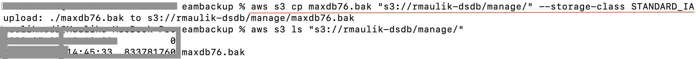
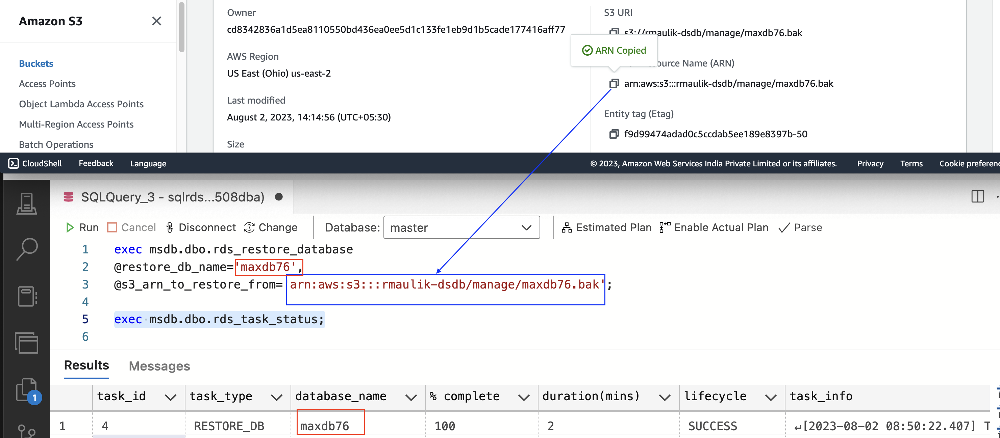
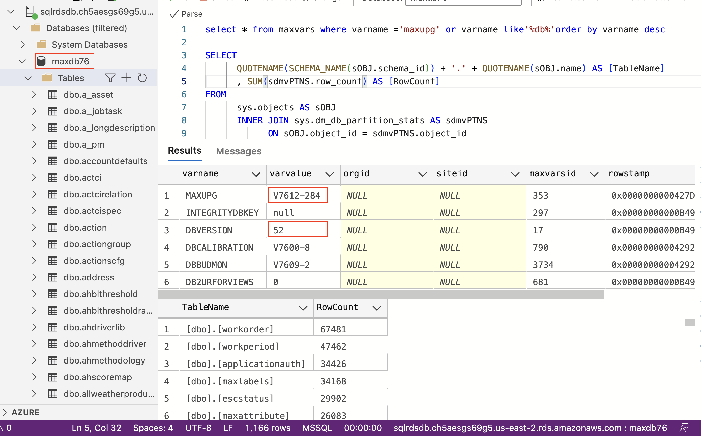

## Backup-Restore ##
As AWS RDS for SQL does not grant file system access, only option we have is to use AWS S3 as intermediate store.

### Upload database backup into AWS S3 ###
There are multiple ways to get database backup into AWS S3. Appropriate option can be used depending on Size of database backup, Upload internet speed, in-transit data protection requirements.

Simplest options are to use AWS Console or AWS S3 api to upload database backup into AWS S3.

CLI way of uploading into AWS S3 is illustrated here.


Sample code
```
aws s3 cp "maxdb76.bak" "s3://rmaulik-dsdb/manage/" --storage-class ONEZONE_IA
```

Advanced optins are to use AWS Private Link over VPN, Amazon S3 File Gateway.

### Restore to AWS RDS ###
You can run this query to restore database backup into AWS RDS
Sample Query

```
exec msdb.dbo.rds_restore_database
@restore_db_name='maximo86-demo-data',
@s3_arn_to_restore_from='arn:aws:s3:::rmaulik-dsdb/manage/maxe2e-v8600-1-demodata.bak';
```

To verify if restore is completed

```
exec msdb.dbo.rds_task_status @db_name='database_name'; 
```




### Verification ###
Run some queries to verify database is restored correctly, querable and usable.

