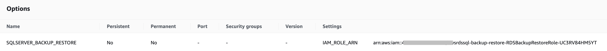

# User Initaited Backup-Restore #
As AWS RDS for SQL does not grant file system access to the user, only option we have is to use AWS S3 as the intermediate store.

AWS Frequently updates their documentation, [read here](https://docs.aws.amazon.com/AmazonRDS/latest/UserGuide/SQLServer.Procedural.Importing.html#SQLServer.Procedural.Importing.Native.Compression)

## Pre-requisites ##
AWS RDS SQL must have `SQLSERVER_BACKUP_RESTORE` `option settings` configured in `Option group`



 [More info here](https://docs.aws.amazon.com/AmazonRDS/latest/UserGuide/Appendix.SQLServer.Options.BackupRestore.html)

## Take database backup from the source Environment ##
AWS RDS Multi-AZ production grade deployment requires backups taken in `FULL` recovery mode, Please ensure database is set to `FULL` recovery mode before taking backup

### Capture database instance level properties ###

Get Collation details [collation details](https://codingsight.medium.com/collation-in-sql-server-a5fbfc3b5f9)

```
SELECT SERVERPROPERTY('Collation')
```

Get Timezone of the server, [more info](https://learn.microsoft.com/en-us/sql/t-sql/functions/current-timezone-transact-sql?view=sql-server-ver16)
```
SELECT CURRENT_TIMEZONE ( )
```

### Ensure Source database Recovery model is Full ##

Use this query to know recovery_model of current database
```
SELECT name, recovery_model_desc
FROM sys.databases
WHERE name = 'maxdb76';
GO
```

If `recovery_model` is other than `FULL`, Execute this query to change recovery model to `FULL`

```
ALTER DATABASE [maxdb76]
SET RECOVERY FULL;
```

### Take compressed backup And Split Backup into multiple files ###

Sometimes size of database backup can be more than 100 GB which can be challanging to transfer over the wire due to constraint in `bandwidth upload speed` and connection interruption, hence it is recommended to leverage `SPLITTING backup into multiple files` and use `COMPRESSION`

If processor supports then `COMPRESSION (ALGORITHM = QAT_DEFLATE)` can be specified or else leave just `COMPRESSION`

```
BACKUP DATABASE [<database_name>]
TO 
DISK=N'C:\BACKUP\maxdb76_1.bak',
DISK=N'C:\BACKUP\maxdb76_2.bak',
DISK=N'C:\BACKUP\maxdb76_3.bak',
DISK=N'C:\BACKUP\maxdb76_4.bak',
DISK=N'C:\BACKUP\maxdb76_5.bak'
WITH 
    COPY_ONLY,
    INIT, 
    CHECKSUM, 
    STATS=10, 
    COMPRESSION
```


### Inspecting the Backup ###

```
RESTORE HEADERONLY FROM DISK=N'C:\Softwares\backup\eam76.bak'
```

OR

```
RESTORE HEADERONLY FROM 
DISK=N'C:\Softwares\backup\maxdb76_1.bak',
DISK=N'C:\BACKUP\maxdb76_2.bak',
DISK=N'C:\BACKUP\maxdb76_3.bak',
DISK=N'C:\BACKUP\maxdb76_4.bak',
DISK=N'C:\BACKUP\maxdb76_5.bak'
```

Look for important fields such as 

- [x] `RecoveryModel` MUST be `FULL`
- [x] `BackupTypeDescription` WILL be `Database`
- [x] `CompatabilityLevel`: `150`:`SQL Server 2019` OR `160`:`SQL Server 2022` Refer [more info](https://learn.microsoft.com/en-us/sql/t-sql/statements/alter-database-transact-sql-compatibility-level?view=sql-server-ver16)
- [x] `Collation`: `SQL_Latin1_General_CP1_CI_AS`
- [x] `SoftwareVersionMajor`: `16`:`SQL Server 2022` OR `15`:`SQL Server 2019`
`SoftwareVersionMinor`:
- [x] `SoftwareVersionBuild`: Refer [SQL 2019 build versions](https://learn.microsoft.com/en-us/troubleshoot/sql/releases/sqlserver-2019/build-versions) or [SQL 2022 build versions](https://learn.microsoft.com/en-us/troubleshoot/sql/releases/sqlserver-2022/build-versions)

## Transfer database backup into AWS S3 ##
There are multiple ways to get database backup into AWS S3. Appropriate option can be used depending on Size of database backup, Upload internet speed, in-transit data protection requirements.

Simplest options are to use AWS Console or AWS S3 api to upload database backup into AWS S3.

CLI way of uploading into AWS S3 is illustrated here.


Sample code
```
aws s3 cp "maxdb76.bak" "s3://rmaulik-dsdb/manage/" --storage-class ONEZONE_IA
```

Advanced options are to use over VPN, trust establishment between AWS Accounts. Some examples are - AWS Private Link over VPN and Amazon S3 File Gateway.

## Restore to AWS RDS ##
You can run this query to restore database backup into AWS RDS
Sample Query

```
exec msdb.dbo.rds_restore_database
@restore_db_name='maxdb76',
@s3_arn_to_restore_from='arn:aws:s3:::rmaulik-dsdb/manage/maxdb76.bak';
```

Verfiy that `%complete` shows `100`, also observe value in `duration(mins)` to understand time taken to restore

```
exec msdb.dbo.rds_task_status @db_name='maxdb76'; 
```


Verify that database state is `ONLINE` and recovery model is `FULL`

```
SELECT 
name
,database_id
,state_desc
,recovery_model_desc
FROM sys.databases
WHERE name NOT IN
('master','msdb','tempdb','model','rdsadmin')
```

### Verification ###
Run some queries to verify database is restored correctly, querable and usable.

```

select * from maxvars where varname ='maxupg' or varname like'%db%'order by varname desc

SELECT
      QUOTENAME(SCHEMA_NAME(sOBJ.schema_id)) + '.' + QUOTENAME(sOBJ.name) AS [TableName]
      , SUM(sdmvPTNS.row_count) AS [RowCount]
FROM
      sys.objects AS sOBJ
      INNER JOIN sys.dm_db_partition_stats AS sdmvPTNS
            ON sOBJ.object_id = sdmvPTNS.object_id
WHERE 
      sOBJ.type = 'U'
      AND sOBJ.is_ms_shipped = 0x0
      AND sdmvPTNS.index_id < 2
GROUP BY
      sOBJ.schema_id
      , sOBJ.name
ORDER BY [RowCount] desc, [TableName] asc
GO
```


## Backup database from AWS RDS ##

### Turn ON S3 Backup compression ###
It is recommended to turn `ON` backup compression to save storage space and reduce the overall time to backup by running this query

```
exec rdsadmin..rds_set_configuration 'S3 backup compression', 'true';
```
To, see the effect of coompression, refer this screenshot showing difference in backup size and overall time to backup


### Split backup into multiple files ###
To ease the transfer of large size backup, you can split the database backup into multiple files, you can leverage ``number_of_files`` parameter to the ``rds_backup_database`` procedure, also specify
``@type`` parameter with value ``Full``

```
exec msdb.dbo.rds_backup_database
@source_db_name='maxdb76',
@s3_arn_to_backup_to='arn:aws:s3:::rmaulik-dsdb/manage/maximo-compress-part*.bak',
@type = 'Full',
@number_of_files=5;
```

Above execution will return `task_id` and `lifecycle` as `IN_PROGRESS` for subsequent verification of backup process completion. Please take a note of `task_id` that will be used in next query

To ensure your backup is fully complete, run query substituting `task_id` returned from previous query and verify that `lifecycle` shows `SUCCESS` and `%complete` shows `100`
```
exec msdb.dbo.rds_task_status @task_id=<<task_id>>; 
```

When backup is `split into multiple files` using `@number_of_files=5`, it will appear as follows in `S3`


### To restore multifile backup ###
Observe, all backup files to be restored here begin with a prefix `maximo-compress-part`

```
exec msdb.dbo.rds_restore_database
@restore_db_name='sampledb',
@type='FULL',
@with_norecovery=0,
@s3_arn_to_restore_from='arn:aws:s3:::rmaulik-dsdb/manage/maximo-compress-part*';
```


