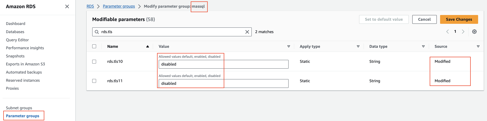
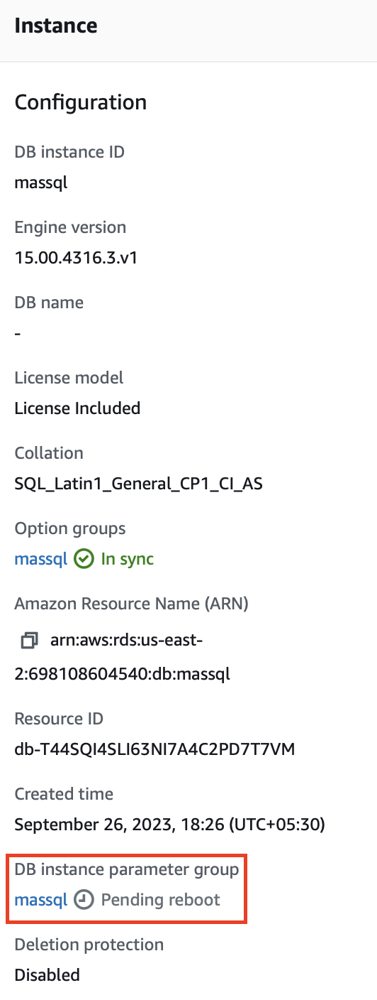

# Config Params #

## View modifiable params ##
AWS SQL Parameter group with name `massql` has several modifiable parameters that requires rebooting instance to take effect e.g. here we will see `TLS 1.0` and `TLS 1.1` support

Notice that when instance was created, `TLS 1.0` and `TLS 1.1` had value - `default` and it is modified to `disabled` from console



Effect of this modification is still not applied as we can see that 
DB Instance parameter group - `massql` requires `reboot`



## Static params that requires Reboot ##
```
SELECT [description]
,value 
,value_in_use
,minimum 
,maximum
,name
,is_advanced
FROM sys.configurations
WHERE is_dynamic=0;
```
|description|value|value_in_use|minimum|maximum|name|is_advanced|
|-----------|-----|------------|-------|-------|----|-----------|
|Number of user connections allowed|0|0|0|32767|user connections|1|
|Number of locks for all users|0|0|5000|2147483647|locks|1|
|Number of open database objects|0|0|0|2147483647|open objects|1|
|Default fill factor percentage|0|0|0|100|fill factor (%)|1|
|Allow remote access|1|1|0|1|remote access|0|
|c2 audit mode|0|0|0|1|c2 audit mode|1|
|Priority boost|0|0|0|1|priority boost|1|
|set working set size|0|0|0|1|set working set size|1|
|User mode scheduler uses lightweight pooling|0|0|0|1|lightweight pooling|1|
|scan for startup stored procedures|1|1|0|1|scan for startup procs|1|
|affinity I/O mask|0|0|-2147483648|2147483647|affinity I/O mask|1|
|affinity64 I/O mask|0|0|-2147483648|2147483647|affinity64 I/O mask|1|
|Automatic soft-NUMA is enabled by default|0|0|0|1|automatic soft-NUMA disabled|1|
|Type of enclave used for computations on encrypted columns|0|0|0|2|column encryption enclave type|0|
|Tempdb metadata memory-optimized is disabled by default.|0|0|0|1|tempdb metadata memory-optimized|1|
|Configure SQL Server to connect to external Hadoop or Microsoft Azure storage blob data sources through PolyBase|0|0|0|8|hadoop connectivity|0|


## Dynamic params that does not require Reboot ##
```
SELECT [description]
,value 
,value_in_use
,minimum 
,maximum
,name
,is_advanced
FROM sys.configurations
WHERE is_dynamic=0;
```

|description|value|value_in_use|minimum|maximum|name|is_advanced|is_dynamic|
|-----------|-----|------------|-------|-------|----|-----------|----------|
|Maximum recovery interval in minutes|0|0|0|32767|recovery interval (min)|1|1|
|Allow updates to system tables|0|0|0|1|allow updates|0|1|
|Disallow returning results from triggers|0|0|0|1|disallow results from triggers|1|1|
|Allow triggers to be invoked within triggers|1|1|0|1|nested triggers|0|1|
|Allow recursion for server level triggers|1|1|0|1|server trigger recursion|0|1|
|default language|0|0|0|9999|default language|0|1|
|Allow cross db ownership chaining|0|0|0|1|cross db ownership chaining|0|1|
|Maximum worker threads|0|0|128|65535|max worker threads|1|1|
|Network packet size|4096|4096|512|32767|network packet size (B)|1|1|
|show advanced options|1|1|0|1|show advanced options|0|1|
|Create DTC transaction for remote procedures|0|0|0|1|remote proc trans|0|1|
|default full-text language|1033|1033|0|2147483647|default full-text language|1|1|
|two digit year cutoff|2049|2049|1753|9999|two digit year cutoff|1|1|
|Memory for index create sorts (kBytes)|0|0|704|2147483647|index create memory (KB)|1|1|
|remote login timeout|20|20|0|2147483647|remote login timeout (s)|0|1|
|remote query timeout|600|600|0|2147483647|remote query timeout (s)|0|1|
|cursor threshold|-1|-1|-1|2147483647|cursor threshold|1|1|
|user options|0|0|0|32767|user options|0|1|
|affinity mask|0|0|-2147483648|2147483647|affinity mask|1|1|
|Maximum size of a text field in replication.|65536|65536|-1|2147483647|max text repl size (B)|0|1|
|Tape retention period in days|0|0|0|365|media retention|1|1|
|cost threshold for parallelism|5|5|0|32767|cost threshold for parallelism|1|1|
|maximum degree of parallelism|0|0|0|32767|max degree of parallelism|1|1|
|minimum memory per query (kBytes)|1024|1024|512|2147483647|min memory per query (KB)|1|1|
|maximum time to wait for query memory (s)|-1|-1|-1|2147483647|query wait (s)|1|1|
|Minimum size of server memory (MB)|0|16|0|2147483647|min server memory (MB)|1|1|
|Maximum size of server memory (MB)|13516|13516|128|2147483647|max server memory (MB)|1|1|
|Maximum estimated cost allowed by query governor|0|0|0|2147483647|query governor cost limit|1|1|
|affinity64 mask|0|0|-2147483648|2147483647|affinity64 mask|1|1|
|Transform noise words for full-text query|0|0|0|1|transform noise words|1|1|
|Use precomputed rank for full-text query|0|0|0|1|precompute rank|1|1|
|DB connection timeout for full-text protocol handler (s)|60|60|1|3600|PH timeout (s)|1|1|
|CLR user code execution enabled in the server|0|0|0|1|clr enabled|0|1|
|Maximum  crawl ranges allowed in full-text indexing|4|4|0|256|max full-text crawl range|1|1|
|Number of reserved full-text notifications buffers|0|0|0|32767|ft notify bandwidth (min)|1|1|
|Max number of full-text notifications buffers|100|100|0|32767|ft notify bandwidth (max)|1|1|
|Number of reserved full-text crawl buffers|0|0|0|32767|ft crawl bandwidth (min)|1|1|
|Max number of full-text crawl buffers|100|100|0|32767|ft crawl bandwidth (max)|1|1|
|Enable or disable the default trace|1|1|0|1|default trace enabled|1|1|
|Blocked process reporting threshold|0|0|0|86400|blocked process threshold (s)|1|1|
|Recovery policy for DTC transactions with unknown outcome|0|0|0|2|in-doubt xact resolution|1|1|
|Dedicated Admin Connections are allowed from remote clients|0|0|0|1|remote admin connections|0|1|
|Enable or disable EKM provider|0|0|0|1|EKM provider enabled|1|1|
|Enable compression of backups by default|1|1|0|1|backup compression default|0|1|
|Sets the FILESTREAM access level|0|0|0|2|filestream access level|0|1|
|When this option is set, plan cache size is further reduced for single-use adhoc OLTP workload.|0|0|0|1|optimize for ad hoc workloads|1|1|
|Default hash bucket count for the access check result security cache|0|0|0|65536|access check cache bucket count|1|1|
|Default quota for the access check result security cache|0|0|0|2147483647|access check cache quota|1|1|
|Enable checksum of backups by default|0|0|0|1|backup checksum default|0|1|
|Allows execution of external scripts|0|0|0|1|external scripts enabled|0|1|
|CLR strict security enabled in the server|1|1|0|1|clr strict security|1|1|
|ADR cleaner retry timeout.|0|0|0|32767|ADR cleaner retry timeout (min)|1|1|
|ADR Preallocation Factor.|0|0|0|32767|ADR Preallocation Factor|1|1|
|version high part of SQL Server that model database copied for|0|0|-2147483648|2147483647|version high part of SQL Server|1|1|
|version low part of SQL Server that model database copied for|0|0|-2147483648|2147483647|version low part of SQL Server|1|1|
|Enable or disable Agent XPs|1|1|0|1|Agent XPs|1|1|
|Enable or disable Database Mail XPs|0|0|0|1|Database Mail XPs|1|1|
|Enable or disable SMO and DMO XPs|1|1|0|1|SMO and DMO XPs|1|1|
|Enable or disable Ole Automation Procedures|0|0|0|1|Ole Automation Procedures|1|1|
|Enable or disable command shell|0|0|0|1|xp_cmdshell|1|1|
|Enable or disable Ad Hoc Distributed Queries|0|0|0|1|Ad Hoc Distributed Queries|1|1|
|Enable or disable Replication XPs|0|0|0|1|Replication XPs|1|1|
|Enables contained databases and contained authentication|0|0|0|1|contained database authentication|0|1|
|Configure SQL Server to encrypt control and data channels when using PolyBase|0|0|0|1|polybase network encryption|0|1|
|Allow the use of the REMOTE_DATA_ARCHIVE data access for databases|0|0|0|1|remote data archive|0|1|
|Allow INSERT into a Hadoop external table|0|0|0|1|allow polybase export|0|1|
|Allow enumeration of filesystem|0|0|0|1|allow filesystem enumeration|1|1|
|Configure SQL Server to connect to external data sources through PolyBase|0|0|0|1|polybase enabled|0|1|
