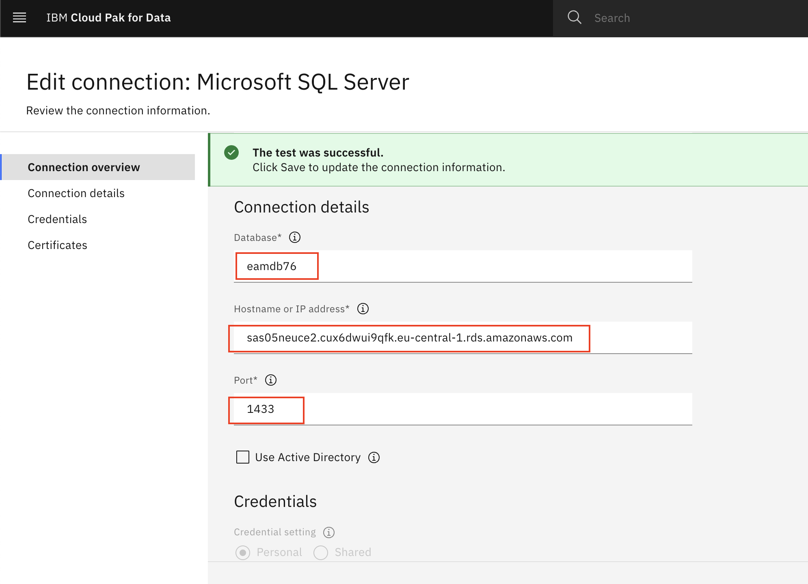

## Checklist ##
- [x] Verify that Remote connections are enabled
- [x] Verify that SQL Server and Windows authentication is enabled
- [x] Verify that TCP/IP is enabled (Sql server network configuration)
- [x] Verify that instance is listening on specific port e.g. 1433 (TCP/IP Properties > IPAll > remove dynamic port)
- [x] Verify that port is allowed in Inbound firewall rule (use wf.msc in RUN)
- [x] Verify that hyperscaler VM > Security group has SQL Server specific port opened
- [x] Verify that credentials are correct and user has access to the database
- [x] Verify connectivity using client tool from the same network if possible e.g.
`tnc <<IP | DNS>> -port <<MSSQL Specific Port>>`

https://www.redhat.com/en/blog/running-microsoft-sql-server-2019-openshift-using-red-hat-openshift-container-storage

## Screenshots ##
### Security group - Inbound rules ###


### Connectivity from the cluster ###
CloudPak4Data Platform connection allows connectivity test from the cluster


### JDBC Validation ###
As MAS requires JDBC connection string, construct it using this syntax
`jdbc:sqlserver://<RDSEndpoint>:<RDSPort>;encrypt=true;databaseName=<DbName>`

```
jdbc:sqlserver://sas05neuce2.cux6dwui9qfk.eu-central-1.rds.amazonaws.com:1433;encrypt=true;databaseName=eamdb76;
```


### SSL Certificate related ###
Locate AWS RDS PEM file corresponding to the region of your AWS RDS instance
Locate certificate authority used in AWS RDS Instance
Extract certificate block corresponding to the certificate authority used in AWS RDS Instance


### Bounce Maxinst ###
 oc scale --replicas=0 deployment/awstrn-rel-main-manage-maxinst

 oc scale --replicas=1 deployment/awstrn-rel-main-manage-maxinst

 ### Validation ##
#### Maxinst ####
```
Calling isValidDBConnection ...
Validating DB connection from script /opt/IBM/SMP/maximo/run-db.sh using the querycount utility to check for the maxvars table.
DB Connection return code = 0
Note: A return code of 0 (table found) or 1 (table not found) indicates a successful query via a valid DB connection and that an exception has not occurred. Otherwise, there's a problem connecting to the database.
isvalidconn.log

==================
DEBUG***:queryType=table
Found
==================
DB Validation is successful
status:dbconnex:success
Calling prepareDBC ...
Preparing DBC's
delserversession.dbc
```

```
BMXAA6818I - ValidateCryptoKey started for schema dbo, connected to database jdbc:sqlserver://sas05neuce2.cux6dwui9qfk.eu-central-1.rds.amazonaws.com:1433;encrypt=true;databaseName=eamdb76; Thu Jan 04 13:25:33 GMT 2024
...... Start to validate CRYPTO...... with key SP*****sa Thu Jan 04 13:25:33 GMT 2024
New crypto = SPoxAXzoSGbblqFwGVdpFdsa false Thu Jan 04 13:25:34 GMT 2024
Validating CRONTASKPARAM.CRYPTOVALUE Thu Jan 04 13:25:34 GMT 2024
Validating DDUSERAUTH.KEYID Thu Jan 04 13:25:34 GMT 2024
Validating DMPKGDSTTRGT.PASSWORD Thu Jan 04 13:25:34 GMT 2024
Validating INBOUNDCOMMCFG.EMAILPASSWORD Thu Jan 04 13:25:34 GMT 2024
Validating INBOUNDCOMMCFG.OAUTHACCESSTOKEN Thu Jan 04 13:25:34 GMT 2024
Validating INBOUNDCOMMCFG.OAUTHCLIENTID Thu Jan 04 13:25:34 GMT 2024
Validating INBOUNDCOMMCFG.OAUTHCLIENTSECRET Thu Jan 04 13:25:34 GMT 2024
Validating INBOUNDCOMMCFG.OAUTHREFRESHTOKEN Thu Jan 04 13:25:34 GMT 2024
Validating MAXENDPOINTDTL.PASSWORD Thu Jan 04 13:25:34 GMT 2024
/**** system#major A major exception has occurred. Check the system log to see if there are any companion errors logged. Report this error to your system administrator. ****/
psdi.util.MXApplicationException: system#major
at psdi.tools.ValidateCryptoKey.validate(ValidateCryptoKey.java:182)

...... Start to validate CRYPTO...... with key SP*****sa Thu Jan 04 13:25:33 GMT 2024
...... Start to validate CRYPTO...... with key SP*****sa Thu Jan 04 13:25:33 GMT 2024
New crypto = SPoxAXzoSGbblqFwGVdpFdsa false Thu Jan 04 13:25:34 GMT 2024
New crypto = SPoxAXzoSGbblqFwGVdpFdsa false Thu Jan 04 13:25:34 GMT 2024
Validating CRONTASKPARAM.CRYPTOVALUE Thu Jan 04 13:25:34 GMT 2024
Validating CRONTASKPARAM.CRYPTOVALUE Thu Jan 04 13:25:34 GMT 2024
Validating DDUSERAUTH.KEYID Thu Jan 04 13:25:34 GMT 2024
Validating DDUSERAUTH.KEYID Thu Jan 04 13:25:34 GMT 2024
Validating DMPKGDSTTRGT.PASSWORD Thu Jan 04 13:25:34 GMT 2024
Validating DMPKGDSTTRGT.PASSWORD Thu Jan 04 13:25:34 GMT 2024
Validating INBOUNDCOMMCFG.EMAILPASSWORD Thu Jan 04 13:25:34 GMT 2024
Validating INBOUNDCOMMCFG.EMAILPASSWORD Thu Jan 04 13:25:34 GMT 2024
Validating INBOUNDCOMMCFG.OAUTHACCESSTOKEN Thu Jan 04 13:25:34 GMT 2024
Validating INBOUNDCOMMCFG.OAUTHACCESSTOKEN Thu Jan 04 13:25:34 GMT 2024
Validating INBOUNDCOMMCFG.OAUTHCLIENTID Thu Jan 04 13:25:34 GMT 2024
Validating INBOUNDCOMMCFG.OAUTHCLIENTID Thu Jan 04 13:25:34 GMT 2024
Validating INBOUNDCOMMCFG.OAUTHCLIENTSECRET Thu Jan 04 13:25:34 GMT 2024
Validating INBOUNDCOMMCFG.OAUTHCLIENTSECRET Thu Jan 04 13:25:34 GMT 2024
Validating INBOUNDCOMMCFG.OAUTHREFRESHTOKEN Thu Jan 04 13:25:34 GMT 2024
Validating INBOUNDCOMMCFG.OAUTHREFRESHTOKEN Thu Jan 04 13:25:34 GMT 2024
Validating MAXENDPOINTDTL.PASSWORD Thu Jan 04 13:25:34 GMT 2024
Validating MAXENDPOINTDTL.PASSWORD Thu Jan 04 13:25:34 GMT 2024
system#major A major exception has occurred. Check the system log to see if there are any companion errors logged. Report this error to your system administrator.
psdi.util.MXApplicationException: system#major
at psdi.tools.ValidateCryptoKey.validate(ValidateCryptoKey.java:182)
at psdi.tools.ValidateCryptoKey.validateKey(ValidateCryptoKey.java:119)
at psdi.tools.ValidateCryptoKey.process(ValidateCryptoKey.java:82)
at psdi.tools.ValidateCryptoKey.main(ValidateCryptoKey.java:271)
Caused by: java.lang.Exception
... 4 more
/**** system#major A major exception has occurred. Check the system log to see if there are any companion errors logged. Report this error to your system administrator. ****/
system#major Thu Jan 04 13:25:34 GMT 2024
system#major Thu Jan 04 13:25:34 GMT 2024
BMXAA6819I - ValidateCryptoKey completed with errors. Thu Jan 04 13:25:34 GMT 2024
BMXAA6819I - ValidateCryptoKey completed with errors. Thu Jan 04 13:25:34 GMT 2024
Failed: Crypto Keys do not match what database uses. UpdateDB will not run.
status: invalid keys
```

### Crypto key error ###
Navigate to maximo directory
```
/opt/IBM/SMP/maximo/tools/maximo
```

Execute validate crypto key
```
./validatecryptokey.sh 
```

Crypto error log
```
Thu Jan 04 14:01:17 GMT 2024 --- Starting ----
BMXAA6806I - Reading the properties file maximo.properties.
Instance of psdi.tools.ValidateCryptoKey
04 Jan 2024 14:01:19:777 [WARN ] [maximo] BMXAA6423W - The value for MAXPROP mxe.com.port could not be cached.  No value for the property was found.
04 Jan 2024 14:01:19:825 [WARN ] [maximo] BMXAA6423W - The value for MAXPROP mxe.db.DB2sslConnection could not be cached.  No value for the property was found.
04 Jan 2024 14:01:19:827 [WARN ] [maximo] BMXAA6423W - The value for MAXPROP mxe.db.DB2sslTrustStoreLocation could not be cached.  No value for the property was found.
04 Jan 2024 14:01:19:828 [WARN ] [maximo] BMXAA6423W - The value for MAXPROP mxe.db.DB2sslTrustStorePassword could not be cached.  No value for the property was found.
04 Jan 2024 14:01:20:358 [WARN ] [maximo] BMXAA6423W - The value for MAXPROP mxe.rmi.port could not be cached.  No value for the property was found.
BMXAA6818I - ValidateCryptoKey started for schema dbo, connected to database jdbc:sqlserver://sas05neuce2.cux6dwui9qfk.eu-central-1.rds.amazonaws.com:1433;encrypt=true;databaseName=eamdb76; Thu Jan 04 14:01:21 GMT 2024
BMXAA6818I - ValidateCryptoKey started for schema dbo, connected to database jdbc:sqlserver://sas05neuce2.cux6dwui9qfk.eu-central-1.rds.amazonaws.com:1433;encrypt=true;databaseName=eamdb76; Thu Jan 04 14:01:21 GMT 2024
...... Start to validate CRYPTO...... with key SP*****sa Thu Jan 04 14:01:21 GMT 2024
...... Start to validate CRYPTO...... with key SP*****sa Thu Jan 04 14:01:21 GMT 2024
New crypto =    SPoxAXzoSGbblqFwGVdpFdsa   false Thu Jan 04 14:01:21 GMT 2024
New crypto =    SPoxAXzoSGbblqFwGVdpFdsa   false Thu Jan 04 14:01:21 GMT 2024
Validating CRONTASKPARAM.CRYPTOVALUE Thu Jan 04 14:01:21 GMT 2024
Validating CRONTASKPARAM.CRYPTOVALUE Thu Jan 04 14:01:21 GMT 2024
Validating DDUSERAUTH.KEYID Thu Jan 04 14:01:21 GMT 2024
Validating DDUSERAUTH.KEYID Thu Jan 04 14:01:21 GMT 2024
Validating DMPKGDSTTRGT.PASSWORD Thu Jan 04 14:01:21 GMT 2024
Validating DMPKGDSTTRGT.PASSWORD Thu Jan 04 14:01:21 GMT 2024
Validating INBOUNDCOMMCFG.EMAILPASSWORD Thu Jan 04 14:01:21 GMT 2024
Validating INBOUNDCOMMCFG.EMAILPASSWORD Thu Jan 04 14:01:21 GMT 2024
Validating INBOUNDCOMMCFG.OAUTHACCESSTOKEN Thu Jan 04 14:01:21 GMT 2024
Validating INBOUNDCOMMCFG.OAUTHACCESSTOKEN Thu Jan 04 14:01:21 GMT 2024
Validating INBOUNDCOMMCFG.OAUTHCLIENTID Thu Jan 04 14:01:21 GMT 2024
Validating INBOUNDCOMMCFG.OAUTHCLIENTID Thu Jan 04 14:01:21 GMT 2024
Validating INBOUNDCOMMCFG.OAUTHCLIENTSECRET Thu Jan 04 14:01:21 GMT 2024
Validating INBOUNDCOMMCFG.OAUTHCLIENTSECRET Thu Jan 04 14:01:21 GMT 2024
Validating INBOUNDCOMMCFG.OAUTHREFRESHTOKEN Thu Jan 04 14:01:21 GMT 2024
Validating INBOUNDCOMMCFG.OAUTHREFRESHTOKEN Thu Jan 04 14:01:21 GMT 2024
Validating MAXENDPOINTDTL.PASSWORD Thu Jan 04 14:01:21 GMT 2024
Validating MAXENDPOINTDTL.PASSWORD Thu Jan 04 14:01:21 GMT 2024
javax.crypto.BadPaddingException: Given final block not properly padded. Such issues can arise if a bad key is used during decryption.
        at java.base/com.sun.crypto.provider.CipherCore.unpad(CipherCore.java:1027)
        at java.base/com.sun.crypto.provider.CipherCore.fillOutputBuffer(CipherCore.java:1108)
        at java.base/com.sun.crypto.provider.CipherCore.doFinal(CipherCore.java:905)
        at java.base/com.sun.crypto.provider.DESedeCipher.engineDoFinal(DESedeCipher.java:294)
        at java.base/javax.crypto.Cipher.doFinal(Cipher.java:2202)
        at psdi.util.MXCipher.decData(MXCipher.java:293)
        at psdi.tools.ValidateCryptoKey.validate(ValidateCryptoKey.java:172)
        at psdi.tools.ValidateCryptoKey.validateKey(ValidateCryptoKey.java:119)
        at psdi.tools.ValidateCryptoKey.process(ValidateCryptoKey.java:82)
        at psdi.tools.ValidateCryptoKey.main(ValidateCryptoKey.java:271)
system#major  A major exception has occurred. Check the system log to see if there are any companion errors logged. Report this error to your system administrator.
psdi.util.MXApplicationException: system#major
        at psdi.tools.ValidateCryptoKey.validate(ValidateCryptoKey.java:182)
        at psdi.tools.ValidateCryptoKey.validateKey(ValidateCryptoKey.java:119)
        at psdi.tools.ValidateCryptoKey.process(ValidateCryptoKey.java:82)
        at psdi.tools.ValidateCryptoKey.main(ValidateCryptoKey.java:271)
Caused by: java.lang.Exception
        ... 4 more
/**** system#major  A major exception has occurred. Check the system log to see if there are any companion errors logged. Report this error to your system administrator. ****/
system#major Thu Jan 04 14:01:21 GMT 2024
system#major Thu Jan 04 14:01:21 GMT 2024
BMXAA6819I - ValidateCryptoKey completed with errors. Thu Jan 04 14:01:21 GMT 2024
BMXAA6819I - ValidateCryptoKey completed with errors. Thu Jan 04 14:01:21 GMT 2024
sh-4.4$ ./validatecryptokey.sh 
Thu Jan 04 14:01:27 GMT 2024 --- Starting ----
BMXAA6806I - Reading the properties file maximo.properties.
Instance of psdi.tools.ValidateCryptoKey
04 Jan 2024 14:01:29:495 [WARN ] [maximo] BMXAA6423W - The value for MAXPROP mxe.com.port could not be cached.  No value for the property was found.
04 Jan 2024 14:01:29:544 [WARN ] [maximo] BMXAA6423W - The value for MAXPROP mxe.db.DB2sslConnection could not be cached.  No value for the property was found.
04 Jan 2024 14:01:29:546 [WARN ] [maximo] BMXAA6423W - The value for MAXPROP mxe.db.DB2sslTrustStoreLocation could not be cached.  No value for the property was found.
04 Jan 2024 14:01:29:547 [WARN ] [maximo] BMXAA6423W - The value for MAXPROP mxe.db.DB2sslTrustStorePassword could not be cached.  No value for the property was found.
04 Jan 2024 14:01:30:097 [WARN ] [maximo] BMXAA6423W - The value for MAXPROP mxe.rmi.port could not be cached.  No value for the property was found.
BMXAA6818I - ValidateCryptoKey started for schema dbo, connected to database jdbc:sqlserver://sas05neuce2.cux6dwui9qfk.eu-central-1.rds.amazonaws.com:1433;encrypt=true;databaseName=eamdb76; Thu Jan 04 14:01:30 GMT 2024
BMXAA6818I - ValidateCryptoKey started for schema dbo, connected to database jdbc:sqlserver://sas05neuce2.cux6dwui9qfk.eu-central-1.rds.amazonaws.com:1433;encrypt=true;databaseName=eamdb76; Thu Jan 04 14:01:30 GMT 2024
...... Start to validate CRYPTO...... with key SP*****sa Thu Jan 04 14:01:30 GMT 2024
...... Start to validate CRYPTO...... with key SP*****sa Thu Jan 04 14:01:30 GMT 2024
New crypto =    SPoxAXzoSGbblqFwGVdpFdsa   false Thu Jan 04 14:01:30 GMT 2024
New crypto =    SPoxAXzoSGbblqFwGVdpFdsa   false Thu Jan 04 14:01:30 GMT 2024
Validating CRONTASKPARAM.CRYPTOVALUE Thu Jan 04 14:01:30 GMT 2024
Validating CRONTASKPARAM.CRYPTOVALUE Thu Jan 04 14:01:30 GMT 2024
Validating DDUSERAUTH.KEYID Thu Jan 04 14:01:30 GMT 2024
Validating DDUSERAUTH.KEYID Thu Jan 04 14:01:30 GMT 2024
Validating DMPKGDSTTRGT.PASSWORD Thu Jan 04 14:01:30 GMT 2024
sh-4.4$ ./validatecryptokey.sh 
Thu Jan 04 14:02:19 GMT 2024 --- Starting ----
BMXAA6806I - Reading the properties file maximo.properties.
Instance of psdi.tools.ValidateCryptoKey
04 Jan 2024 14:02:22:233 [WARN ] [maximo] BMXAA6423W - The value for MAXPROP mxe.com.port could not be cached.  No value for the property was found.
04 Jan 2024 14:02:22:283 [WARN ] [maximo] BMXAA6423W - The value for MAXPROP mxe.db.DB2sslConnection could not be cached.  No value for the property was found.
04 Jan 2024 14:02:22:284 [WARN ] [maximo] BMXAA6423W - The value for MAXPROP mxe.db.DB2sslTrustStoreLocation could not be cached.  No value for the property was found.
04 Jan 2024 14:02:22:286 [WARN ] [maximo] BMXAA6423W - The value for MAXPROP mxe.db.DB2sslTrustStorePassword could not be cached.  No value for the property was found.
04 Jan 2024 14:02:22:801 [WARN ] [maximo] BMXAA6423W - The value for MAXPROP mxe.rmi.port could not be cached.  No value for the property was found.
BMXAA6818I - ValidateCryptoKey started for schema dbo, connected to database jdbc:sqlserver://sas05neuce2.cux6dwui9qfk.eu-central-1.rds.amazonaws.com:1433;encrypt=true;databaseName=eamdb76; Thu Jan 04 14:02:23 GMT 2024
BMXAA6818I - ValidateCryptoKey started for schema dbo, connected to database jdbc:sqlserver://sas05neuce2.cux6dwui9qfk.eu-central-1.rds.amazonaws.com:1433;encrypt=true;databaseName=eamdb76; Thu Jan 04 14:02:23 GMT 2024
...... Start to validate CRYPTO...... with key SP*****sa Thu Jan 04 14:02:23 GMT 2024
...... Start to validate CRYPTO...... with key SP*****sa Thu Jan 04 14:02:23 GMT 2024
New crypto =    SPoxAXzoSGbblqFwGVdpFdsa   false Thu Jan 04 14:02:23 GMT 2024
New crypto =    SPoxAXzoSGbblqFwGVdpFdsa   false Thu Jan 04 14:02:23 GMT 2024
Validating CRONTASKPARAM.CRYPTOVALUE Thu Jan 04 14:02:23 GMT 2024
Validating CRONTASKPARAM.CRYPTOVALUE Thu Jan 04 14:02:23 GMT 2024
Validating DDUSERAUTH.KEYID Thu Jan 04 14:02:23 GMT 2024
Validating DDUSERAUTH.KEYID Thu Jan 04 14:02:23 GMT 2024
Validating DMPKGDSTTRGT.PASSWORD Thu Jan 04 14:02:23 GMT 2024
Validating DMPKGDSTTRGT.PASSWORD Thu Jan 04 14:02:23 GMT 2024
Validating INBOUNDCOMMCFG.EMAILPASSWORD Thu Jan 04 14:02:23 GMT 2024
Validating INBOUNDCOMMCFG.EMAILPASSWORD Thu Jan 04 14:02:23 GMT 2024
Validating INBOUNDCOMMCFG.OAUTHACCESSTOKEN Thu Jan 04 14:02:23 GMT 2024
Validating INBOUNDCOMMCFG.OAUTHACCESSTOKEN Thu Jan 04 14:02:23 GMT 2024
Validating INBOUNDCOMMCFG.OAUTHCLIENTID Thu Jan 04 14:02:23 GMT 2024
Validating INBOUNDCOMMCFG.OAUTHCLIENTID Thu Jan 04 14:02:23 GMT 2024
Validating INBOUNDCOMMCFG.OAUTHCLIENTSECRET Thu Jan 04 14:02:23 GMT 2024
Validating INBOUNDCOMMCFG.OAUTHCLIENTSECRET Thu Jan 04 14:02:23 GMT 2024
Validating INBOUNDCOMMCFG.OAUTHREFRESHTOKEN Thu Jan 04 14:02:23 GMT 2024
Validating INBOUNDCOMMCFG.OAUTHREFRESHTOKEN Thu Jan 04 14:02:23 GMT 2024
Validating MAXENDPOINTDTL.PASSWORD Thu Jan 04 14:02:23 GMT 2024
Validating MAXENDPOINTDTL.PASSWORD Thu Jan 04 14:02:23 GMT 2024
javax.crypto.BadPaddingException: Given final block not properly padded. Such issues can arise if a bad key is used during decryption.
        at java.base/com.sun.crypto.provider.CipherCore.unpad(CipherCore.java:1027)
        at java.base/com.sun.crypto.provider.CipherCore.fillOutputBuffer(CipherCore.java:1108)
        at java.base/com.sun.crypto.provider.CipherCore.doFinal(CipherCore.java:905)
        at java.base/com.sun.crypto.provider.DESedeCipher.engineDoFinal(DESedeCipher.java:294)
        at java.base/javax.crypto.Cipher.doFinal(Cipher.java:2202)
        at psdi.util.MXCipher.decData(MXCipher.java:293)
        at psdi.tools.ValidateCryptoKey.validate(ValidateCryptoKey.java:172)
        at psdi.tools.ValidateCryptoKey.validateKey(ValidateCryptoKey.java:119)
        at psdi.tools.ValidateCryptoKey.process(ValidateCryptoKey.java:82)
        at psdi.tools.ValidateCryptoKey.main(ValidateCryptoKey.java:271)
system#major  A major exception has occurred. Check the system log to see if there are any companion errors logged. Report this error to your system administrator.
psdi.util.MXApplicationException: system#major
        at psdi.tools.ValidateCryptoKey.validate(ValidateCryptoKey.java:182)
        at psdi.tools.ValidateCryptoKey.validateKey(ValidateCryptoKey.java:119)
        at psdi.tools.ValidateCryptoKey.process(ValidateCryptoKey.java:82)
        at psdi.tools.ValidateCryptoKey.main(ValidateCryptoKey.java:271)
Caused by: java.lang.Exception
        ... 4 more
/**** system#major  A major exception has occurred. Check the system log to see if there are any companion errors logged. Report this error to your system administrator. ****/
system#major Thu Jan 04 14:02:23 GMT 2024
system#major Thu Jan 04 14:02:23 GMT 2024
BMXAA6819I - ValidateCryptoKey completed with errors. Thu Jan 04 14:02:23 GMT 2024
BMXAA6819I - ValidateCryptoKey completed with errors. Thu Jan 04 14:02:23 GMT 2024
```

###successful execution of crypto key ###

```

Sibandi Likuwa
  2 months ago
bash-4.4$ ./validatecryptokey.sh 
Fri Nov 17 02:00:18 GMT 2023 --- Starting ----
BMXAA6806I - Reading the properties file maximo.properties.
BMXAA6814W - ValidateCryptoKey Connection warning: com.ibm.db2.jcc.am.SqlWarning: DB2 SQL Warning: SQLCODE=0, SQLSTATE=00000, SQLERRMC=1;1208;PWCSPROD;BLUDB;QDB2/LINUXX8664;839;839;0;1208;1;0;, DRIVER=4.32.28
Instance of psdi.tools.ValidateCryptoKey
17 Nov 2023 02:00:33:522 [WARN ] [maximo] BMXAA6423W - The value for MAXPROP mxe.com.port could not be cached.  No value for the property was found.
17 Nov 2023 02:00:34:090 [WARN ] [maximo] BMXAA6423W - The value for MAXPROP mxe.rmi.port could not be cached.  No value for the property was found.
BMXAA6818I - ValidateCryptoKey started for schema MAXIMO, connected to database jdbc:db2://c-db2wh-1698834735482140-db2u-engn-svc.mas-cpd.svc:50001/BLUDB:sslConnection=true; Fri Nov 17 02:00:42 GMT 2023
BMXAA6818I - ValidateCryptoKey started for schema MAXIMO, connected to database jdbc:db2://c-db2wh-1698834735482140-db2u-engn-svc.mas-cpd.svc:50001/BLUDB:sslConnection=true; Fri Nov 17 02:00:42 GMT 2023
...... Start to validate CRYPTO...... with key xN*****xO Fri Nov 17 02:00:42 GMT 2023
...... Start to validate CRYPTO...... with key xN*****xO Fri Nov 17 02:00:42 GMT 2023
New crypto =    xNaHOvfLNCGIZMeVBgGNuUxO   false Fri Nov 17 02:00:42 GMT 2023
New crypto =    xNaHOvfLNCGIZMeVBgGNuUxO   false Fri Nov 17 02:00:42 GMT 2023
Validating CRONTASKPARAM.CRYPTOVALUE Fri Nov 17 02:00:42 GMT 2023
Validating CRONTASKPARAM.CRYPTOVALUE Fri Nov 17 02:00:42 GMT 2023
Validating DDUSERAUTH.KEYID Fri Nov 17 02:00:42 GMT 2023
Validating DDUSERAUTH.KEYID Fri Nov 17 02:00:42 GMT 2023
Validating DMPKGDSTTRGT.PASSWORD Fri Nov 17 02:00:42 GMT 2023
Validating DMPKGDSTTRGT.PASSWORD Fri Nov 17 02:00:42 GMT 2023
Validating INBOUNDCOMMCFG.EMAILPASSWORD Fri Nov 17 02:00:42 GMT 2023
Validating INBOUNDCOMMCFG.EMAILPASSWORD Fri Nov 17 02:00:42 GMT 2023
Validating INBOUNDCOMMCFG.OAUTHACCESSTOKEN Fri Nov 17 02:00:42 GMT 2023
Validating INBOUNDCOMMCFG.OAUTHACCESSTOKEN Fri Nov 17 02:00:42 GMT 2023
Validating INBOUNDCOMMCFG.OAUTHCLIENTID Fri Nov 17 02:00:42 GMT 2023
Validating INBOUNDCOMMCFG.OAUTHCLIENTID Fri Nov 17 02:00:42 GMT 2023
Validating INBOUNDCOMMCFG.OAUTHCLIENTSECRET Fri Nov 17 02:00:42 GMT 2023
Validating INBOUNDCOMMCFG.OAUTHCLIENTSECRET Fri Nov 17 02:00:42 GMT 2023
Validating INBOUNDCOMMCFG.OAUTHREFRESHTOKEN Fri Nov 17 02:00:42 GMT 2023
Validating INBOUNDCOMMCFG.OAUTHREFRESHTOKEN Fri Nov 17 02:00:42 GMT 2023
Validating MAXENDPOINTDTL.PASSWORD Fri Nov 17 02:00:42 GMT 2023
Validating MAXENDPOINTDTL.PASSWORD Fri Nov 17 02:00:42 GMT 2023
Validating MAXINTMAPPINGDETAIL.PASSWORD Fri Nov 17 02:00:42 GMT 2023
Validating MAXINTMAPPINGDETAIL.PASSWORD Fri Nov 17 02:00:42 GMT 2023
Validating MAXPROPVALUE.ENCRYPTEDVALUE Fri Nov 17 02:00:42 GMT 2023
Validating MAXPROPVALUE.ENCRYPTEDVALUE Fri Nov 17 02:00:42 GMT 2023
Validating MAXPUSHPROVIDERDEVTYPE.APNCERTIFICATEPASSWORD Fri Nov 17 02:00:42 GMT 2023
Validating MAXPUSHPROVIDERDEVTYPE.APNCERTIFICATEPASSWORD Fri Nov 17 02:00:42 GMT 2023
Validating MAXPUSHPROVIDERDEVTYPE.IPNAPIKEY Fri Nov 17 02:00:42 GMT 2023
Validating MAXPUSHPROVIDERDEVTYPE.IPNAPIKEY Fri Nov 17 02:00:42 GMT 2023
Validating MAXPUSHPROVIDERDEVTYPE.IPNCLIENTSECRET Fri Nov 17 02:00:42 GMT 2023
Validating MAXPUSHPROVIDERDEVTYPE.IPNCLIENTSECRET Fri Nov 17 02:00:42 GMT 2023
Validating MAXQUEUE.PASSWORD Fri Nov 17 02:00:42 GMT 2023
Validating MAXQUEUE.PASSWORD Fri Nov 17 02:00:42 GMT 2023
Validating MAXQUEUE.PROVIDERPASSWORD Fri Nov 17 02:00:42 GMT 2023
Validating MAXQUEUE.PROVIDERPASSWORD Fri Nov 17 02:00:42 GMT 2023
Validating MAXUSER.PWHINTANSWER Fri Nov 17 02:00:42 GMT 2023
Validating MAXUSER.PWHINTANSWER Fri Nov 17 02:00:42 GMT 2023
Validating MSGHUBPROVIDERCFG.PROPENCVALUE Fri Nov 17 02:00:42 GMT 2023
Validating MSGHUBPROVIDERCFG.PROPENCVALUE Fri Nov 17 02:00:42 GMT 2023
Validating MXODMAPP.OPTSNDBPASSWORD Fri Nov 17 02:00:42 GMT 2023
Validating MXODMAPP.OPTSNDBPASSWORD Fri Nov 17 02:00:42 GMT 2023
Validating REPORTDSPARAM.PASSWORD Fri Nov 17 02:00:42 GMT 2023
Validating REPORTDSPARAM.PASSWORD Fri Nov 17 02:00:42 GMT 2023
Validating WEATHERENDPOINT.PASSWORD Fri Nov 17 02:00:42 GMT 2023
Validating WEATHERENDPOINT.PASSWORD Fri Nov 17 02:00:42 GMT 2023
Validating WEATHERORG.CLIENTSECRET Fri Nov 17 02:00:42 GMT 2023
Validating WEATHERORG.CLIENTSECRET Fri Nov 17 02:00:42 GMT 2023
Validating APIKEYTOKEN.APIKEY Fri Nov 17 02:00:42 GMT 2023
Validating APIKEYTOKEN.APIKEY Fri Nov 17 02:00:42 GMT 2023
BMXAA6820I - ValidateCryptoKey completed without errors. Fri Nov 17 02:00:42 GMT 2023
BMXAA6820I - ValidateCryptoKey completed without errors. Fri Nov 17 02:00:42 GMT 2023
bash-4.4$ 
```

#### Crypto keys####
```
MXE_SECURITY_CRYPTOX_KEY
MXE_SECURITY_CRYPTO_KEY
MXE_SECURITY_OLD_CRYPTOX_KEY
MXE_SECURITY_OLD_CRYPTO_KEY
```