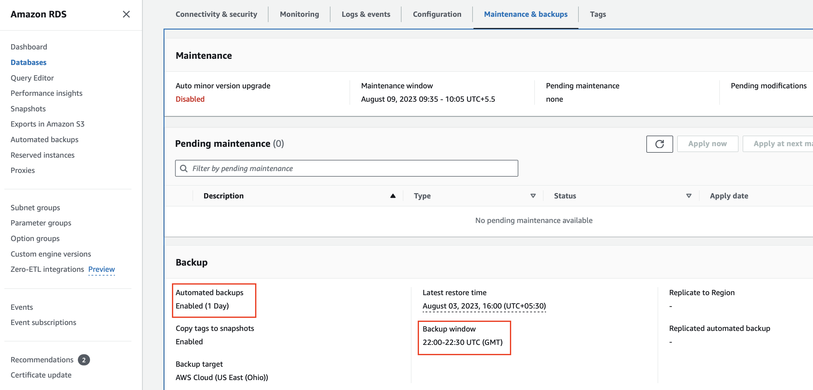
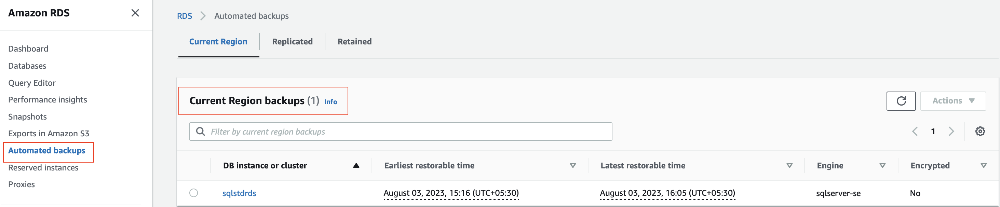
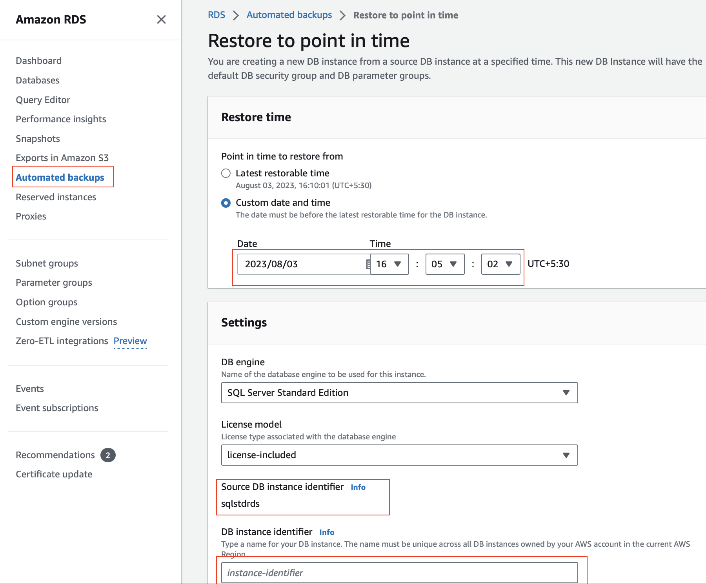

# Data Recoverability #
## Purpose ##
Data corruption can happen due to many reasons e.g. accidentially deletion/manipulation records from important tables. Also, hardware failure/outage may cause data loss. Hence, strong data recoverability strategy is required.

These settings require alignment with Service level agreemnts.

## Automated Backup ##
Configuring automated backup requires defining,
1. Retention period 
2. Backup window(30 minutes) in UTC 
3. (Optional) Replicating region

When Automated Backup is configured, screenshot may look like this

Automated backups for Current region can be seen in this screen

## PITR (Point in time recovery)
AWS RDS allows recovery upto last 30 minutes from current timestamp, refer this screenshot

[More details](https://docs.aws.amazon.com/AmazonRDS/latest/UserGuide/USER_PIT.html)
