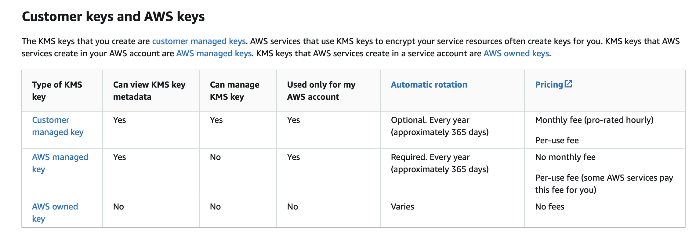
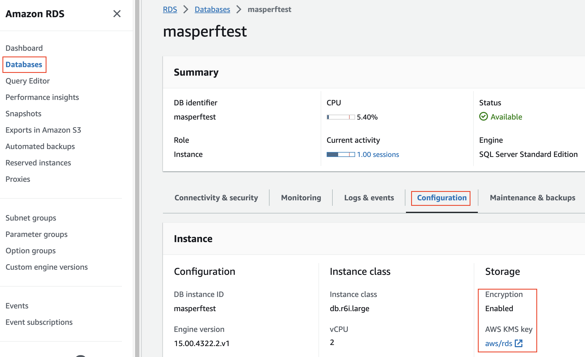
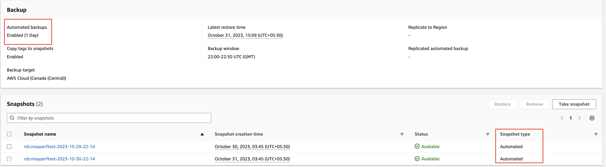
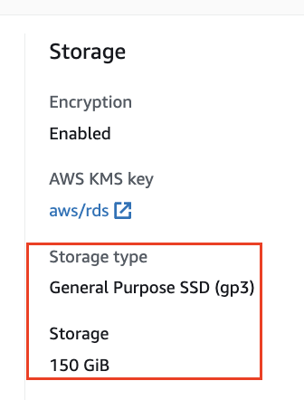
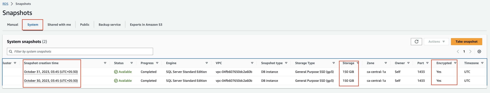

# Data Protection - at rest #

## Option 1 - Use AWS RDS KMS Key ##

Refer this image to understand capabilities and feature  

There are some inherent limitations with AWS RDS based KMS key encryption
- Only supports Symmetric encryption
- Can only be used within AWS environments, customer must be having AWS account
- AWS KMS Encrypted backup cannot be restored to non-AWS environment

### Option 1a - Use AWS Managed keys ###
- Starts with aws/ prefix
- <code style="color : green"> Cannot be Deleted or modified </code>
- Free
- Exclusively used by AWS Managed services e.g. AWS RDS SQL in this case
- Cannot be used for your own operations 
- <code style="color : red"> Per AWS Account per Region </code>
- Can only be used for Entire RDS instance Snapshot Encryption
- <code style="color : red">Cannot be used for backing up individual database </code>

When AWS RDS instance is encrypted using AWS managed key, we can see it under `Databases` > `Configuration` > `Storage` > `Encryption: Enabled` and `AWS KMS key:` `aws/rds` as seen in the image below:

`Automated backups` enabled with `1 day` retention period:

 

Configured storage size is `150 GB` as seen in this screenshot

As, we have enabled `Automated backups`, we can see `system snapshots` taken are `encrypted: Yes` and `size of snapshot` is `150 GB` as per the `provisioned storage` 

### Option 1b - Use Customer Managed keys ###

## Relevent references
https://repost.aws/knowledge-center/s3-object-encryption-keys
https://repost.aws/knowledge-center/rds-sql-server-restore-kms-encrypted-backup
https://docs.aws.amazon.com/kms/latest/developerguide/rotate-keys.html
https://docs.aws.amazon.com/kms/latest/developerguide/key-policies.html
https://docs.aws.amazon.com/AmazonRDS/latest/UserGuide/Appendix.SQLServer.Options.TDE.html

## Option 2 - TDE (Transparent data encryption) ##

[TDE in AWS RDS SQL - AWS Docs](https://docs.aws.amazon.com/AmazonRDS/latest/UserGuide/Appendix.SQLServer.Options.TDE.html#TDE.Limitations)

# Data Protection - in transit #
