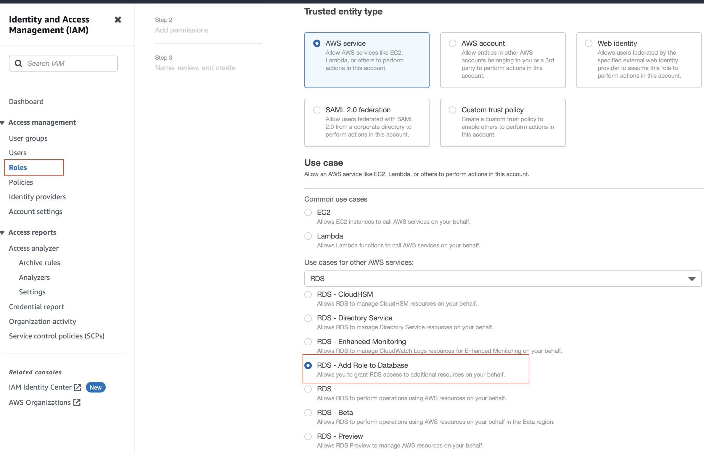
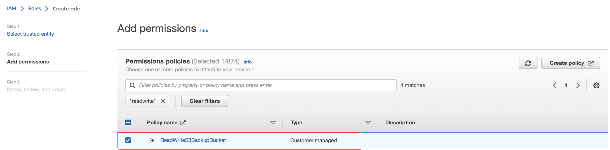
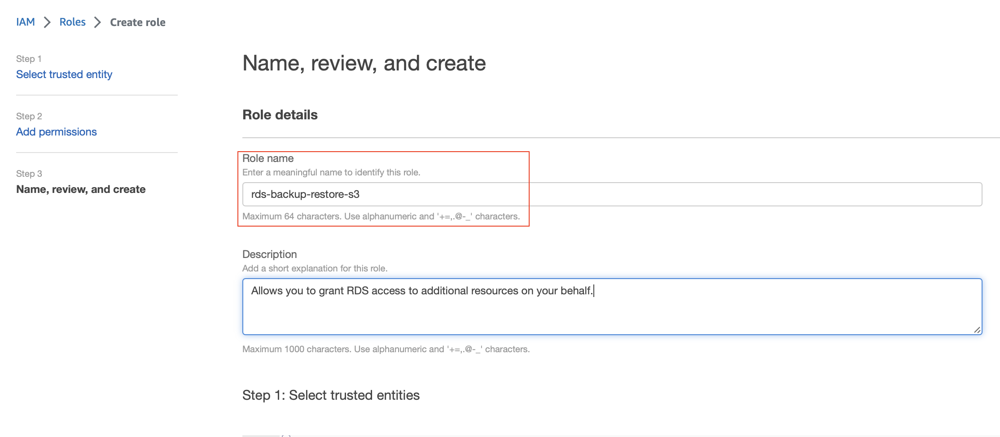

# IAM Role #
## Backup-Restore ##
### Purpose ###
To restore on-premise database in AWS RDS Database Instance OR To take user initiated database backup of an existing database on AWS RDS Database Instance.

By default, AWS RDS Database Instance does not have access to any object storage resources in Customer's AWS account. Hence, Cloud Engineer/Administrator needs to create/designate an intermediate S3 Bucket, Prefix that acts as a staging location for database backup and associated AWS Service role that has permission to read/write from S3 bucket > Prefix.

### Steps ###
1. Create S3 Bucket & Prefix
2. Create IAM Policy with JSON definition shown below replacing ``MY-MAS-DB-BACKUP-BUCKET`` and ``MY-PREFIX`` as per step 1, you may name it ``ReadWriteS3BackupBucket``
```
{
    "Version": "2012-10-17",
    "Statement": [
        {
            "Effect": "Allow",
            "Action": [
                "s3:ListBucket",
                "s3:GetBucketLocation"
            ],
            "Resource": [
                "arn:aws:s3:::<<MY-MAS-DB-BACKUP-BUCKET>>"
            ]
        },
        {
            "Effect": "Allow",
            "Action": [
                "s3:GetObjectMetaData",
                "s3:GetObject",
                "s3:PutObject",
                "s3:ListMultipartUploadParts",
                "s3:AbortMultipartUpload"
            ],
            "Resource": [
                "arn:aws:s3:::<<MY-MAS-DB-BACKUP-BUCKET>>/<<MY-PREFIX>>/*"
            ]
        }
    ]
}
```
3. Create AWS Service Role for AWS RDS
   Create role requires 1. creating trusted entitity, 2. assigning permission policy and 3. naming role
   
    1. Select AWS Service as trusted entity type, RDS as AWS Service and RDS - Add Role to Database as the use case

    Refer picture below
    

    2. Assign permission policy e.g. ``ReadWriteS3BackupBucket`` as created in previous step

    Refer picture below
     

    3. Specify name of role e.g. ```rds-backup-restore-s3```

    Refer picture below
      

## Auditing ##
Coming Soon!

## Granting permissions to Users ##
To start with, use built-in policies e.g. AWS managed policy: AmazonRDSReadOnlyAccess can be assigned so users can observe the infrastructure but cannot modify anything that affects the infrastructure.

[Managed Policy](https://docs.aws.amazon.com/AmazonRDS/latest/UserGuide/rds-security-iam-awsmanpol.html#rds-security-iam-awsmanpol-AmazonRDSReadOnlyAccess)

