# SQL Server to Postgres Migration #
## Find supported database engines ##
More info is https://docs.aws.amazon.com/cli/latest/reference/dms/describe-endpoint-types.html

Command
```
aws dms describe-endpoint-types --filters "Name=engine-name,Values=db2"
```
Sample response
```
{
    "SupportedEndpointTypes": [
        {
            "EngineName": "db2",
            "SupportsCDC": true,
            "EndpointType": "source",
            "EngineDisplayName": "IBM Db2 LUW"
        }
    ]
}
```
Command
```
aws dms describe-endpoint-types --filters "Name=engine-name,Values=sqlserver"
```
Sample response
```
{
    "SupportedEndpointTypes": [
        {
            "EngineName": "sqlserver",
            "SupportsCDC": true,
            "EndpointType": "source",
            "EngineDisplayName": "Microsoft SQL Server"
        },
        {
            "EngineName": "sqlserver",
            "SupportsCDC": true,
            "EndpointType": "target",
            "EngineDisplayName": "Microsoft SQL Server"
        }
    ]
}
```

## Infrastructure layout ##
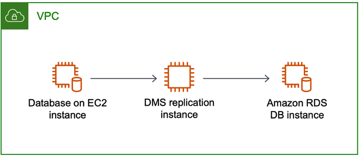

## Describe endpoints ##
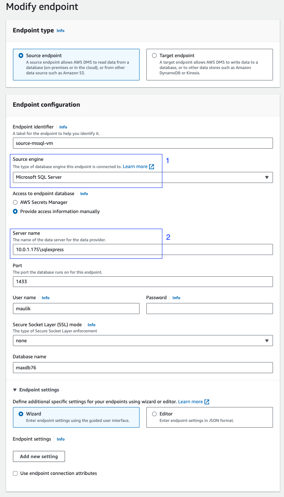
Observe source engine and server name

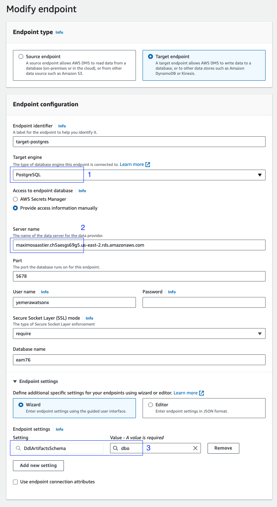
Observe target engine, server name and schema

```
aws dms describe-endpoints
```

```

    "Endpoints": [
        {
            "EndpointIdentifier": "source-mssql-vm",
            "EndpointType": "SOURCE",
            "EngineName": "sqlserver",
            "EngineDisplayName": "Microsoft SQL Server",
            "Username": "maulik",
            "ServerName": "10.0.1.175\\sqlexpress",
            "Port": 1433,
            "DatabaseName": "maxdb76",
            "Status": "active",
            "KmsKeyId": "arn:aws:kms:us-east-2:698108604540:key/da1d66a1-0237-4d69-a4a2-979e7059406d",
            "EndpointArn": "arn:aws:dms:us-east-2:698108604540:endpoint:YIMVQSTQRHDU3C2F74TPSSL5GXOG6ILGLHPOLYI",
            "SslMode": "none",
            "MicrosoftSQLServerSettings": {
                "Port": 1433,
                "DatabaseName": "maxdb76",
                "ServerName": "10.0.1.175\\sqlexpress",
                "Username": "maulik"
            }
        },
        {
            "EndpointIdentifier": "target-postgres",
            "EndpointType": "TARGET",
            "EngineName": "postgres",
            "EngineDisplayName": "PostgreSQL",
            "Username": "yemerawatsonx",
            "ServerName": "maximosaastier.ch5aesgs69g5.us-east-2.rds.amazonaws.com",
            "Port": 5678,
            "DatabaseName": "eam76",
            "Status": "active",
            "KmsKeyId": "arn:aws:kms:us-east-2:698108604540:key/da1d66a1-0237-4d69-a4a2-979e7059406d",
            "EndpointArn": "arn:aws:dms:us-east-2:698108604540:endpoint:5KOC27HAARVBY7W3CXAQXRHFOT5KZPLQ6RH5ENY",
            "SslMode": "require",
            "PostgreSQLSettings": {
                "DatabaseName": "eam76",
                "DdlArtifactsSchema": "dbo",
                "Port": 5678,
                "ServerName": "maximosaastier.ch5aesgs69g5.us-east-2.rds.amazonaws.com",
                "Username": "yemerawatsonx"
            }
        }
    ]
```

## Describe Subnet group ##
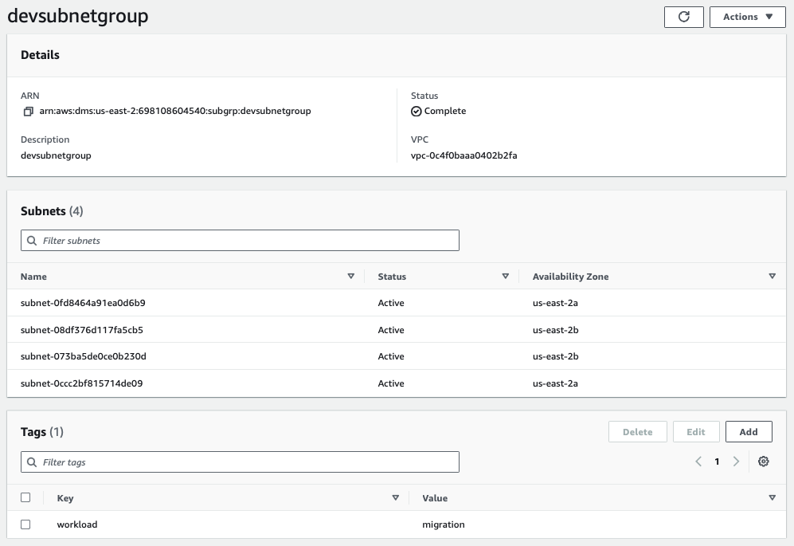

Refer https://awscli.amazonaws.com/v2/documentation/api/latest/reference/dms/describe-replication-subnet-groups.html
```
aws dms describe-replication-subnet-groups
```

```
{
    "ReplicationSubnetGroups": [
        {
            "ReplicationSubnetGroupIdentifier": "devsubnetgroup",
            "ReplicationSubnetGroupDescription": "devsubnetgroup",
            "VpcId": "vpc-0c4f0baaa0402b2fa",
            "SubnetGroupStatus": "Complete",
            "Subnets": [
                {
                    "SubnetIdentifier": "subnet-0fd8464a91ea0d6b9",
                    "SubnetAvailabilityZone": {
                        "Name": "us-east-2a"
                    },
                    "SubnetStatus": "Active"
                },
                {
                    "SubnetIdentifier": "subnet-08df376d117fa5cb5",
                    "SubnetAvailabilityZone": {
                        "Name": "us-east-2b"
                    },
                    "SubnetStatus": "Active"
                },
                {
                    "SubnetIdentifier": "subnet-073ba5de0ce0b230d",
                    "SubnetAvailabilityZone": {
                        "Name": "us-east-2b"
                    },
                    "SubnetStatus": "Active"
                },
                {
                    "SubnetIdentifier": "subnet-0ccc2bf815714de09",
                    "SubnetAvailabilityZone": {
                        "Name": "us-east-2a"
                    },
                    "SubnetStatus": "Active"
                }
            ],
            "SupportedNetworkTypes": [
                "IPV4"
            ]
        }
    ]
}
```

## Replication Instance Security Group ##
Inbound rule allows VPC CIDR
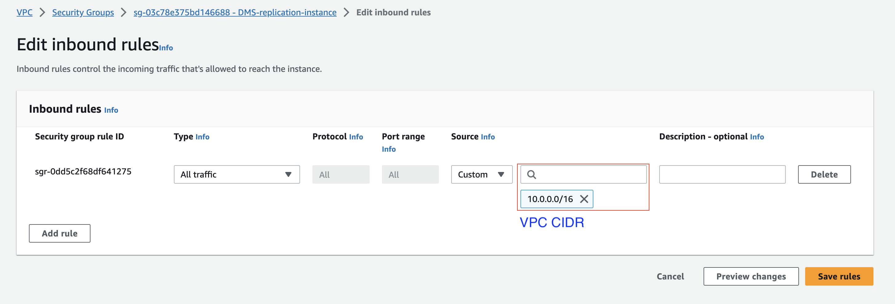


## Describe replication instances ##
Observer instance class, engine version and security group
[More info - here](https://docs.aws.amazon.com/cli/latest/reference/dms/describe-replication-instances.html)

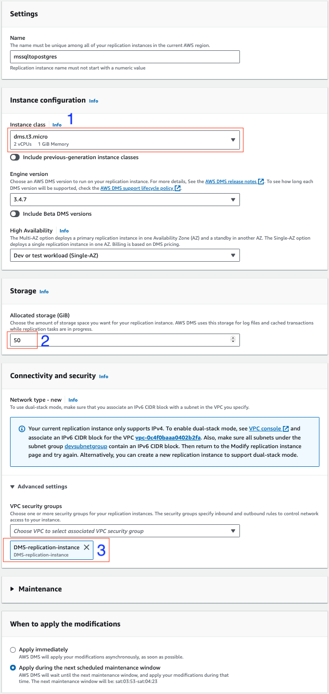

Command
```
 aws dms describe-replication-instances
```

Response
```
{
    "ReplicationInstances": [
        {
            "ReplicationInstanceIdentifier": "mssqltopostgres",
            "ReplicationInstanceClass": "dms.t3.medium",
            "ReplicationInstanceStatus": "available",
            "AllocatedStorage": 50,
            "InstanceCreateTime": "2023-08-31T12:15:35.090000+00:00",
            "VpcSecurityGroups": [
                {
                    "VpcSecurityGroupId": "sg-03c78e375bd146688",
                    "Status": "active"
                }
            ],
            "AvailabilityZone": "us-east-2a",
            "ReplicationSubnetGroup": {
                "ReplicationSubnetGroupIdentifier": "devsubnetgroup",
                "ReplicationSubnetGroupDescription": "devsubnetgroup",
                "VpcId": "vpc-0c4f0baaa0402b2fa",
                "SubnetGroupStatus": "Complete",
                "Subnets": [
                    {
                        "SubnetIdentifier": "subnet-0fd8464a91ea0d6b9",
                        "SubnetAvailabilityZone": {
                            "Name": "us-east-2a"
                        },
                        "SubnetStatus": "Active"
                    },
                    {
                        "SubnetIdentifier": "subnet-08df376d117fa5cb5",
                        "SubnetAvailabilityZone": {
                            "Name": "us-east-2b"
                        },
                        "SubnetStatus": "Active"
                    },
                    {
                        "SubnetIdentifier": "subnet-073ba5de0ce0b230d",
                        "SubnetAvailabilityZone": {
                            "Name": "us-east-2b"
                        },
                        "SubnetStatus": "Active"
                    },
                    {
                        "SubnetIdentifier": "subnet-0ccc2bf815714de09",
                        "SubnetAvailabilityZone": {
                            "Name": "us-east-2a"
                        },
                        "SubnetStatus": "Active"
                    }
                ]
            },
            "PreferredMaintenanceWindow": "sat:03:53-sat:04:23",
            "PendingModifiedValues": {},
            "MultiAZ": false,
            "EngineVersion": "3.4.7",
            "AutoMinorVersionUpgrade": true,
            "KmsKeyId": "arn:aws:kms:us-east-2:698108604540:key/da1d66a1-0237-4d69-a4a2-979e7059406d",
            "ReplicationInstanceArn": "arn:aws:dms:us-east-2:698108604540:rep:mssqltopostgres",
            "ReplicationInstancePrivateIpAddress": "10.0.134.68",
            "ReplicationInstancePublicIpAddresses": [
                null
            ],
            "ReplicationInstancePrivateIpAddresses": [
                "10.0.134.68"
            ],
            "ReplicationInstanceIpv6Addresses": [],
            "PubliclyAccessible": false,
            "NetworkType": "IPV4"
        }
    ]
}
```

## Migration Task ##
### Task configuration ###

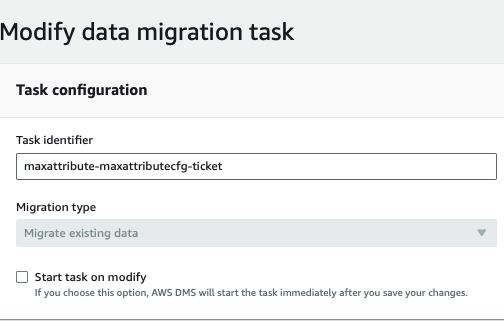
```
"ReplicationTaskIdentifier": "maxattribute-maxattributecfg-ticket",
            "SourceEndpointArn": "arn:aws:dms:us-east-2:698108604540:endpoint:YIMVQSTQRHDU3C2F74TPSSL5GXOG6ILGLHPOLYI",
            "TargetEndpointArn": "arn:aws:dms:us-east-2:698108604540:endpoint:5KOC27HAARVBY7W3CXAQXRHFOT5KZPLQ6RH5ENY",
            "ReplicationInstanceArn": "arn:aws:dms:us-east-2:698108604540:rep:mssqltopostgres",
            "MigrationType": "full-load",
```


### Task settings ###

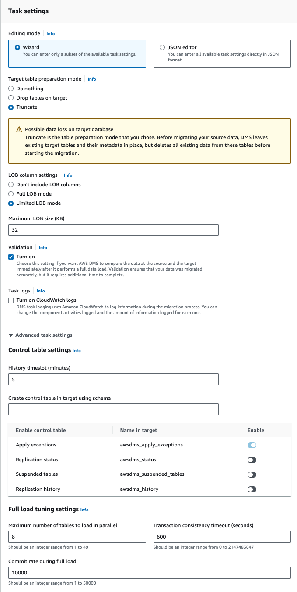

```
{
  "Logging": {
    "EnableLogging": false,
    "EnableLogContext": false,
    "LogComponents": [
      {
        "Severity": "LOGGER_SEVERITY_DEFAULT",
        "Id": "TRANSFORMATION"
      },
      {
        "Severity": "LOGGER_SEVERITY_DEFAULT",
        "Id": "SOURCE_UNLOAD"
      },
      {
        "Severity": "LOGGER_SEVERITY_DEFAULT",
        "Id": "IO"
      },
      {
        "Severity": "LOGGER_SEVERITY_DEFAULT",
        "Id": "TARGET_LOAD"
      },
      {
        "Severity": "LOGGER_SEVERITY_DEFAULT",
        "Id": "PERFORMANCE"
      },
      {
        "Severity": "LOGGER_SEVERITY_DEFAULT",
        "Id": "SOURCE_CAPTURE"
      },
      {
        "Severity": "LOGGER_SEVERITY_DEFAULT",
        "Id": "SORTER"
      },
      {
        "Severity": "LOGGER_SEVERITY_DEFAULT",
        "Id": "REST_SERVER"
      },
      {
        "Severity": "LOGGER_SEVERITY_DEFAULT",
        "Id": "VALIDATOR_EXT"
      },
      {
        "Severity": "LOGGER_SEVERITY_DEFAULT",
        "Id": "TARGET_APPLY"
      },
      {
        "Severity": "LOGGER_SEVERITY_DEFAULT",
        "Id": "TASK_MANAGER"
      },
      {
        "Severity": "LOGGER_SEVERITY_DEFAULT",
        "Id": "TABLES_MANAGER"
      },
      {
        "Severity": "LOGGER_SEVERITY_DEFAULT",
        "Id": "METADATA_MANAGER"
      },
      {
        "Severity": "LOGGER_SEVERITY_DEFAULT",
        "Id": "FILE_FACTORY"
      },
      {
        "Severity": "LOGGER_SEVERITY_DEFAULT",
        "Id": "COMMON"
      },
      {
        "Severity": "LOGGER_SEVERITY_DEFAULT",
        "Id": "ADDONS"
      },
      {
        "Severity": "LOGGER_SEVERITY_DEFAULT",
        "Id": "DATA_STRUCTURE"
      },
      {
        "Severity": "LOGGER_SEVERITY_DEFAULT",
        "Id": "COMMUNICATION"
      },
      {
        "Severity": "LOGGER_SEVERITY_DEFAULT",
        "Id": "FILE_TRANSFER"
      }
    ],
    "CloudWatchLogGroup": null,
    "CloudWatchLogStream": null
  },
  "StreamBufferSettings": {
    "StreamBufferCount": 3,
    "CtrlStreamBufferSizeInMB": 5,
    "StreamBufferSizeInMB": 8
  },
  "ErrorBehavior": {
    "FailOnNoTablesCaptured": true,
    "ApplyErrorUpdatePolicy": "LOG_ERROR",
    "FailOnTransactionConsistencyBreached": false,
    "RecoverableErrorThrottlingMax": 1800,
    "DataErrorEscalationPolicy": "SUSPEND_TABLE",
    "ApplyErrorEscalationCount": 0,
    "RecoverableErrorStopRetryAfterThrottlingMax": true,
    "RecoverableErrorThrottling": true,
    "ApplyErrorFailOnTruncationDdl": false,
    "DataTruncationErrorPolicy": "LOG_ERROR",
    "ApplyErrorInsertPolicy": "LOG_ERROR",
    "EventErrorPolicy": "IGNORE",
    "ApplyErrorEscalationPolicy": "LOG_ERROR",
    "RecoverableErrorCount": -1,
    "DataErrorEscalationCount": 0,
    "TableErrorEscalationPolicy": "STOP_TASK",
    "RecoverableErrorInterval": 5,
    "ApplyErrorDeletePolicy": "IGNORE_RECORD",
    "TableErrorEscalationCount": 0,
    "FullLoadIgnoreConflicts": true,
    "DataErrorPolicy": "LOG_ERROR",
    "TableErrorPolicy": "SUSPEND_TABLE"
  },
  "ValidationSettings": {
    "ValidationPartialLobSize": 0,
    "PartitionSize": 10000,
    "RecordFailureDelayLimitInMinutes": 0,
    "SkipLobColumns": false,
    "FailureMaxCount": 10000,
    "HandleCollationDiff": false,
    "ValidationQueryCdcDelaySeconds": 0,
    "ValidationMode": "ROW_LEVEL",
    "TableFailureMaxCount": 1000,
    "RecordFailureDelayInMinutes": 5,
    "MaxKeyColumnSize": 8096,
    "EnableValidation": true,
    "ThreadCount": 5,
    "RecordSuspendDelayInMinutes": 30,
    "ValidationOnly": false
  },
  "TTSettings": null,
  "FullLoadSettings": {
    "CommitRate": 10000,
    "StopTaskCachedChangesApplied": false,
    "StopTaskCachedChangesNotApplied": false,
    "MaxFullLoadSubTasks": 8,
    "TransactionConsistencyTimeout": 600,
    "CreatePkAfterFullLoad": false,
    "TargetTablePrepMode": "TRUNCATE_BEFORE_LOAD"
  },
  "TargetMetadata": {
    "ParallelApplyBufferSize": 0,
    "ParallelApplyQueuesPerThread": 0,
    "ParallelApplyThreads": 0,
    "TargetSchema": "",
    "InlineLobMaxSize": 0,
    "ParallelLoadQueuesPerThread": 0,
    "SupportLobs": true,
    "LobChunkSize": 0,
    "TaskRecoveryTableEnabled": false,
    "ParallelLoadThreads": 0,
    "LobMaxSize": 32,
    "BatchApplyEnabled": false,
    "FullLobMode": false,
    "LimitedSizeLobMode": true,
    "LoadMaxFileSize": 0,
    "ParallelLoadBufferSize": 0
  },
  "BeforeImageSettings": null,
  "ControlTablesSettings": {
    "historyTimeslotInMinutes": 5,
    "HistoryTimeslotInMinutes": 5,
    "StatusTableEnabled": false,
    "SuspendedTablesTableEnabled": false,
    "HistoryTableEnabled": false,
    "ControlSchema": "",
    "FullLoadExceptionTableEnabled": false
  },
  "LoopbackPreventionSettings": null,
  "CharacterSetSettings": null,
  "FailTaskWhenCleanTaskResourceFailed": false,
  "ChangeProcessingTuning": {
    "StatementCacheSize": 50,
    "CommitTimeout": 1,
    "BatchApplyPreserveTransaction": true,
    "BatchApplyTimeoutMin": 1,
    "BatchSplitSize": 0,
    "BatchApplyTimeoutMax": 30,
    "MinTransactionSize": 1000,
    "MemoryKeepTime": 60,
    "BatchApplyMemoryLimit": 500,
    "MemoryLimitTotal": 1024
  },
  "ChangeProcessingDdlHandlingPolicy": {
    "HandleSourceTableDropped": true,
    "HandleSourceTableTruncated": true,
    "HandleSourceTableAltered": true
  },
  "PostProcessingRules": null
}
```

### Table mappings ###
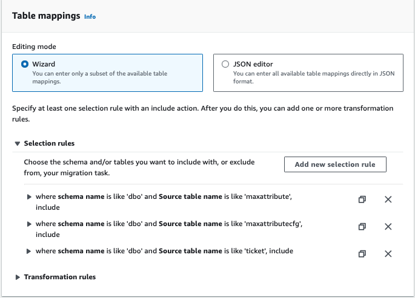

```
{
  "rules": [
    {
      "rule-type": "selection",
      "rule-name": "maxattribute-rule",
      "rule-id": "486202928",
      "object-locator": {
        "schema-name": "dbo",
        "table-name": "maxattribute"
      },
      "rule-action": "include",
      "load-order": "1",
      "filters": []
    },
    {
      "rule-type": "selection",
      "rule-id": "486202929",
      "rule-name": "maxattributecfg",
      "object-locator": {
        "schema-name": "dbo",
        "table-name": "maxattributecfg"
      },
      "rule-action": "include",
      "load-order": "2",
      "filters": []
    },
    {
      "rule-type": "selection",
      "rule-id": "486202930",
      "rule-name": "ticket",
      "object-locator": {
        "schema-name": "dbo",
        "table-name": "ticket"
      },
      "rule-action": "include",
      "load-order": "3",
      "filters": []
    }
  ]
}
```

## Pre-Migration Assessment ##
Running Pre-migration assessment requires setting up S3 bucket and AWS DMS Service linked role
At the end of migration assessement run, we can see assessment logs are stored in S3 bucket


### DMS Service linked role ###
Refer [AWS Docs for more information](https://docs.aws.amazon.com/dms/latest/userguide/CHAP_Tasks.AssessmentReport.html)

Sample policy Json, replace ``<<MIGRATION-ASSESSMENT-LOG>>`` with bucket name 

```
{
   "Version":"2012-10-17",
   "Statement":[
      {
         "Effect":"Allow",
         "Action":[
            "s3:PutObject",
            "s3:DeleteObject",
            "s3:GetObject",
            "s3:PutObjectTagging"
         ],
         "Resource":[
            "arn:aws:s3:::<<MIGRATION-ASSESSMENT-LOG>>/*"
         ]
      },
      {
         "Effect":"Allow",
         "Action":[
            "s3:ListBucket",
            "s3:GetBucketLocation"
         ],
         "Resource":[
            "arn:aws:s3:::<<MIGRATION-ASSESSMENT-LOG>>"
         ]
      }
   ]
}
```
Custom Trust entity
```
{
   "Version":"2012-10-17",
   "Statement":[
      {
         "Sid":"",
         "Effect":"Allow",
         "Principal":{
            "Service":"dms.amazonaws.com"
         },
         "Action":"sts:AssumeRole"
      }
   ]
}       
```

### Assessment outcome ###
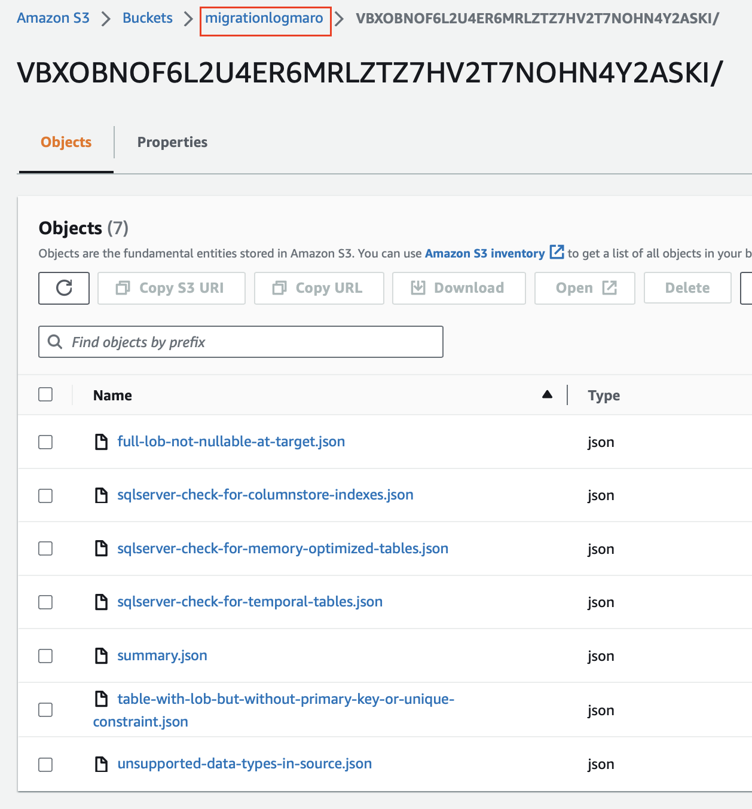

Summary

```
{
  "version": "0.0.2",
  "overall-test-result": "passed",
  "summary": {
    "passed": [
      {
        "test-name": "sqlserver-check-for-columnstore-indexes",
        "test-result": "passed",
        "test-result-details": "Validation succeeded, no tables with columnstore indexes found.",
        "results-summary": {
          "passed": "N/A",
          "warning": "N/A",
          "failed": "N/A"
        }
      },
      {
        "test-name": "unsupported-data-types-in-source",
        "test-result": "passed",
        "test-result-details": "No columns in scope of migration have been identified as unsupported or partially supported",
        "results-summary": {
          "passed": "N/A",
          "warning": "N/A",
          "failed": "N/A"
        }
      },
      {
        "test-name": "sqlserver-check-for-memory-optimized-tables",
        "test-result": "passed",
        "test-result-details": "Validation succeeded, no memory optimized tables found",
        "results-summary": {
          "passed": "N/A",
          "warning": "N/A",
          "failed": "N/A"
        }
      },
      {
        "test-name": "table-with-lob-but-without-primary-key-or-unique-constraint",
        "test-result": "passed",
        "test-result-details": "No tables in scope of migration have been identified as having a LOB column without a Primary Key or Unique Constraint",
        "results-summary": {
          "passed": "N/A",
          "warning": "N/A",
          "failed": "N/A"
        }
      },
      {
        "test-name": "sqlserver-check-for-temporal-tables",
        "test-result": "passed",
        "test-result-details": "Validation succeeded, no temporal tables found.",
        "results-summary": {
          "passed": "N/A",
          "warning": "N/A",
          "failed": "N/A"
        }
      },
      {
        "test-name": "full-lob-not-nullable-at-target",
        "test-result": "passed",
        "test-result-details": "No LOB columns in scope of migration have been identified as not nullable",
        "results-summary": {
          "passed": "N/A",
          "warning": "N/A",
          "failed": "N/A"
        }
      }
    ],
    "failed": [],
    "error": [],
    "warning": [],
    "cancelled": []
  }
}
```

## Replication Run ##

### Migration Outcome ###
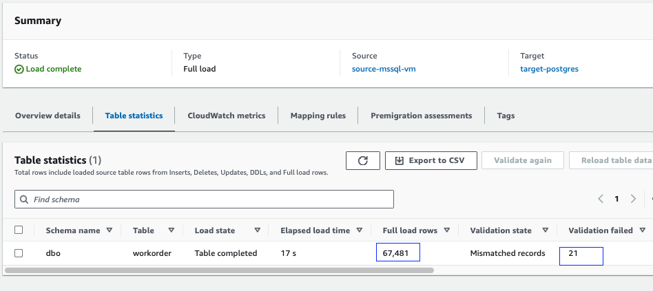

Refer
[More info - here](https://docs.aws.amazon.com/cli/latest/reference/dms/describe-replication-table-statistics.html)

Command
```
aws dms describe-replication-table-statistics
```

Response
```
 "TableStatistics": [
        {
            "SchemaName": "dbo",
            "TableName": "workorder",
            "Inserts": 0,
            "Deletes": 0,
            "Updates": 0,
            "Ddls": 0,
            "AppliedInserts": 0,
            "AppliedDeletes": 0,
            "AppliedUpdates": 0,
            "AppliedDdls": 0,
            "FullLoadRows": 67481,
            "FullLoadCondtnlChkFailedRows": 0,
            "FullLoadErrorRows": 0,
            "FullLoadStartTime": "2023-09-01T07:49:43.761000+00:00",
            "FullLoadEndTime": "2023-09-01T07:50:01.109000+00:00",
            "FullLoadReloaded": false,
            "LastUpdateTime": "2023-09-06T05:24:42.699000+00:00",
            "TableState": "Table completed",
            "ValidationPendingRecords": 0,
            "ValidationFailedRecords": 21,
            "ValidationSuspendedRecords": 0,
            "ValidationState": "Mismatched records"
        }
    ]
```


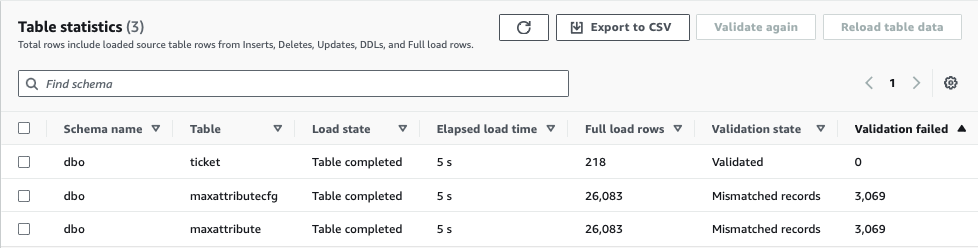

### Inspecting Errors ###

For more information, refer https://docs.aws.amazon.com/dms/latest/userguide/CHAP_Validating.html#CHAP_Validating.Troubleshooting
Connecting to destination table and inspect errors

Command
```
select * from awsdms_validation_failures_v1 where "TABLE_NAME" ='workorder'
```

Response
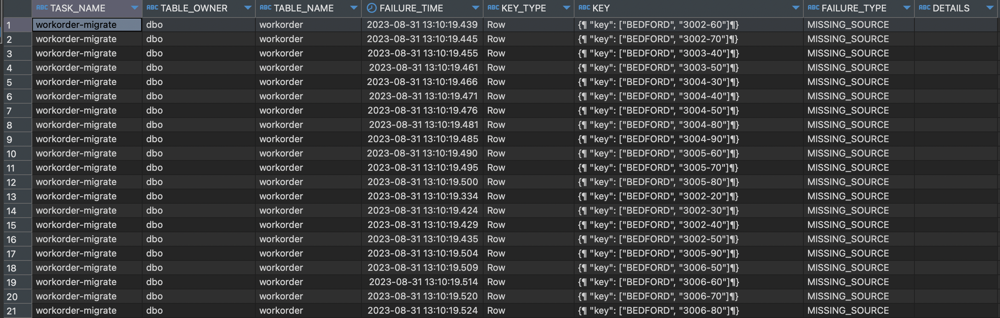

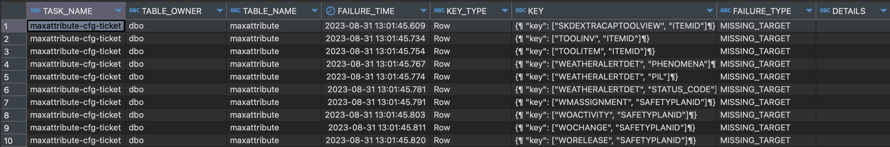

Sample mismatch record from destination db (PostgeSql)
<pre><code> 
|wonum|parent|status|statusdate|worktype|description|assetnum|location|jpnum|faildate|changeby|changedate|estdur|estlabhrs|estmatcost|estlabcost|esttoolcost|pmnum|actlabhrs|actmatcost|actlabcost|acttoolcost|haschildren|outlabcost|outmatcost|outtoolcost|historyflag|contract|wopriority|targcompdate|targstartdate|woeq1|woeq2|woeq3|woeq4|woeq5|woeq6|woeq7|woeq8|woeq9|woeq10|woeq11|woeq12|reportedby|reportdate|phone|problemcode|calendar|downtime|actstart|actfinish|schedstart|schedfinish|remdur|crewid|supervisor|woeq13|woeq14|wojp1|wojp2|wojp3|wojp4|wojp5|wol1|wol2|wol3|wol4|wolablnk|respondby|assetlocpriority|calcpriority|chargestore|failurecode|wolo1|wolo2|wolo3|wolo4|wolo5|wolo6|wolo7|wolo8|wolo9|wolo10|glaccount|estservcost|actservcost|disabled|estatapprlabhrs|estatapprlabcost|estatapprmatcost|estatapprtoolcost|estatapprservcost|wosequence|hasfollowupwork|worts1|worts2|worts3|worts4|worts5|sourcesysid|ownersysid|pmduedate|pmextdate|pmnextduedate|worklocation|externalrefid|sendersysid|fincntrlid|generatedforpo|genforpolineid|orgid|siteid|taskid|inspector|measurementvalue|measuredate|observation|pointnum|wojo1|wojo2|wojo3|wojo4|wojo5|wojo6|wojo7|wojo8|istask|woclass|onbehalfof|vendor|origrecordclass|origrecordid|justifypriority|risk|environment|backoutplan|woacceptscharges|owner|classstructureid|parentchgsstatus|ownergroup|commoditygroup|commodity|workorderid|whomischangefor|reasonforchange|verification|persongroup|lead|langcode|interruptible|wogroup|hasld|route|routestopid|cinum|jobtaskid|woisswap|newchildclass|suspendflow|flowcontrolled|flowactionassist|launchentryname|targetdesc|flowaction|firstapprstatus|repfacsiteid|repairfacility|genforporevision|storeroommtlstatus|dirissuemtlstatus|workpackmtlstatus|ignoresrmavail|ignorediavail|estintlabcost|estintlabhrs|estoutlabhrs|estoutlabcost|actintlabcost|actintlabhrs|actoutlabhrs|actoutlabcost|estatapprintlabcost|estatapprintlabhrs|estatapproutlabhrs|estatapproutlabcost|assignedownergroup|availstatusdate|lastcopylinkdate|pluscfrequency|pluscfrequnit|pluscismobile|pluscjprevnum|pluscloop|pluscnextdate|pluscoverduedate|pluscphyloc|inctasksinsched|sneconstraint|fnlconstraint|calcorgid|calccalendar|calcshift|nestedjpinprocess|inspformnum|rowstamp|amcrew|crewworkgroup|reqasstdwntime|apptrequired|aos|ams|los|lms|repairlocflag|intshift|pcpchangeby|pcpchangedate|pcphys|pcacthrs|pctaskcomp|unitsofwork|djpapplied|djperror|milestone|plusilocpath|plusiorgpath|
|-----|------|------|----------|--------|-----------|--------|--------|-----|--------|--------|----------|------|---------|----------|----------|-----------|-----|---------|----------|----------|-----------|-----------|----------|----------|-----------|-----------|--------|----------|------------|-------------|-----|-----|-----|-----|-----|-----|-----|-----|-----|------|------|------|----------|----------|-----|-----------|--------|--------|--------|---------|----------|-----------|------|------|----------|------|------|-----|-----|-----|-----|-----|----|----|----|----|--------|---------|----------------|------------|-----------|-----------|-----|-----|-----|-----|-----|-----|-----|-----|-----|------|---------|-----------|-----------|--------|---------------|----------------|----------------|-----------------|-----------------|----------|---------------|------|------|------|------|------|-----------|----------|---------|---------|-------------|------------|-------------|-----------|----------|--------------|--------------|-----|------|------|---------|----------------|-----------|-----------|--------|-----|-----|-----|-----|-----|-----|-----|-----|------|-------|----------|------|---------------|------------|---------------|----|-----------|-----------|----------------|-----|----------------|----------------|----------|--------------|---------|-----------|---------------|---------------|------------|-----------|----|--------|-------------|-------|-----|-----|-----------|-----|---------|--------|-------------|-----------|--------------|----------------|---------------|----------|----------|---------------|------------|--------------|----------------|------------------|-----------------|-----------------|--------------|-------------|-------------|------------|------------|-------------|-------------|------------|------------|-------------|-------------------|------------------|------------------|-------------------|------------------|---------------|----------------|--------------|-------------|-------------|-------------|---------|-------------|----------------|-----------|---------------|-------------|-------------|---------|------------|---------|-----------------|-----------|--------|------|-------------|--------------|------------|---|---|---|---|-------------|--------|-----------|-------------|------|--------|----------|-----------|----------|--------|---------|------------|------------|
|3002-60|3002|WSCH|1998-12-28 00:00:00.000||Stress Test Motor Starter 12/440 V/60HZ|11300|BR300|||||0.0|0.0|0.00|0.00|0.00||0.0|0.00|0.00|0.00|0|0.00|0.00|0.00|0||||||||||||||||||||||0|||||||||||||||||||||||0||||||||||||6210-326-???|0.00|0.00|0|0.0|0.00|0.00|0.00|0.00||0|||||||||||||||||EAGLENA|BEDFORD|60||||||||||||||1|ACTIVITY|||||||||1|||1||||601||||||EN|0|3002|0|||||0|WORKORDER|0|0|0||||WSCH|||||||1|0|0.00|0.0|0.0|0.00|0.00|0.0|0.0|0.00|0.00|0.0|0.0|0.00||||||0||0||||1||||||0||
ظ|||0|0|0|0|0|0|0||||||||NO||0|||
</code></pre> 

Sample mismatch record from source db (MS SQL)
<pre><code> 
|wonum|parent|status|statusdate|worktype|description|assetnum|location|jpnum|faildate|changeby|changedate|estdur|estlabhrs|estmatcost|estlabcost|esttoolcost|pmnum|actlabhrs|actmatcost|actlabcost|acttoolcost|haschildren|outlabcost|outmatcost|outtoolcost|historyflag|contract|wopriority|targcompdate|targstartdate|woeq1|woeq2|woeq3|woeq4|woeq5|woeq6|woeq7|woeq8|woeq9|woeq10|woeq11|woeq12|reportedby|reportdate|phone|problemcode|calendar|downtime|actstart|actfinish|schedstart|schedfinish|remdur|crewid|supervisor|woeq13|woeq14|wojp1|wojp2|wojp3|wojp4|wojp5|wol1|wol2|wol3|wol4|wolablnk|respondby|assetlocpriority|calcpriority|chargestore|failurecode|wolo1|wolo2|wolo3|wolo4|wolo5|wolo6|wolo7|wolo8|wolo9|wolo10|glaccount|estservcost|actservcost|disabled|estatapprlabhrs|estatapprlabcost|estatapprmatcost|estatapprtoolcost|estatapprservcost|wosequence|hasfollowupwork|worts1|worts2|worts3|worts4|worts5|sourcesysid|ownersysid|pmduedate|pmextdate|pmnextduedate|worklocation|externalrefid|sendersysid|fincntrlid|generatedforpo|genforpolineid|orgid|siteid|taskid|inspector|measurementvalue|measuredate|observation|pointnum|wojo1|wojo2|wojo3|wojo4|wojo5|wojo6|wojo7|wojo8|istask|woclass|onbehalfof|vendor|origrecordclass|origrecordid|justifypriority|risk|environment|backoutplan|woacceptscharges|owner|classstructureid|parentchgsstatus|ownergroup|commoditygroup|commodity|workorderid|whomischangefor|reasonforchange|verification|persongroup|lead|langcode|interruptible|wogroup|hasld|route|routestopid|cinum|jobtaskid|woisswap|newchildclass|suspendflow|flowcontrolled|flowactionassist|launchentryname|targetdesc|flowaction|firstapprstatus|repfacsiteid|repairfacility|genforporevision|storeroommtlstatus|dirissuemtlstatus|workpackmtlstatus|ignoresrmavail|ignorediavail|estintlabcost|estintlabhrs|estoutlabhrs|estoutlabcost|actintlabcost|actintlabhrs|actoutlabhrs|actoutlabcost|estatapprintlabcost|estatapprintlabhrs|estatapproutlabhrs|estatapproutlabcost|assignedownergroup|availstatusdate|lastcopylinkdate|pluscfrequency|pluscfrequnit|pluscismobile|pluscjprevnum|pluscloop|pluscnextdate|pluscoverduedate|pluscphyloc|inctasksinsched|sneconstraint|fnlconstraint|calcorgid|calccalendar|calcshift|nestedjpinprocess|inspformnum|rowstamp|amcrew|crewworkgroup|reqasstdwntime|apptrequired|aos|ams|los|lms|repairlocflag|intshift|pcpchangeby|pcpchangedate|pcphys|pcacthrs|pctaskcomp|unitsofwork|djpapplied|djperror|milestone|plusilocpath|plusiorgpath|
|-----|------|------|----------|--------|-----------|--------|--------|-----|--------|--------|----------|------|---------|----------|----------|-----------|-----|---------|----------|----------|-----------|-----------|----------|----------|-----------|-----------|--------|----------|------------|-------------|-----|-----|-----|-----|-----|-----|-----|-----|-----|------|------|------|----------|----------|-----|-----------|--------|--------|--------|---------|----------|-----------|------|------|----------|------|------|-----|-----|-----|-----|-----|----|----|----|----|--------|---------|----------------|------------|-----------|-----------|-----|-----|-----|-----|-----|-----|-----|-----|-----|------|---------|-----------|-----------|--------|---------------|----------------|----------------|-----------------|-----------------|----------|---------------|------|------|------|------|------|-----------|----------|---------|---------|-------------|------------|-------------|-----------|----------|--------------|--------------|-----|------|------|---------|----------------|-----------|-----------|--------|-----|-----|-----|-----|-----|-----|-----|-----|------|-------|----------|------|---------------|------------|---------------|----|-----------|-----------|----------------|-----|----------------|----------------|----------|--------------|---------|-----------|---------------|---------------|------------|-----------|----|--------|-------------|-------|-----|-----|-----------|-----|---------|--------|-------------|-----------|--------------|----------------|---------------|----------|----------|---------------|------------|--------------|----------------|------------------|-----------------|-----------------|--------------|-------------|-------------|------------|------------|-------------|-------------|------------|------------|-------------|-------------------|------------------|------------------|-------------------|------------------|---------------|----------------|--------------|-------------|-------------|-------------|---------|-------------|----------------|-----------|---------------|-------------|-------------|---------|------------|---------|-----------------|-----------|--------|------|-------------|--------------|------------|---|---|---|---|-------------|--------|-----------|-------------|------|--------|----------|-----------|----------|--------|---------|------------|------------|
|3002-60|3002|WSCH|1998-12-28 00:00:00.000||Stress Test Motor Starter 12/440 V/60HZ|11300|BR300|||||0.0|0.0|0.00|0.00|0.00||0.0|0.00|0.00|0.00|0|0.00|0.00|0.00|0||||||||||||||||||||||0|||||||||||||||||||||||0||||||||||||6210-326-???|0.00|0.00|0|0.0|0.00|0.00|0.00|0.00||0|||||||||||||||||EAGLENA|BEDFORD|60||||||||||||||1|ACTIVITY|||||||||1|||1||||601||||||EN|0|3002|0|||||0|WORKORDER|0|0|0||||WSCH|||||||1|0|0.00|0.0|0.0|0.00|0.00|0.0|0.0|0.00|0.00|0.0|0.0|0.00||||||0||0||||1||||||0||
ظ|||0|0|0|0|0|0|0||||||||NO||0|||
</code> </pre>