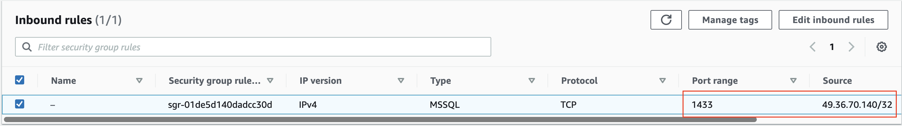
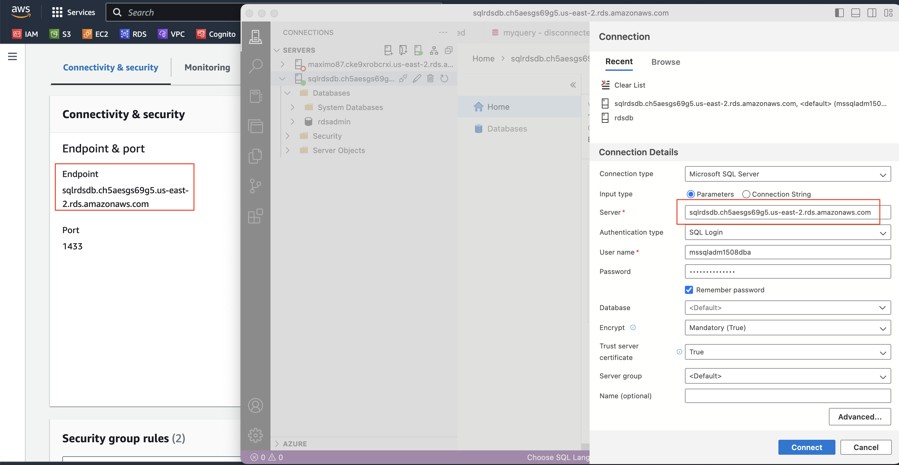
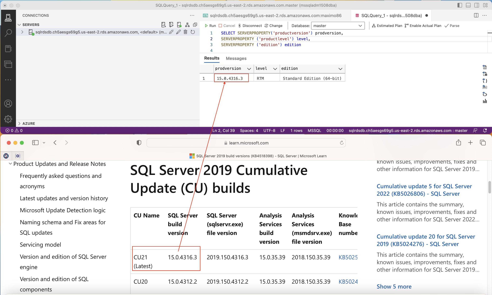
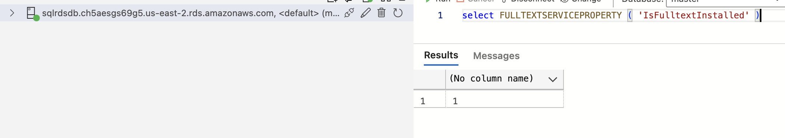
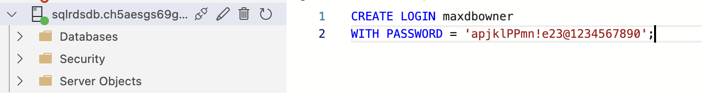

## Verification ##
Verify that Security Group has been successfully created white listing provided CIDR range with SQL Server Port. This allows making connection from management PC.



## Database Connection ##
Download [Azure Data Studio](https://learn.microsoft.com/en-us/sql/azure-data-studio/download-azure-data-studio?view=sql-server-ver16&tabs=redhat-install%2Credhat-uninstall) for connecting to AWS RDS Instance

Extract Endpoint, Port and establish connection using Admin username and Password provided


## Verify Version ##
To find out  MS SQL Server installed version and edition, run this SQL Query. 

```
SELECT SERVERPROPERTY('productversion') prodversion,
SERVERPROPERTY ('productlevel') level,
SERVERPROPERTY ('edition') edition
```
It would be similar to this:


## Verify Full text search is Enabled ##
```
select FULLTEXTSERVICEPROPERTY ( 'IsFulltextInstalled' )
```
It would be similar to this:


## Create Login ##
Create Server Login using this query
```
CREATE LOGIN maxdbowner
WITH PASSWORD = 'apjklPPmn!e23@1234567890';
```

It would be similar to this:


## Create Database ##
Create Database using preferred settings and configuration based on business requirement.
For development, test environment setup, this query can be used

```

CREATE DATABASE [maximo86]
 CONTAINMENT = NONE
 ON  PRIMARY 
( NAME = N'maximo86', FILENAME = N'D:\rdsdbdata\DATA\maximo86.mdf' , SIZE = 1GB , FILEGROWTH = 10%)
 LOG ON 
( NAME = N'maximo86_log', FILENAME = N'D:\rdsdbdata\DATA\maximo86_log.ldf' , SIZE = 512MB , FILEGROWTH = 10%)
GO
ALTER DATABASE [maximo86] SET ANSI_NULL_DEFAULT OFF 
GO
ALTER DATABASE [maximo86] SET ANSI_NULLS OFF 
GO
ALTER DATABASE [maximo86] SET ANSI_PADDING OFF 
GO
ALTER DATABASE [maximo86] SET ANSI_WARNINGS OFF 
GO
ALTER DATABASE [maximo86] SET ARITHABORT OFF 
GO
ALTER DATABASE [maximo86] SET AUTO_CLOSE OFF 
GO
ALTER DATABASE [maximo86] SET AUTO_SHRINK OFF 
GO
ALTER DATABASE [maximo86] SET AUTO_CREATE_STATISTICS ON(INCREMENTAL = OFF)
GO
ALTER DATABASE [maximo86] SET AUTO_UPDATE_STATISTICS ON 
GO
ALTER DATABASE [maximo86] SET CURSOR_CLOSE_ON_COMMIT OFF 
GO
ALTER DATABASE [maximo86] SET CURSOR_DEFAULT  GLOBAL 
GO
ALTER DATABASE [maximo86] SET CONCAT_NULL_YIELDS_NULL OFF 
GO
ALTER DATABASE [maximo86] SET NUMERIC_ROUNDABORT OFF 
GO
ALTER DATABASE [maximo86] SET QUOTED_IDENTIFIER OFF 
GO
ALTER DATABASE [maximo86] SET RECURSIVE_TRIGGERS OFF 
GO
ALTER DATABASE [maximo86] SET  DISABLE_BROKER 
GO
ALTER DATABASE [maximo86] SET AUTO_UPDATE_STATISTICS_ASYNC OFF 
GO
ALTER DATABASE [maximo86] SET DATE_CORRELATION_OPTIMIZATION OFF 
GO
ALTER DATABASE [maximo86] SET PARAMETERIZATION SIMPLE 
GO
ALTER DATABASE [maximo86] SET READ_COMMITTED_SNAPSHOT OFF 
GO
ALTER DATABASE [maximo86] SET  READ_WRITE 
GO
ALTER DATABASE [maximo86] SET RECOVERY FULL 
GO
ALTER DATABASE [maximo86] SET  MULTI_USER 
GO
ALTER DATABASE [maximo86] SET PAGE_VERIFY CHECKSUM  
GO
ALTER DATABASE [maximo86] SET TARGET_RECOVERY_TIME = 0 SECONDS 
GO
ALTER DATABASE [maximo86] SET DELAYED_DURABILITY = DISABLED 
GO
USE [maximo86]
GO
ALTER DATABASE SCOPED CONFIGURATION SET LEGACY_CARDINALITY_ESTIMATION = Off;
GO
ALTER DATABASE SCOPED CONFIGURATION FOR SECONDARY SET LEGACY_CARDINALITY_ESTIMATION = Primary;
GO
ALTER DATABASE SCOPED CONFIGURATION SET MAXDOP = 0;
GO
ALTER DATABASE SCOPED CONFIGURATION FOR SECONDARY SET MAXDOP = PRIMARY;
GO
ALTER DATABASE SCOPED CONFIGURATION SET PARAMETER_SNIFFING = On;
GO
ALTER DATABASE SCOPED CONFIGURATION FOR SECONDARY SET PARAMETER_SNIFFING = Primary;
GO
ALTER DATABASE SCOPED CONFIGURATION SET QUERY_OPTIMIZER_HOTFIXES = Off;
GO
ALTER DATABASE SCOPED CONFIGURATION FOR SECONDARY SET QUERY_OPTIMIZER_HOTFIXES = Primary;
GO
USE [maximo86]
GO
IF NOT EXISTS (SELECT name FROM sys.filegroups WHERE is_default=1 AND name = N'PRIMARY') ALTER DATABASE [maximo86] MODIFY FILEGROUP [PRIMARY] DEFAULT
GO

```

## Assign User to The Database ##
Use this query to assign user to the database
```
use [maximo86]
CREATE USER maxdbowner
FROM LOGIN maxdbowner
WITH DEFAULT_SCHEMA=dbo;
```