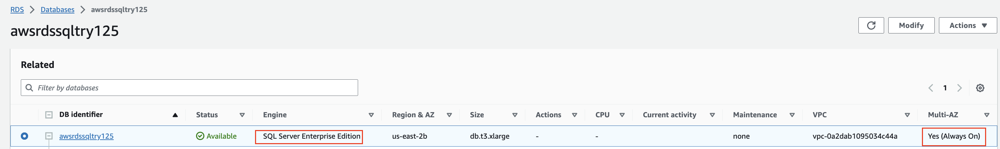
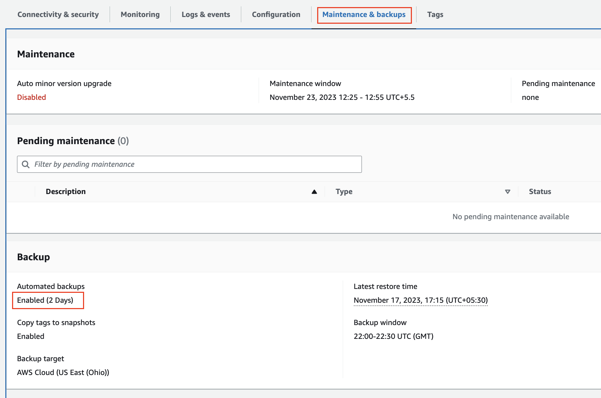
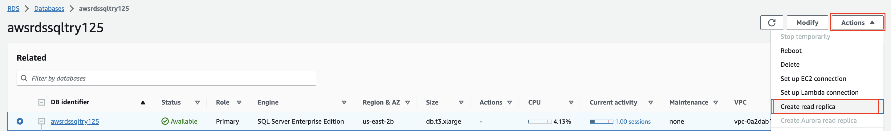
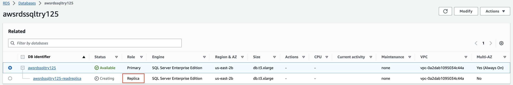
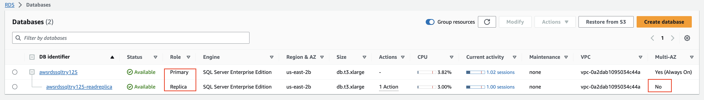
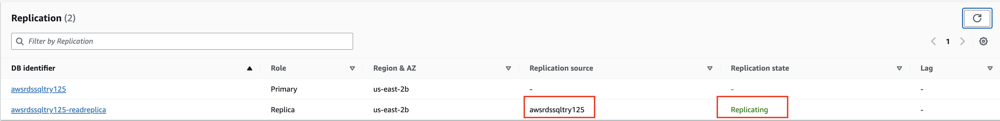

## Pre-requisites ##
Read replica requires meeting several pre-requisites on the source Db instance

 1. Engine MUST BE SQL Server Enteprise Edition
 2. Multi-AZ MUST BE Yes
 3. Automated backup MUST BE ON

## Creating Read replica instance ##

Specify necessary options, It will show it as **creating** and **Replica** as role below **Primary** instance

## Checking read replica instance  ##
After some time, Read replica instance will show up as **created**

Also, we can check **Replication** tab showing **Replication Source** and **Replication State**
