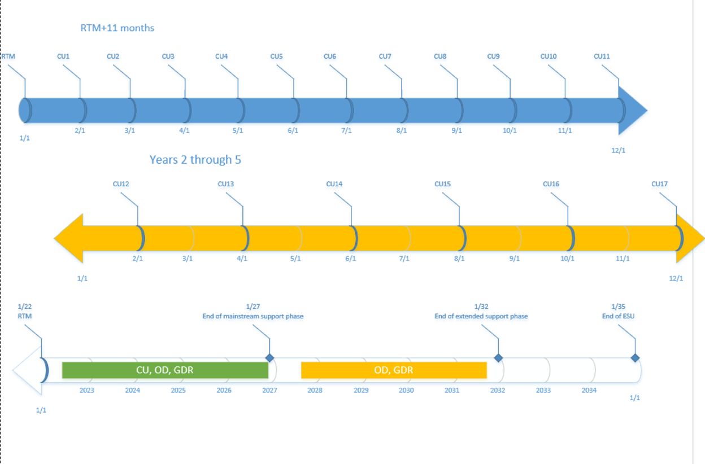
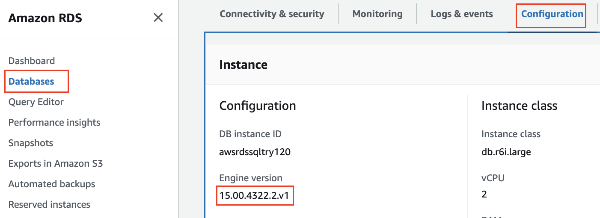
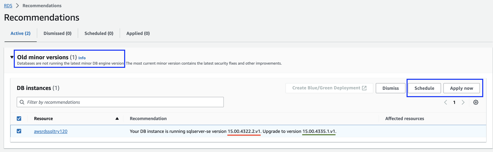
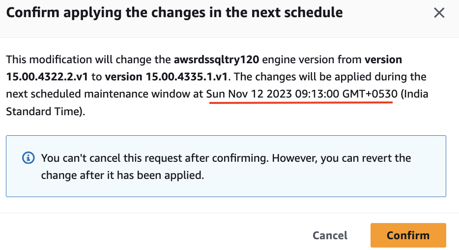
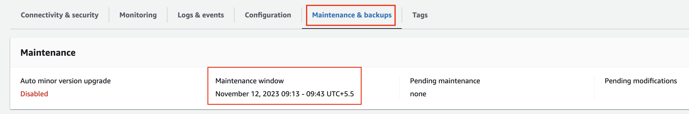
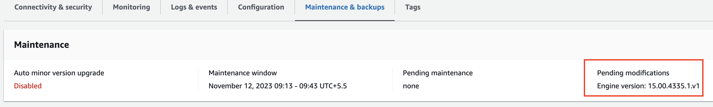
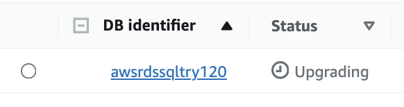
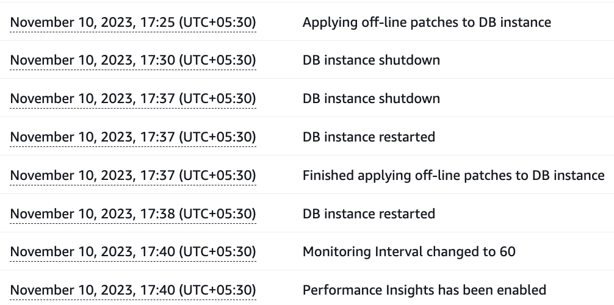

# Understanding AWS RDS SQL Server Engine upgrade #
## SQL Server - Major Version & Support Dates ##
At present `MAS 8.11` supports `SQL 2019` and
`MAS 9.0` is expected to add support of `SQL 2022`

|SQL Server Release|Major Version|Default compatbility level|Mainstream End Date|AWS RDS Availability|
|------------------|-------------|--------------------------|-------------------|--------------------|
|2019              |15.0         |150                       |Feb 28, 2025       |YES
|2022              |16.0         |160                       |Jan 11, 2028       |NO

`Compatability level`: keeps query processing behaviour compatible with specified version of database engine.

To change `compatability level` of a database, running below query on `SQL 2022` database server will use
query processing behaviour of `SQL 2017` as 140 is the compatability level of SQL 2017

```
ALTER DATABASE maxdb80
SET COMPATIBILITY_LEVEL =  140;
```


[Supported compatability levels](https://learn.microsoft.com/en-us/sql/t-sql/statements/alter-database-transact-sql-compatibility-level?view=sql-server-ver16)

[SQL Server 2019 Support cycle](https://learn.microsoft.com/en-us/lifecycle/products/sql-server-2019)

[SQL Server 2022 Support cycle](https://learn.microsoft.com/en-us/lifecycle/products/sql-server-2022)

## SQL Server edition comparison  ##
For MAS SaaS, We are considering only `Standard` and `Enterprise` editions which are `production-grade` and comparing `key features` for decision making

|Edition   |Read only Replica|Min vCPU on AWS RDS|Online indexing|Online schema change|Passive Failover Replica|Max CPU core|Max Memory(GB)|Max Db Size(PB)|
|----------|---|---|--|---|---|----------|----------|---|
|Standard  |NO |2  |NO|NO |YES|24        |128       |524
|Enterprise|YES|4  |YES|YES|YES|OS maximum|OS maximum|524

`Online indexing`:
On the Standard version, SQL Server will lock your object (i.e. table) during index creation/rebuild.

`Read only Replica(OPTIONAL)`:
It is an optional feature that requires Multi-AZ deployment as pre-requisite, only available in `enterprise` edition

`Passive Failover Replica(OPTIONAL)`:
It is ab optional feature that requires Multi-AZ deployment as pre-requisite, available in both `standard` and `enterprise`

Refer this link for [Detailed comparison of features](https://learn.microsoft.com/en-us/sql/sql-server/editions-and-components-of-sql-server-2019?view=sql-server-ver15&preserve-view=true)

Refer similar link for [AWS RDS SQL Standard/Enterprise features](https://docs.aws.amazon.com/prescriptive-guidance/latest/evaluate-downgrading-sql-server-edition/compare.html)

Refer this link for [AWS RDS SQL Instance types](https://aws.amazon.com/rds/sqlserver/pricing/?nc=sn&loc=4)


## Terminology - CU, Minor version/build version, RDS API version ##
|Major version|CU | Release date|Minor Version/Build Version|RDS Engine version|
|-------------|---|-------------|---------------------------|------------------|
|2019         |23 |Oct 12, 2023 |15.0.4335.1                |15.00.4335.1.v1   |
|2022         |9  |Oct 12, 2023 |16.0.4085.2                |NOT AVAILABLE     |

`CU`: Stands for Cumulative update, Contains `Security fixes` + `Functional fixes`; 
<BR> CU 23 includes all fixes from prior cumulative updates since `original GA` release of SQL Server 2019

`GDR`: Stands for General distribution release, Only contains `Security Fixes` 

As we can see in the image below, <BR>
`1st year from RTM`: 1 CU Every month<BR>
`2nd year to 5th year`: 1 CU every alternate month <BR>
`6th year to 10th year`: This is extended support period, No CU gets released, only `GDR` is released



 Microsoft's advice
 > We now recommend ongoing, proactive installation of CU’s as they become available

Refer [Release note of CU 23 of SQL Server 2019](https://learn.microsoft.com/en-us/troubleshoot/sql/releases/sqlserver-2019/cumulativeupdate23)

Refer [Release note of CU9 of SQL Server 2022](https://learn.microsoft.com/en-us/troubleshoot/sql/releases/sqlserver-2022/cumulativeupdate9#2659494)

Refer [SQL Server versions supported in RDS](https://docs.aws.amazon.com/AmazonRDS/latest/UserGuide/CHAP_SQLServer.html)

## Minor Version Upgrade ##
### Finding current engine version ###
`Current engine version` is displayed on AWS RDS console > Databases > Configuration Tab > Configuration Section



### Is there an upgrade available? ###
#### GUI Approach ####

Frm AWS RDS Console > Recommendations menu, we can see upgrade notification when new version is available for upgrade.


Clicking `Apply` will bring up confirmation prompt to apply `version upgrade` `immediately` which causes downtime <BR>
Clicking `Schedule` will bring up confirmation prompt asking to apply `version upgrade` during `scheduled maintainance window` configured for your AWS RDS instance<BR>


Here's screenshot showing upcoming `maintenance window` 


Confirming the option will show it as `pending upgrade`


### CLI Approach ###

#### Find If there are upgrade versions available? ####
Run this CLI command and look for `ValidUpgradeTarget` in the output
```
aws rds describe-db-engine-versions --engine sqlserver-se --engine-version 15.00.4322.2.v1 
```

Only `ValidUpgradeTarget` section is shown in the output for brevity; As we can see from current version `15.00.4322.2.v1` upgrade versions available to us are <BR>
1. Minor version - `15.00.4335.1.v1`
2. Major versin - `16.00.4085.2.v1`

```
  "ValidUpgradeTarget": [
                {
                    "Engine": "sqlserver-se",
                    "EngineVersion": "15.00.4335.1.v1",
                    "Description": "SQL Server 2019 15.00.4335.1.v1",
                    "AutoUpgrade": false,
                    "IsMajorVersionUpgrade": false
                },
                {
                    "Engine": "sqlserver-se",
                    "EngineVersion": "16.00.4085.2.v1",
                    "Description": "SQL Server 2022 16.00.4085.2.v1",
                    "AutoUpgrade": false,
                    "IsMajorVersionUpgrade": true
                }
            ],
```

#### Perform upgrade ####
Applying `--apply-immediately` flag will immediately start the upgrade
NOT applying `--apply-immediately` flag will schedule upgrade during maintenance window

```
aws rds modify-db-instance --db-instance-identifier "awsrdssqltry120" --engine-version "15.00.4335.1.v1" --apply-immediately

```

### Observe Upgrade process  ###
#### Is Upgrade going on? ####
If AWS RDS SQL instance is undergoing an upgrade, status will change to `upgrading`


#### Upgrade events ####
Events tab shows events occurred during upgrade process, it took roughly `15 minutes` to upgrade `single-AZ` instance

