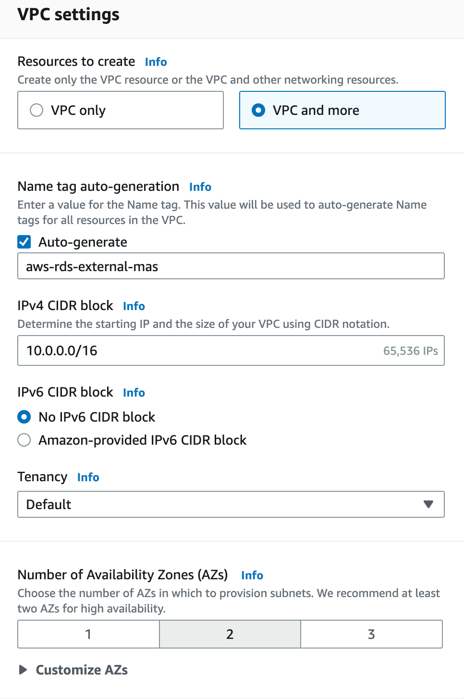
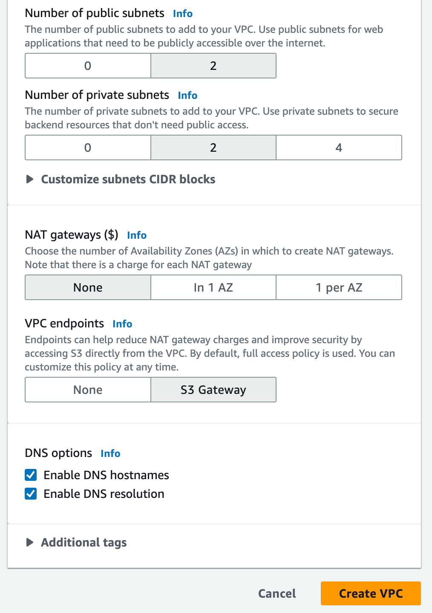

It is mandatory to have pre-existing VPC in the desired *region* of choice before AWS RDS Database Instance can be created.

In case, you want to create VPC to hold ONLY AWS RDS Instance, use setting shown in this picture to create a VPC. I feel that NAT Gateway is not necessarily required.

